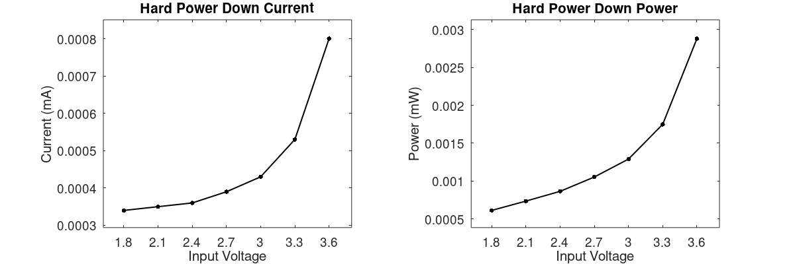

---
title: SFM10 Developer Manual 1.4.8
...

# Introduction


The SFM10 Module is designed for mobile, wearable electronics, Internet-of-Things (IoT), agriculture, healthcare, and automotive applications. It provides UWB capabilities with a minimal number of external components required. It houses the NXP Trimension (TM) OL23D0, which enables secure ranging and precision sensing across devices.

The module contains easy-to-use hardware and software, allowing anyone to create UWB solutions that fit their needs with the least amount of effort. A positioning system can be built using just SFM10 Modules.

This user manual provides an introduction to the SFM10-DEV development board and its capabilities. The document consists of an overview of the hardware components, a brief introduction to UWB and an explanation of the SFM firmware structure. Then, the API definitions are described followed by an explanation on how to create distance measurements between modules.


### UWB


UWB is a radio technology that is fundamentally different from the conventional carrier wave methods in telecommunication. With a carrier wave signal, the transmitter emits a waveform at a certain frequency (for example ~2.4 GHz for WiFi). This waveform is emitted for some period of time and the receiver is tuned to pick up this electromagnetic energy at this specific wave-length. To encode digital data, the transmitter slightly modulates the signal (e.g., varying amplitude or phase). 

However, UWB does not use a carrier wave: an UWB radio is an impulse-radio that utilizes patterns of extremely brief bursts of electromagnetic energy. Compared to a carrier wave signal, the UWB signal is much harder to detect, because electromagnetic bursts could have several causes and the receiver must have quite some knowledge of what pattern to expect in order to be able to detect it. 

The pulse pattern is composed of four parts:

1. preamble: a repetitive pattern (i.e. sync code) that is used for signal detection
2. start of frame delimiter: a pattern that marks the end of the preamble
3. STS sequence: randomness for extra security. This part is optional.
4. Payload: digital data. This part is also optional.

Because the electromagnetic signal is composed of very brief pulses, we can obtain very precise timing capabilities. When a pulse travels through the air, it could hit and bounce off physical obstacles like walls or ceiling. The receiver will pick up the energy of the pulse, including these reflections. However, because the pulse is so short in time, the reflections will not overlap, but arrive as distinct pulses at the receiver. The very first burst of electromagnetic energy that arrives at the receiver is usually the most interesting: it is the signal of interest that must have traveled in a straight line from transmitter to receiver and therefore can be used to compute the distance.


# Hardware Components

## SFM10-MOD


The SFM10-MOD module is built around the fully integrated and programmable NXP Trimension (TM) OL23D0. 
This module offers self-contained Ultra-Wideband (UWB) networking capabilities, adhering to the IEEE 802.15.4z standard. 
The OL23D0 integrates a microcontroller, security extensions, and UWB radio circuitry, making it an efficient solution for various applications.


Designed for mobile, wearable electronics, Internet of Things (IoT), agriculture, and automotive applications, the this module offers UWB networking capabilities with minimal external components. It features all the necessary decoupling capacitors to stabilize internal voltages and utilizes a ceramic antenna for UWB signal transmission and reception. The module's compact size of approximately 24x15mm and connections on both sides with 50mil (1.27mm) spacing enhance its versatility.


The OL23D0 enables secure ranging and precision sensing across devices. As a fully integrated single-chip Impulse Radio Ultra-Wideband (IR-UWB) low-energy transceiver IC, it complies with both IEEE 802.15.4 HRP UWB PHY and IEEE 802.15.4z BPRF/HPRF UWB PHY for secure ranging. It can accurately determine distances up to 5 cm. Additionally, it supports data transfer rates of up to 6.8 Mbps (BPRF) and 7.8 Mbps (HPRF).


UWB technology provides precise, secure, real-time localization capabilities. Our philosophy is to make this promising technology accessible to everyone, even the least experienced programmer. We've designed a complementary programming environment in the C language, complete with ample documentation and examples, to ensure an intuitive, user-friendly, and fast development experience. 


### Key Features


* **Single-Chip UWB Solution**: The SFM10 stands out as the world's only single-chip Ultra-Wideband (UWB) solution, streamlining design and reducing complexity.
* **Integrated RF Components**: The module integrates all essential and optimized RF components, ensuring efficient performance without the need for external add-ons.
* **Global UWB Coverage**: Supporting SHF UWB bands spanning from 6.0 GHz to 8.5 GHz, the SFM10 is suitable for worldwide deployment.
* **IEEE 802.15.4 HRP UWB PHY**: The module adheres to the IEEE 802.15.4 High-Rate Pulse (HRP) UWB PHY, enabling high-speed data transmission.
* **Secure Radio Technology**: Compliant with the IEEE 802.15.4z standard, the SFM10 employs secure radio technology for reliable communication.
* **Versatile Data Rates**: 110 kbps (BPRF) for robust communication. 850 kbps (BRRF) for efficient data exchange. 6.8 Mbps (BPRF) and 7.8 Mbps (HPRF) for diverse application needs.
* **Narrowband Interference Filtering**: The SFM10 incorporates a filtering stage to block unwanted narrowband interferences, ensuring clean signals.
* **Programmable Transmitter Power**: Achieve optimal range and efficiency with a programmable transmitter output power of up to 30 dBm peak.
* **Scrambled Timestamp Sequence (STS)**: The module generates STS compliant with NIST SP 800-90A, enhancing security.
* **32-Bit Arm Cortex Microcontroller**: The SFM10 features an Arm Cortex-based 32-bit microcontroller with built-in security extensions.
* **XTAL Sharing**: An XO buffer allows sharing the crystal oscillator (XTAL) with other devices (e.g., UHF or BLE transceivers).
* **True Random Number Generation (TRNG)**: Secure applications benefit from the TRNG capability.
* **Flexible Communication Interfaces**: SPI, UART, and (software) I2C compatibility for seamless integration.
* **Integrated temperature sensor **for precise clock compensation.
* **Coin Cell Battery Support**: The module offers a configurable current limiter, ideal for applications powered by coin cell batteries.
* **Optimized Low-Power Modes**: Extend battery life with efficient low-power modes.
* **High Accuracy Distance Measurement**: Leverage UWB for precise distance determination (up to 5 cm accuracy).
* **DW1000 and DW3000 Compatibility**: The SFM10 is compatible with the popular DW1000 and DW3000 UWB transceivers.
* **Internal Timers**: Utilize internal timers for precise scheduling in your applications.
* **User-Friendly Programming Environment**: Enjoy a simple and clear programming environment (C language) with ample documentation and examples.
* **Sub-Microsecond Wireless GPIO Timestamping**: Achieve precise synchronization between devices with sub-microsecond accuracy.
* **Wide Supply Voltage Range**: The module operates from 1.8V to 3.6V.
* **Flexible Programming Options**: Programmable via UART for ease of configuration. Programmable via USB using an FTDI chip or equivalent.


### Product Photos


### Order Information


Part Number: SFM10-MOD


Price: EUR 19,-


Where to order: info@synchronicit.nl


### Product Content


* Single SFM10 Module


### Layout


_SFM10 components_


Within the SFM10-MOD, we encounter the following essential components:


* The module is equipped with an **RF shield**, a protective layer made of metal. This shield serves the crucial purpose of electromagnetic shielding, effectively preventing external signals from disrupting the operation of the module's sensitive radio circuitry.

* The **OL23D0** is the sole chip on the board. Within the OL23D0 UWB transceiver of the module, there resides a 32-bit Cortex-M33 microcontroller equipped with security extensions. This microcontroller, designed by ARM, specifically targets the Internet of Things (IoT) and embedded applications that demand robust security or precise digital signal control. Developers can create their own software (referred to as firmware) to guide the microcontroller's actions, as detailed in the User Application Development section.

* Positioned at the corner of the module, a ceramic **antenna** known as the Johansson 7000AT18A1600 serves as the on-board antenna. With an overall gain of -0.5 dB within the frequency range of 6200-8240 MHz, this antenna has been meticulously tuned to achieve a robust omnidirectional radiation pattern.  

* The heartbeat of every microcontroller lies within its oscillator circuit. This electronic circuit generates clock pulses that synchronize the execution of instructions throughout the chip. When the module boots up, it initially utilizes an internal oscillator operating at approximately 38.4 MHz. However, it's important to note that the exact speed is variable, influenced by factors such as the chip's temperature. As the chip heats up, the oscillator's frequency decreases. During a UWB session, specialized UWB circuitry comes into play, relying on a more precise oscillator circuit. To accommodate this, an external crystal (**XTAL**) is positioned next to the chip, operating at a stable 55.2 MHz. This crystal ensures the necessary precision for UWB communication. 


### Pinout


_SFM10 pinout_


* **Pin 1**: Ground (digital)
* **Pin 2**: Power supply buffer, VBUF. Internally connected to VBAT (pin 3 and 21) via a programmable current limiter. VBUF is the main power input when using an external power supply. Leave VBUF unconnected when battery powered, enabling the internal programmable current limiter.
* **Pin 3**: VBAT. Power supply for digital I/Os and power supply for the chip via current limiter. Connect VBAT to a battery, or connect VBAT to VBUF when no current limiter is needed.
* **Pin 4**: Ground (digital)
* **Pin 5**: General-purpose input/output bit number 8 / Output gating signal for an optional external Power Amplifier (PA) / UART CTS /  boot mode selection.
* **Pin 6**: General-purpose input/output bit number 6 / Data input (RX) in LIN/UART operation. 
* **Pin 7**: General-purpose input/output bit number 7 / Data output (TX) in LIN/UART operation. 
* **Pin 8**: General-purpose input/output bit number 9 / Alternative Slave Select / Chip Select (active low) named CS2; output in SPI Master operation; input in SPI Slave operation / boot mode selection.
* **Pin 9**: XTAL Out. Outputs a Clock Reference (typical 27.6MHz) for external IC. XTAL clock output buffer, optionally divided. Trapezoid-wave with configurable slope to guaranty minimum 0.6Vpp at typical 27.6MHz
* **Pin 10**: Serial Wire Debug (SWD) clock, with an internal pull-up resistor
* **Pin 11**: Serial Wire Debug (SWD) data, with an internal pull-up resistor
* **Pin 12**: Ground (digital)
* **Pin 13**: Ground (digital)
* **Pin 14**: Reset input (active low), with an internal pull-up resistor. To perform a reset, RST shall be active for at least 5 us. 
* **Pin 15**: General-purpose input/output bit number 1 / Data clock for SPI operation (SCK); output in SPI Master operation; input in SPI Slave operation.
* **Pin 16**: General-purpose input/output bit number 3 / Data input for SPI full duplex operation (MISO in SPI Master operation). 
* **Pin 17**: General-purpose input/output bit number 2 / Data output for SPI full duplex operation (MOSI in SPI Master operation). 
* **Pin 18**: General-purpose input/output bit number 0 / Slave Select / Chip Select (active low) named CS1; output in SPI Master operation; input in SPI Slave operation
* **Pin 19**: General-purpose input/output bit number 5 / Interrupt output (active low) in SPI operation.
* **Pin 20**: General-purpose input/output bit number 4 / Ready output (active low) in 6-wire SPI operation
* **Pin 21**: An alternative to VBAT at pin 3.
* **Pin 22**: An alternative to VBUF at pin 2.
* **Pin 23**: Ground (digital)
* **Pin 24**: Ground (digital)


### Power Consumption




The Hard Power Down (HPD) mode has the lowest power consumption. When in HPD, the device can wakeup only via GPIO.


The Deep Power Down (DPD) mode has the second lowest power consumption. When in DPD, the device can wakeup via an internal timer or via GPIO.
See the [Clock Speeds example](/docs?topic=example-clock-speeds).


When the SFM10 wakes up, the UWB Circuitry is not yet powered. This state we refer to as CPU-only.


When the UWB Circuitry is activated, and RX is active, the most power is consumed.


UWB TX is relatively short with a power consumption comparable to RX.
The figure (10Hz TX) shows the average power consumption during the following: 
Transmit Serial Number over UWB then go to DPD (about 6ms CPU, 1ms UWB, and 93ms asleep).


### Dimensions


## SFM10-DEV


The SFM10-DEV development board is specifically designed for evaluating the capabilities of the SFM10-MOD. 
The SFM10-DEV board combines convenience, programmability, and educational resources to empower developers exploring the exciting world of UWB technology. 
Whether you're a seasoned programmer or a curious beginner, this platform invites you to unlock the potential of precise localization and spatial awareness. 


**Form Factor and Compatibility**: 
                The SFM10-DEV adopts the form factor of the popular **Wemos D1 mini series**. This design choice ensures compatibility with generic D1 shields, allowing developers to easily enhance the board's functionality.
                By leveraging D1 shields, users can add features such as sensors, displays, or communication modules without complex wiring or soldering.
                
            


**I/O Headers for Breadboarding**: 
                
                    The spacing of the I/O headers on the SFM10-DEV is **100mil (2.54mm)**. This aligns perfectly with a standard breadboard and dupont cables.
                    Whether you're connecting sensors, actuators, or other components, the breadboard-friendly layout simplifies prototyping and experimentation.

                


**Micro-USB Connectivity**:                 
                    The SFM10-DEV features a **micro-USB** port that connects to an **on-board CP2102 (Silicon Labs)** chip.
                    The CP2102 acts as a bridge between the USB interface and the UART pins of the SFM10 Module.
                    Through this serial port interface, users can upload their custom applications to the Module.

                


**Flexible Power Options**:                 
                    Developers have multiple power sources to choose from, ensuring adaptability to various scenarios:
                    * **USB Port**: The board can be powered directly via the micro-USB port.
                    * **External Supply**: An external power supply (up to 6V) can be connected.
                    * **Battery Operation**: The SFM10-DEV accepts battery power within the range of 1.8V to 3.6V.

                


**Unlocking UWB Technology**: 
                
                    The SFM10-DEV is all about Ultra-Wideband (UWB) technology.
                    UWB provides precise, secure, real-time localization capabilities.
                    Imagine giving spatial awareness to smart device, enabling them to understand their position and surroundings with remarkable accuracy.
                
                    Our mission is to make UWB accessible to everyone, regardless of their programming expertise.
                    The C language programming environment, coupled with extensive documentation and examples, ensures a smooth learning curve.

                


The SFM10-DEV is part of the comprehensive SFM10 Evaluation Kit.
The kit includes tutorials that cover essential concepts:

* Clock Synchronization: Understanding how devices synchronize their internal clocks.
* Time of Flight (ToF): Grasping the time taken by signals to travel between devices.
* Time Division Multiple Access (TDMA): Learning about efficient channel access in UWB networks.


**Single-Chip Wonder**:                 
                    The SFM10 Module stands out as the world's only single-chip UWB solution.
                    Its integration of all necessary RF components simplifies development and accelerates time-to-market.
                


In summary, the SFM10-DEV combines technical excellence, ease of use, and comprehensive features to empower developers.


### Key Features


* **Convenient Evaluation Platform**: The SFM10-DEV serves as a convenient board specifically designed for evaluating the capabilities of the SFM10-MOD. Whether you're a seasoned developer or a curious enthusiast, this platform simplifies the exploration of UWB technology.
* **Single-Chip UWB Solution**: The module stands out as the world's only single-chip UWB solution. Its integration of all essential RF components streamlines development and accelerates time-to-market.
* **Programmable via USB (via UART)**: The SFM10-DEV is programmable via USB, thanks to the on-board CP2102 (Silicon Labs) chip. The CP2102 bridges the USB interface to the UART pins of the module, allowing seamless application uploads.
* **Smooth Learning Curve**: The SFM10-DEV offers a very good learning curve for developers. Whether you're new to UWB or an experienced programmer, the platform ensures an accessible and intuitive experience.
* **Wide UWB Band Support**: The board supports SHF UWB bands spanning from 6.0 GHz to 8.5 GHz, making it suitable for worldwide use. This versatility enables applications across different regions and regulatory domains.
* **Secure Radio Technology**: The SFM10-DEV incorporates secure radio technology compliant with the IEEE 802.15.4z standard. Security-conscious developers can confidently build applications with robust communication.
* **High Data Rates**: The module achieves impressive data rates: 110 kbps (BPRF), 850 kbps (BRRF), 6.8 Mbps (BPRF), 7.8 Mbps (HPRF). These rates cater to diverse use cases, from low-power sensor networks to high-throughput applications.
* **Effective Narrowband Interference Filtering**: The board features a filtering stage that effectively blocks narrowband interferences. This ensures reliable communication even in noisy environments.
* **Adjustable Transmitter Output Power**: Developers can program the transmitter output power of the SFM10-DEV, reaching up to 30 dBm peak. Fine-tune the power level based on application requirements.
* **NIST-Compliant Scrambled Timestamp Sequence (STS)**: The SFM10-DEV generates Scrambled Timestamp Sequences compliant with NIST SP 800-90A. These sequences play a crucial role in precise time-of-flight measurements.
* **Robust Microcontroller Core**: The board houses an Arm Cortex-based 32-bit microcontroller with security extensions. This powerful core handles computation and security tasks efficiently.
* **XTAL Sharing and True Random Number Generation**: An XO buffer allows sharing the crystal oscillator (XTAL) with other devices (e.g., UHF or BLE transceivers). The board also boasts true random number generation (TRNG) for cryptographic applications.
* **Versatile Communication Interfaces**: The SFM10-DEV supports SPI, UART, and (software) I2C communication. Developers can choose the most suitable interface for their specific use case.
* **Temperature Compensation and Low-Power Modes**: An integrated temperature sensor compensates for clock variations due to temperature changes. The board offers optimized low-power modes, extending battery life in energy-efficient applications.
* **Precise Distance Measurement and Timers**: Achieve high-accuracy distance measurement using UWB technology. Internal timers allow precise scheduling for various tasks.
* **User-Friendly Programming Environment**: The SFM10-DEV provides a simple, clear programming environment. Whether you're writing custom firmware or experimenting with examples, the platform encourages rapid development.
* **Sub-Microsecond Wireless GPIO Timestamping**: The board supports sub-microsecond wireless GPIO timestamping. This feature is valuable for applications requiring precise synchronization.
* **Flexible Supply Voltage Range**: The SFM10-DEV operates within a supply voltage range of 1.8V to 3.6V. Whether powered by USB, external supply, or battery, the board adapts to your needs.


### Product Photos


### Order Information


Part Number: SFM10-DEV


Price: EUR 49,-


Where to order: info@synchronicit.nl


### Product Content


* Single SFM10-DEV board containing a SFM10 Module
* One pair of stackable 8-pin headers


### Layout


_SFM10-DEV components_


The SFM10-DEV board contains on the bottom side a SFM10 Module (housing the OL23D0 UWB chip). 

On the front side we find the following components:

* **The current limiter bypass jumper**. The SFM10 exposes two voltage rails: VBAT and VBUF. The pre-soldered jumper connects these two rails. On the SFM10, buffer capacitors are connected to VBUF for applications where the battery cannot deliver the high peak current demand of the OL23D0. Removing the jumper disconnects VBUF, leaving the 3V3 pin to be connected to VBAT only. An adjustable current limiter between VBAT and VBUF limits the recharge current of the VBUF capacitors. As a result, the battery current will never exceed the maximum current setting of the limiter.

* **The 5V to 3.3V LDO**.  When connected to a PC via the USB micro connector, the voltage of VUSB will be 5V. However, the OL23D0 will be damaged if 5.0V is applied to it. Therefore, the voltage is dropped to 3.3V using an LDO, which can supply up to 500mA. The voltage range of all I/O is 3.3V. In case you want to use peripheral circuitry that has different I/O voltages, it is recommended to use a level shifter. When the 3v3 pin is powered externally (for example with a CR2032 battery), a diode will prevent current flowing backwards to the LDO and USB chip.

* **The MOSI/MISO swap jumpers**. The OL23D0 has two SPI data pins: SDI (Data input for SPI full duplex operation) and SDO (Data I/O for SPI operation; output in full duplex operation; input/output in half duplex operation). Thus, only one of these two pins can be an output (SDO). Because with microcontrollers it is more common to use the names MISO (master-in-slave-out) and MOSI (master-out-slave-in), we used these names on the SFM10-DEV. However, this labeling is correct when the SFM10 is configured as a SPI Master only. When configured as a SPI Slave, the jumpers can be repositioned, which electrically swaps the D6 and D7 pins, making the MISO/MOSI labels consistent again. 

* **The Micro USB** female connector allows connecting the SFM10 to, for example, a PC for power and UART data communication, using a common USB micro cable.

* **The reset button**. When the reset button is pressed, the reset line is pulled to GND (i.e., active low), resetting the OL23D0.

* **The tick length indication**. The measurement clock runs at 128\*499.2 MHz (which is about 64 GHz). This equals 1/63897.6 microseconds per tick. The radio propagation speed in air is approximately 299704079 m/s (speed of light). Thus, if we want to convert a tick to millimeters, we find: 1000\*299704079 / (128\*499.2e6) ~= 4.690381 mm. Thus, the resolution of the measurement clock is roughly 4.7 millimeters.

* **The red LED**. Pin D1 (alias GPIO8) is connected to a red LED that can be programmed and used as a status LED (active low). The presence of the LED does not prevent you from using this pin for I2C.

* **The green LED**. Pin D2 (alias GPIO9) is connected to a green LED that can be programmed and used as a status LED (active low). The presence of the LED does not prevent you from using this pin for I2C.

* **The UART-to-USB chip**. The UART-to-USB chip, which is the CP2102 by Silicon Labs, will be detected and configured as a COM port when connected to your PC via USB. Using this serial port interface you can upload user applications to the SFM10 and interact with it.

* **The programming status LED** will show the programming status when compiling and uploading firmware.

* **The D3 button** will pull down pin D3 low (i.e., active low) when pressed. The internal pull-up resistor needs to be activated on pin D3 to make use of this button.


### Pinout


_SFM10-DEV pinout_


* **Pin RST**: Reset input (active low), with an internal pull-up resistor. To perform a reset, RST shall be active for at least 5 us.                 
* **Pin NC**: Not Connected. In the Wemos D1 mini form factor, this pin corresponds to the analog-to-digital convertor (ADC) A0. However, the ADCs within the SFM10 are all connected internally.               
* **Pin D0**: General-purpose input/output bit number 5. Interrupt output (active low) in SPI operation.               
* **Pin D5**: General-purpose input/output bit number 1. Data clock for SPI operation (SCK); output in SPI Master operation; input in SPI Slave operation.                
* **Pin D6**: General-purpose input/output bit number 3. Data input for SPI full duplex operation (MISO in SPI Master operation).                 
* **Pin D7**: General-purpose input/output bit number 2. Data output for SPI full duplex operation (MOSI in SPI Master operation).                 
* **Pin D8**: General-purpose input/output bit number 0. Slave Select / Chip Select (active low) named CS1; output in SPI Master operation; input in SPI Slave operation
* **Pin 3V3**: The general voltage requirement is 1.8V to 3.6V. If the system supply of the application is in that range, the supply could be connected directly. When USB is connected, VUSB (5V) will be dropped to ~3.3V using the on-board LDO. One can connect external circuitry that uses this 3.3V as long as its current consumption stays below 400mA.
* **Pin TX**: General-purpose input/output bit number 7. Data output in LIN/UART operation.                 
* **Pin RX**: General-purpose input/output bit number 6. Data input in LIN/UART operation.                 
* **Pin D1**: General-purpose input/output bit number 8. Output gating signal for an optional external Power Amplifier (PA)           
* **Pin D2**: General-purpose input/output bit number 9. Alternative Slave Select / Chip Select (active low) named CS2; output in SPI Master operation; input in SPI Slave operation              
* **Pin D3**: General-purpose input/output bit number 4.
* **Pin XO**: XTAL Out. Outputs a Clock Reference (typical 27.6MHz) for external IC. XTAL clock output buffer, optionally divided. Trapezoid-wave with configurable slope to guaranty minimum 0.6Vpp at typical 27.6MHz
* **Pin GND**: Ground (digital)
* **Pin VUSB**: Connected to the USB 5V rail.


### Schematic


_sfm10-dev v1.4_


## SFM10-KIT


The SFM10-KIT is a comprehensive package that includes six SFM10-DEV Boards, providing an ideal platform for various stages of UWB (Ultra-Wideband) exploration. 


Here's what you need to know about this versatile kit:


**Development Board Multiplicity**: The SFM10-KIT comprises six Development Boards, each tailored for evaluating the SFM10 Module. Whether you're a hobbyist, researcher, or professional, having multiple boards facilitates parallel prototyping and experimentation.


**SFM10 Tutorials**: When you purchase the this Evaluation Kit, you gain exclusive access to the comprehensive SFM10 tutorials. These tutorials serve as your guide, leading you step by step through key concepts related to Ultra-Wideband (UWB) technology. Whether you're a curious learner or a seasoned developer, these resources empower you to unlock the full potential of the SFM10 Module. 


**Prototyping and Performance Evaluation**: Use the SFM10-KIT for rapid prototyping and hardware performance evaluation. Dive into the intricacies of UWB technology, test your ideas, and fine-tune your designs.


**The Module Unveiled**: At the heart of the SFM10-KIT lies the SFM10-MOD, a fully integrated and programmable UWB solution. Based on the NXP Trimension (TM) OL23D0, this module combines ease of use with powerful capabilities.


**Effortless UWB Solution Creation**: With the SFM10-KIT, you can build UWB applications with minimal effort. Explore a wide range of use cases, from energy-efficient signal transmission to precise distance measurements.


Potential Applications:
The possibilities are vast:
* Low-Energy Signal Transmission: Efficiently transmit data with minimal power consumption.
* Clock Synchronization: Achieve precise synchronization across external devices.
* Synchronized Timestamping: Capture events with sub-microsecond accuracy.
* Two-Way Ranging (TWR): Measure distances using time-of-flight principles.
* Time Difference of Arrival (TDoA): Locate objects based on signal arrival times.
* Spatial Awareness: Enable devices to understand their surroundings.
* Real-Time Localization Systems (RTLS): Track assets or people in real time.
* Highly Secure Data Transfer: Safeguard sensitive information.


In summary, the SFM10-KIT opens doors to UWB innovation, empowering you to create cutting-edge applications with confidence. Let your imagination roam, and let the SFM10-KIT be your guide! 


### Key Features


* Convenient kit for evaluation of the SFM10 Module

* Programmable via USB (using UART)
* Free application development software
* Simple, clear programming environment (C)
* Tutorials for the novice programmer

* Ideal for IoT

* The world's only single-chip UWB solution
* Integrated Arm Cortex M33 microcontroller
* Optimized low-power modes for (coin cell) battery supply
* High accuracy distance measurement
* Compatible with DW1000 and DW3000
* SPI, UART, and (software) I2C compatible                   


### Product Photos


### Order Information


Part Number: SFM10-KIT


Price: EUR 499,-


Where to order: info@synchronicit.nl


### Product Content


* Six SFM10-DEV boards
* Six USB micro cables (1m)
* Six pairs of stackable 8-pin headers
* Tutorial activation code


### Tutorials


Creating a Real-Time Localization System (RTLS) is a challenging endeavor. It goes beyond simply purchasing a chipset from NXP. To build an effective RTLS, you'll need to consider several critical components and concepts:


* **Radio Signal Propagation**: Understanding how radio waves propagate through space is essential. Factors like signal strength, interference, and multipath effects play a crucial role.
* **Location Engine Mathematics**: The mathematics behind determining precise positions based on received signals is intricate. Concepts like trilateration and multilateration are fundamental.
* **Power Management**: Efficiently managing power consumption is vital for battery-operated devices. Balancing accuracy with energy efficiency is a delicate task.
* **Clock Drift and Clock Wandering**: Clock synchronization is crucial for accurate timestamping. Dealing with clock inaccuracies due to drift and wandering is part of the challenge.
* **TDMA Algorithms**: Time-Division Multiple Access (TDMA) ensures efficient communication between devices. Coordinating transmissions within specific time slots is essential.


The typical Ultra-Wideband (UWB) solution involves multiple chipsets, including an external host controller and the UWB transceiver. The external microcontroller handles power management and orchestrates communication with the UWB chip. This complexity can be daunting for developers new to UWB technology or (embedded) programming.


At SynchronicIT, we aim to simplify this process. Our ambition is to make exciting UWB technology accessible to everyone, even those with minimal technical knowledge. Here's how we help:

* **Software Page**: Visit our software page, where you'll find all the necessary files to build a user application and upload it to an SFM10 Development Board. Our build tools are entirely free of charge.
* **API**: We've made the User Application API available to anyone. It provides a straightforward interface for integrating UWB functionality into your applications.
* **Built-In Examples**: Our downloads include built-in examples to kickstart your UWB journey. While the free documentation won't hold your hand through every detail, our tutorials bridge the gap.
* **Tutorials Access**: When you purchase an SFM10 Evaluation Kit, you'll receive a tutorial activation code. Register, explore the tutorials, and unlock the full potential of UWB technology.


## SFM10-DONGLE


The SFM10-DONGLE shares identical functionality with the SFM10-DEV Board, differing only in its form factor-it takes the shape of a convenient USB dongle. 
When you receive it, the SFM10-DONGLE will come encased in a sleek black dongle housing, as depicted in the accompanying image.


Refer to the SFM10 Development Board for more details.


### Product Photos


### Order Information


Part Number: SFM10-DONGLE


Price: EUR 65-


Where to order: info@synchronicit.nl


### Product Content


* SFM10-DONGLE USB module
* Black enclosure for the dongle


## SFM10-WEARABLE


The SFM10-WEARABLE is a versatile device equipped with essential features for wearable applications. 
It incorporates an accelerometer, a wireless charger, and a LiPo battery charger. 
Notably, it is also waterproof, making it suitable for various outdoor and water-resistant use cases. This compact module can be programmed using two convenient methods: over-the-air or via a common FTDI TTL/USB adapter.


### Product Photos


### Order Information


Part Number: SFM10-WEARABLE


Price: EUR 99,-


Where to order: info@synchronicit.nl


### Product Content


* SFM10-WEARABLE board with white enclosure
* Wrist band (black)
* Belt clip (white)


## SFM10-SOCKET


The SFM10-SOCKET is a convenient adapter that enables seamless connections between 2.54mm headers or Dupont cables and an SFM10-MOD, all without the need for soldering.


Soldering connections are permanent. With this adapter, you can easily disconnect and reconnect a SFM10-MOD as needed. This flexibility is especially useful during prototyping, testing, verifying functionality, or when making adjustments.


### Product Photos


### Order Information


Part Number: SFM10-SOCKET


Price: EUR 49,-


Where to order: info@synchronicit.nl


### Product Content


* SFM10-SOCKET


## SFM10-DEMO


The SFM10-DEMO showcases the impressive distance measurement capability of the SFM10. 
In this setup, one SFM10 module drives a 32x8 LED matrix, dynamically displaying real-time distance measurements (in centimeters) between the LED display and a LiPo-battery-powered SFM10 (tag).


### Product Photos


### Order Information


Part Number: SFM10-DEMO


Price: EUR 249,-


Where to order: info@synchronicit.nl


### Product Content


* Two SFM10-DEV modules
* 32x8 LED maxtrix shield for a SFM10-DEV
* Battery shield for SFM10-DEV with a LiPo 390mAh


# Software Development

## Getting Started

### Steps


* The first step is to learn about and download the Software Development Kit.
* The second step is to follow the Software Development Setup guide to install the recommended third-party software. This installation guide is written for a Windows PC, but the listed software is not OS specific.
* The third step is to get familiar with the structure of a user application as explained below.
* The fourth step is to have a look at the Built-in Examples, demonstrating basic functionality, and to have a look at the User Application API.
* The fifth step is to follow the Tutorials. Note that before you can participate you need to register first. 


## What did SynchronicIT add to the OL23D0?


The software that runs on the SFM10 Module is what we call firmware.

Firmware is a term for a piece of software that is stored on a hardware device in order to make it run properly. 


On top of what is provided by the chip manufacturer, SynchronicIT added three firmware layers to make it usable: the Bootloader, the UWB Library, and the User Application. 


_Firmware structure and memory addresses_


In addition to the UWB baseband functionality, the OL23D0 is shipped with ROM functions for peripherals and memory management. This firmware layer is hidden in our SDK for a few reasons. It requires extensive documentation and quite some prior knowledge to use it. The chip is designed with a high level of security in mind, therefore some functionalities are hidden by the manufacturer. In addition, you will need expensive tools to create custom firmware and upload it to the device. Instead this development kit should provide easy-to-use software tools, allowing anyone to build UWB solutions.


## What does the Bootloader do?


The SFM10 Module contains a bootloader consuming only 4kB of flash memory that enables customers to upload (higher layer) firmware over UART.


In general, a bootloader is a small program that runs on a microcontroller and is responsible for loading and executing the main application code. It is used to upgrade or modify the system software without the need for specialized firmware upgrade tools.


The bootloader that we created for the SFM10 uses UART and the reset line to upload new firmware.  A common alternative to upload an application binary is SWD, which stands for Serial Wire Debug and is a two-wire protocol used for debugging and programming ARM microcontrollers. 


Compared to SWD, using UART to upload a binary has several benefits. One of them is that application output and debug information is commonly printed over UART. By also using UART to upload the application we get a fluent user experience without the need to connect a lot of wires. In addition, for SWD you need specialized (costly) programmers, while USB-to-UART converters are commonly available and cheap.


Here we will explain our bootloader interface.


The bootloader flow is as follows: after a boot it checks if the conditions are met for "Upload Mode". 
If not, it checks if an application is present in flash to start up. If not, it will print a "SN string". 


## What does the UWB Library do?


The main firmware block that we build for this SDK is what we call the UWB Library, or primary application. 


Creating a Real Time Localisation System (RTLS) is not a trivial task. It requires knowledge of signal propagation, power management, clock drift, internal delays, etc. This complexity is a big hurdle for developers that are new to UWB and a giant leap for anyone new to (embedded) programming. To make configuration and programming of this complex device as easy as possible, the SFM10 Module comes with a UWB Library that implements all important functions. It can be regarded as a stable foundation for creating custom-tailored UWB solutions.


This program is loaded right after the bootloader. However, it won't do anything by itself. It exposes a list of functions that your own application can use. The UWB Library can be updated via the bootloader, which is advised when a new version is made available. 


## What is the User Application?


The third firmware layer is the User Application which makes use of the functions that are exposed by the UWB Library. The User Application can be freely programmed to fit to the needs or preferences of a specific customer or application.


This piece of firmware you will build yourself. We choose to design an Arduino-like programming language because the Arduino language is well documented, has a large community, is easy-to-use for beginners, yet flexible enough for advanced users. Like with an Arduino sketch, the user of our module defines a ``setup()`` function that initializes and sets the initial values, and a ``loop()`` function that loops consecutively, allowing your program to change and respond.


After the UWB Library is successfully uploaded, the User Application can be updated and replaced as many times as you want. However, when a new version of the UWB Library is uploaded, the binaries of the User Application (hex files) need to be recompiled with the new header files before they are uploaded again.


## What does the User Application look like?


To build the user application, we will use the language C.
C is a general-purpose programming language created by Dennis Ritchie at the Bell Laboratories in 1972.
Despite being old, it still is very powerful and efficient.
It is widely used especially with embedded systems, because:


* It offers low-level access to the device hardware.
* It forces you to think about proper usages of the very limited resources available (e.g., CPU time and memory size).
* Compared to alternatives it is a very fast language. Typically C was used as a building block to create other languages (e.g., C++, Python, Java).


Because C operates close to the low-level hardware, it is considered as a low-level language, which means it is quite technical and could be challenging at first.

If you have no experience with C (or even any other language) don't worry - because it is an old language and it is so widely used, there are plenty of tutorials out there.
For example [here](https://www.w3schools.com/c/c_syntax.php). 

However, although the syntax is C, the code (or 'sketch') that you will write for the user application will use a slightly different skeleton compared to the typical ``int main()`` program, as explained below in the section below.


### ``setup()``


Your sketch should always contain the function ``setup()``, which is to initialize variables, pin modes, libraries, etc. The ``setup()`` function will run only once, after each powerup or reset of the module.

**Code example:**

```c++
    
    #include "user-application.h"
    
    void setup() {
        Serial.begin(115200); // initialize UART
        Serial.print("Hello world\n");
    }
    

```


### ``loop()``


Your sketch is expected to contain the function ``loop()``, which is called continuously. The loop frequency can be adjusted by changing ``CONFIG_LOOP_INTERVAL`` to some value other than 0. The value is in milliseconds. The default of 0 means ``loop()`` will be called as often as possible.

**Code example:**

```c++
    
    #include "user-application.h"
    
    void setup() { // run once:
        Serial.begin(115200);
        Serial.print("Hello world!\n");
    }
    
    void loop() { // runs indefinitely:
        Serial.print("Hi\n"); 
        delay(1000); // wait one second
    }
    

```


### ``errno``


The global variable "errno" can be checked to test whether a problem has occurred. In your sketch, you can set its value to 0 and check at some point if errno does not equal 0 anymore. The value of errno is never set to zero by any system call or library function. Alternatively you detect an error as soon as it occurs using ``attachInterrupt(ERROR_INTERRUPT, fun, 0)``. The value of errno will encode the Standalone function group (e.g., GPIO, SPI, UART), the function within the group, and the reason of error.

**Code example:**

```c++
    
    #include "user-application.h"
    
    // To print changes of the errno variable:
    void handleError() {
        Serial.print("E0x%06X\n", errno);
    }
    
    void setup() {
        Serial.begin(115200);
        attachInterrupt(ERROR_INTERRUPT, handleError, 0); // set callback
        pinMode(99, INPUT); // will trigger a call to error(), printing E10102
                            // corresponding to E_GPIO_PIN_MODE__PIN_UNKNOWN
    }
    

```

**Code example:**

```c++
    
    #include "user-application.h"
    
    void setup() {
        Serial.begin(115200);
        attachInterrupt(ERROR_INTERRUPT, Serial.printError, 0); // set predefined callback
    }
    

```


## What are UWB.* functions?


At the User Application API page you will find all the functions that the UWB library exposes for you to use. 
Note that the last few function families have a name starting with ``UWB``. 

These are special in the sense that they are exposed to the external host MCU when the SFM10 is used as a slave, 
using generated files ``phy-uci-interpreter.h`` and ``phy-uci-interpreter.c``. 

Note the term UCI. This abbreviation stands for Ultra-wideband Command Interface and it enables communication with the Ultra-wideband subsystem (UWBS). 
The UCI defines the transport layer, independent from the physical connection.
This means it can be used over UART or SPI when the SFM10 is connected as a slave module to a host microprocessor. 
See user application ``uci-over-uart`` in the SDK.


Three types of UCI messages are defined: 

* a Command message (CMD), which provides instructions to the UWBS, 
* a Response message (RSP) that is always a (direct) response following a command, 
* and a notification message (NTF) that informs about some state which can occur at any time. 


According to the standard, a UCI message should always start with a four-bytes header that defines the type and length of the consecutive payload. 
Within a User Application, all UCI functions are directly accessible under the ``UWB.`` class without an intermediate transport layer. 
Hence, a four-byte header is always omitted. 


The return value of a UCI function indicates the success or error of the command. This is different from the non-UCI functions, where errors can be caught via variable ``errno``.
In case a function returns output, for example ``UWB.getDeviceInfo()``, it will use a user-provided structure pointer. 
You can subscribe to notification messages using the ``UWB.on..()`` functions in which you provide a callback function and provide the data containers that should be used.


To make the SFM10 a UCI slave device, please see the uci-over-uart and uci-over-spi User Application examples. 
They basically add a UCI header to outgoing messages and use some header interpretation logic for incoming messages.
Please see the documentation within the examples to learn about the UCI packet format and the current Phy implementation and serialization.


# Software Development Setup


Before we can use the SFM10-DEV, we need to install a few third-party software components. Some may be installed already at your side. In that case you can skip that of course.


* CMake is distributed under the [3-clause BSD License](https://opensource.org/licenses/BSD-3-Clause).

* Python software and documentation are licensed under the [PSF License Agreement](https://docs.python.org/3/license.html#psf-license-agreement-for-python-release).

* The Arm GNU Toolchain uses the [GNU General Public License](https://www.gnu.org/licenses/gpl-3.0.en.html).

* Visual Studio Code is available under the [MIT license agreement](https://code.visualstudio.com/license).

* Ninja is distributed under the [Apache License 2.0](https://www.apache.org/licenses/LICENSE-2.0).


This installation guide was written Juni 6th 2022 for a fresh Windows 10 Version 21H2 system.

Download the SFM10 SDK, extract it and place the folder somewhere convenient, for example ``C:/SFM10/``.


## CP210X Driver


Connect a SFM10-DEV development board to your PC. Ensure that you fully insert the micro-USB end of our supplied USB cables into the socket. Windows should install drivers automatically.


To verify that the installation was successful, press the Windows button and type "devi" and open Device Manager.


The CP2102N should be listed under Ports (COM & LPT). If automatic installation fails, the CP2102N is shown under "Other devices".


If this happens, go to [www.silabs.com/developers/usb-to-uart-bridge-vcp-drivers](https://www.silabs.com/developers/usb-to-uart-bridge-vcp-drivers) and click on the downloads tab. Download the "CP210x Windows Drivers" zip.


Extract the CP210x_Windows_Drivers.zip file.


And start the installation by opening CP210xVCPInstaller_x64.exe.


After the installation completes, the CP210x should now appear under Ports (COM & LPT).


Note that the COM port ID here is COM3. Let's remember that for later.


## CMake


CMake is an open-source, cross-platform family of tools designed to build, test and package software. It will interpret for example the CMakeLists.txt files that you find throughout the SDK.


If you already have CMAKE installed, open a command prompt window and type "cmake --version". If this returns version 3.23.2 or higher, you can skip installing CMAKE.


Go to [cmake.org/download](https://cmake.org/download/) and download "Windows x64 Installer". An installer is convenient, because it will give you the option to automatically add cmake to your PATH environment variable.


After the download, open in the installer (by opening cmake-3.24.0-rc5-windows-x86_64.msi). You will see something like: 


Click Next, tick "I accept the terms" and click Next. Then, change the selection to "Add CMake to the system PATH":


Click Next, and install it wherever you like (for example the default ``C:/Program Files/CMake/`` location). Click Next and finally click Install (it will require admin rights of course).


## Python


Python is a popular high-level, interpreted, general-purpose programming language. We will use it mainly for USB-UART communication.


Go to [python.org/downloads](https://www.python.org/downloads/) and click on the button "Download Python". You may want to check first if you have Python installed already: Open a Command Prompt (press WINDOWS button, type in "cmd" and press enter). Type in the following commands: ``python --version``. If this returns a Python version 3.0.0 or higher, you're good.   


Open the installation (for example python-3.10.5-amd64.exe).


Make sure that you select the checkbox "Add Python to PATH". Then, click on Install Now. Again, it will ask for administrator rights.


## Compiler


In computing, a compiler is a computer program that translates computer code written in one programming language (the source language) into another language. Here the source language is C, and the output is ARM assembly language.


Go to [developer.arm.com](https://developer.arm.com/Tools%20and%20Software/GNU%20Toolchain) and click on "Download GNU Toolchain".


Scroll down a bit and download gcc-arm-11.2-2022.02-mingw-w64-i686-arm-none-eabi.exe.


After downloading, open the installation. It will ask for administrator rights right away. Select the language.


Click Next, then I Agree. Install it anywhere you like and press Install.


After installation, make sure you check the "Add path to environment variable" before you click Finish.


## Visual Studio Code


An integrated development environment (IDE) is a software application for building applications. Within the IDE we will build the User Application that will run on the SFM10 Module.
We will use Visual Studio Code here. Visual Studio Code, also commonly referred to as VS Code, is a source-code editor made by Microsoft for Windows, Linux and macOS. 

It is currently ranked the most popular developer environment tool as indicated by a Survey from Stack Overflow.


Go to [code.visualstudio.com/download](https://code.visualstudio.com/download).


Download the "User Installer 64 bit". Op the installation file (for example VSCodeUserSetup-x64-1.67.2.exe).


Accept and click Next. Install it anywhere you like (I used the default) and press Next. Click Next again, and then, make sure you select both checkboxes "Add Open with Code action" and the checkbox "Add to PATH".


Press Next and then Install.


## Ninja


Ninja is designed to have its input files generated by a higher-level build system such as CMake, and it is designed to run builds as fast as possible. Simply put, it will make the connection between CMake and the GCC compiler.


Ninja does not come with an installer, so we need to add it to the environment variables manually. We placed ninja.exe in the source-files folder of the SDK already, so we now only need to add the source-files folder to the PATH variable. Press the Windows button, type in "envi" or "variables" and select "Edit the system environment variables".
Alternatively, on the Windows taskbar, right-click the Windows icon and select System. In the Settings window click Advanced system settings.


Click on "Environment Variables".


Under system variables, click on "Path" and add a new row (click on New) with the path to the SDK source-files.


Press OK, and OK.


## Checkup


Before we proceed, we need to sign out of Windows and sign in again to make the changes to the PATH environment variable effective (or reboot your system).
After the reboot we will check if all installations were successful. Open a Command Prompt (press WINDOWS button, type in "cmd" and press enter).  Type in the following commands:


``arm-none-eabi-gcc --version``


``python --version``


``cmake --version``


``ninja --version``


In case you got a "not recognized as an internal or external command", adding to PATH was not successful. In that case, either install that piece of software again, or add it to PATH manually like we did for Ninja.


## Visual Code and Python Extensions


Go to the location of the SDK on your disk.


When inside the folder, press the right mouse button, and click on "Open with Code"


Click on "Yes, I trust the authors" to continue. Now, we need to install a few extensions.


Click on the "blocks" icon on the left and the first extension we are going to install appears already at the top: Python. Click on the blue install button. At some point the Windows Firewall asks if Visual Studio Code is allowed to access the internet and you click on Allow access.


Next, in the search-bar in the top left corner, type in "c ext" and install the C/C++ Extension Pack.


After all components of the expansion pack are installed, we are going to add extensions to Python. Press Ctrl and ` together and a console will appear, or use the top navigation bar and select View->Terminal. Type in:


``pip install six``


``pip install intelhex``


``pip install pyserial``


Be sure to install ``pyserial`` not ``serial``.


You can ignore the pip version warnings. In case you run into an error, for example ``OSError: [Errno 13] Permission denied``, you need to open Visual Code or the regular windows terminal using administrator rights. 


Now, close Visual Studio Code.


## Upload a Sketch


Using Explorer go to the "user-application-examples" folder of the SDK. Right click on the "example-hello-world" folder and select Open with Code.


In Visual Studio Code, on the bottom right, pop ups may appear asking to configure things. We can ignore them.


Within Visual Studio Code, browse to the file settings.json, located in the .vscode folder. On line 3 it says "serialPort": "". When leaving the serialPort variable empty like this, the current user application will be uploaded to all connected (and available) SFM10 devices.
You can change it to for example "serialPort": "COM6" to target only the device connected as COM6, or change it to a comma-separated list to target multiple, for example: "serialPort": "COM3,COM5,COM6".


Now, open file ``main.c`` (double click will prevent the file from closing). 


Press Ctrl+Shift+B and it will start the Build sequence, listed in tasks.json. It will first create a build folder, then it will run CMake for setting up a building environment, then Ninja to use the GCC compiler and linker, and finally it calls a python script within the SDK to upload the binary.


On the right we see the API version code, the project name (example-hello-world), the application type and the application size. The line below the size lists the target devices (only COM14 here).


If a ``No CMAKE_ASM_COMPILER could be found`` error is shown the environment variable was not set correctly by the ARM GNU Toolchain installer. Open the "Path" variable as was done for setting up Ninja and add the folder where ``arm-none-eabi-gcc.exe`` is located, for example: C:/Program Files (x86)/Arm GNU Toolchain arm-none-eabi/11.2 2022.02/bin as shown in this figure:


In the figure above, all steps were successfully taken, except for the last one. This happened after I set "serialPort" to "COM6". It notes that COM14 is available but not targetet (in grey) which may hint that the variable "serialPort" was set wrong.


Note items could be listed after "ignoring" for several reasons.


With Ctrl+Shift+B we perform the build and upload procedure. 
We can also press the F5 key. This will do the latter plus it opens a terminal window in which UART output of the SFM10-DEV is shown, and serial communication to the SFM10-DEV can be entered.


The connection can be closed (must be closed before another binary can be uploaded) by pressing Ctrl+C after selecting the terminal, or by pressing Shift+F5.


We can edit main.c, for example change the word "Hello world" into "monkey" with an incrementing count value.
When we leave "serialPort" empty and connect multiple SFM10-DEV boards using USB, and press F5, they will all receive new firmware and the serial monitor will connect to them all, dissociating them with colors.


Note that each time a new SDK is downloaded and used, each connected module will receive the dedicated UWB library before a user application is uploaded. This will happen automatically. For more information, see "What did SynchronicIT add to the OL23D0" and other topics on the Getting Started / Software Developement section.


That's it. Good luck with your project!


# Built-in Examples

### example-hello-world


Hello World is one of the classic examples demonstrating minimal application structure and UART output.


**Code example:**

```c++
    
    // We always start with including the user-application header file:
    #include "user-application.h"
    
    
    // Our setup, that runs only once:
    void setup() {
      // We configure the TX / RX pins as UART and initialize it with a 
      // baud rate of 115200 bits per second:
      Serial.begin(115200);
    }
    
    // Our loop, that runs continuously:
    void loop() {
      // We print Hello World. Don't forget to add \n at the end, which 
      // triggers a UART flush: all the bytes in the UART buffer are 
      // sent on the wire.
      Serial.print("Hello world!\n");
      delay(1000);
    }
    

```


### example-blinky-led


Blinky LED is one of the classic examples demonstrating GPIO output and the delay (wait) function.


It will use the onboard red and green LED of the SFM10 Development Board.


**Code example:**

```c++
    
    // We always start with including the user-application header file:
    #include "user-application.h"
    
    // Let's define some MACRO functions that turn on/off a LED
    
    // The LEDs on the SFM10-DEV board are active low, meaning that we 
    // have to set the GPIO pin to LOW when the LED must be lit and 
    // HIGH when it must be off.
    #define ON LOW
    #define OFF HIGH
    #define TURN_RED_LED(value)   { digitalWrite(PIN_LED_R, value); }
    #define TURN_GREEN_LED(value) { digitalWrite(PIN_LED_G, value); }
    // Now we can write this for example: 
    //   TURN_RED_LED(ON);
    // Which now is an alternative notication for:
    //   digitalWrite(PIN_LED_R, LOW);
    
    
    // Our setup, that runs only once:
    void setup() {
      // We configure the GPIO pins that control both LEDs.
      // We can 'or' the pins together to make it a single call to 
      // pinMode(). We set them both as OUTPUT pins with the initial 
      // state HIGH, meaning the LEDs are off:
      pinMode(PIN_LED_R | PIN_LED_G, OUTPUT_HIGH);
    }
    
    // Our loop, that runs continuously:
    void loop() {
      // We turn on the red LED for 500 ms:
      TURN_RED_LED(ON);
      delay(500);
      TURN_RED_LED(OFF);
      // We wait 200 ms:
      delay(200);
      // Then we turn on the green LED for 100 ms:
      TURN_GREEN_LED(ON);
      delay(100);
      TURN_GREEN_LED(OFF);
      // We wait 1 second:
      delay(200);  
    }
    

```


In the figure below both GPIO pins are recorded for 10 seconds. From T=0 s onwards, you see D1 (orange line) toggling with an interval of about half a second. The line D2 (red) briefly goes down (1/10th of a second), making the green LED blink.


Note that although 500+200+100+200=1000ms the pattern shows an interval of slightly more than 1 second. This is because the scheduler in the background, and the functions ``digitalWrite()`` and ``loop()`` itself consume some processing time.
One way to achieve more precise scheduling is using the Timer class, see the timed-leds example.


### example-user-button


The User Button example demonstrates detection of a GPIO pin state change.


It will use the onboard button and red LED of the SFM10 Development Board.


**Code example:**

```c++
    
    // We always start with including the user-application header file:
    #include "user-application.h"
    
    // The LEDs on the SFM10-DEV board are active low, meaning that we 
    // have to set the GPIO pin to LOW when the LED must be lit and 
    // HIGH when it must be off.
    #define ON LOW
    #define OFF HIGH
    #define TURN_RED_LED(value)   { digitalWrite(PIN_LED_R, value); }
    
    
    // Forward declaration of function, so we can 'use' them before they 
    // are defined:
    void btn_down_isr(void);
    void btn_up_isr(void);
    
    
    void setup() {
        // We initialize the LED pins and the UART:
        pinMode(PIN_LED_R | PIN_LED_G, OUTPUT_HIGH);
        Serial.begin(115200);
        // In case an error occurs, errno will change its value. 
        // Using the line below we can catch this event:
        attachInterrupt(ERROR_INTERRUPT, Serial.printError, 0);
    
        pinMode(PIN_USER_BUTTON, INPUT_PULLUP); // setup button pin
    
        attachInterrupt(PIN_USER_BUTTON, btn_down_isr, FALLING);
    }
    
    
    void btn_down_isr(void) {
    
        detachInterrupt(PIN_USER_BUTTON);
        attachInterrupt(PIN_USER_BUTTON, btn_up_isr, RISING);
    
        TURN_RED_LED(ON);
    
    }
    
    void btn_up_isr(void) {
    
        detachInterrupt(PIN_USER_BUTTON);
        attachInterrupt(PIN_USER_BUTTON, btn_down_isr, FALLING);
        
        TURN_RED_LED(OFF);
    }
    

```


### example-uart-echo


The UART Echo example demonstrates how incoming data can be captured and sent via a serial terminal.


**Code example:**

```c++
    
    // We always start with including the user-application header file:
    #include "user-application.h"
    
    
    
    // Our setup, that runs only once:
    void setup() {
      // We configure the TX / RX pins as UART and initialize it with a 
      // baud rate of 115200 bits per second:
      Serial.begin(115200);
      // In case some error occurs, we can detect them by setting:
      attachInterrupt(ERROR_INTERRUPT, Serial.printError, 0);
    
      Serial.print("Send me some characters and I'll echo them back\n");
    }
    
    // Our loop, that runs continuously:
    void loop() {
      int count = Serial.available();
      if (count >0) {
        uint8_t buffer[100];
        Serial.readBytes(buffer, count);
        Serial.print("RECEIVED: ");
        Serial.write(buffer, count);
        Serial.print("\n");
      }
    }
    
    

```


Below, the example is opened in VS Code and after pressing the F5 button the serial monitor is opened. We've sent two strings, but note that they are partially received. 

This is because the check ``Serial.available()`` returned before the whole string was transferred, resulting in multiple lines of ``RECEIVED``. 
One solution to this is to wait a little before calling ``Serial.available()`` for example by inserting ``delay(1);`` before it. 
Or, you fill the buffer, for example using ``Serial.read()`` until you encounter the newline character. 


### example-boot-reasons


Demonstrates several boot reasons.


**Code example:**

```c++
    
    #include "user-application.h"
    
    
    void setup() {
        attachInterrupt(ERROR_INTERRUPT, Serial.printError, 0);
        Serial.begin(115200);
        
        Serial.print("Reset reason = ");
    
        switch (getResetReason())
        {
            case POWER_ON:              Serial.print("POWER_ON"); break;
            case RESET_PIN:             Serial.print("RESET_PIN"); break;
            case DPD_RESET_PIN:         Serial.print("DPD_RESET_PIN"); break;
            case HPD_RESET_PIN:         Serial.print("HPD_RESET_PIN"); break;
            case HPD_WAKE_UP_PIN:       Serial.print("HPD_WAKE_UP_PIN"); break;
            case SOFTWARE_RESET:        Serial.print("SOFTWARE_RESET"); break;
            case FAIL_BIAS_BANDGAP_VDD: Serial.print("FAIL_BIAS_BANDGAP_VDD"); break;
            case FAIL_CPU_VDD:          Serial.print("FAIL_CPU_VDD"); break;
            case BROWNOUT_CPU:          Serial.print("BROWNOUT_CPU"); break;
            case FAIL_PFLASH_VDD:       Serial.print("FAIL_PFLASH_VDD"); break;
            case FAIL_BUF_LOW_VDD:      Serial.print("FAIL_BUF_LOW_VDD"); break;
            case WATCHDOG:              Serial.print("WATCHDOG"); break;
            case FAIL_STATE_CHANGE:     Serial.print("FAIL_STATE_CHANGE"); break;
            case WUP_TIMER:             Serial.print("WUP_TIMER"); break;
            case WUP_SNAPSHOT:          Serial.print("WUP_SNAPSHOT"); break;
            case DPD_GPIO:        Serial.print("DPD_GPIO"); break;
            default: break;
        }
        Serial.print("\n");
    
        switch (getResetReason()) {
            case RESET_PIN: {
                delay(1000); 
                reset(); // trigger SOFTWARE_RESET
            } break; 
            case SOFTWARE_RESET: {
                Timer.setWatchdog(1000); // trigger WATCHDOG
            } break; 
            case WATCHDOG: {
                delay(10); // allow Serial.print() to complete
                sleep(1000, 0, 0); // trigger WUP_TIMER
            } break; 
            case WUP_TIMER: {
                Serial.print("Press the User Button to continue...\n");
                delay(10); 
                sleep(0, D3, FALLING); // trigger DPD_GPIO
            } break; 
            case DPD_GPIO: {
                Serial.print("Send me some serial character(s)\n");
                delay(10); 
                deepSleep(PIN_RX); // trigger HPD_WAKE_UP_PIN
            } break;
            case HPD_WAKE_UP_PIN: {
                Serial.print("Done\n");
            }
        }
    
        Serial.print("You reached this line\n");
    }
    
    /* example output:
    
    Reset reason = RESET_PIN
    Reset reason = SOFTWARE_RESET
    You reached this line
    Reset reason = WATCHDOG
    Reset reason = WUP_TIMER
    Press the User Button to continue...
    Reset reason = DPD_GPIO
    Send me some serial character(s)
    TO COM6: test
    Reset reason = HPD_WAKE_UP_PIN
    Done
    You reached this line
    
    */
    

```


### example-timed-leds


The Timed LEDS example demonstrates how the LED blinking pattern from the blinky-led example can be replicated with tight timing.


**Code example:**

```c++
    
    // We always start with including the user-application header file:
    #include "user-application.h"
    
    void setup() {
        // We initialize the LED pins and the UART:
        pinMode(PIN_LED_R | PIN_LED_G, OUTPUT_HIGH);
        Serial.begin(115200);
        // In case an error occurs, errno will change its value. 
        // Using the line below we can catch this event:
        attachInterrupt(ERROR_INTERRUPT, Serial.printError, 0);
    
        // We start the hardware timer class:
        Timer.begin();
    
        // We start the UWB circuitry which activates the XTAL, providing a 
        // precise clock. This can be omited to reduce power consumption:
        UWB.begin();
    }
    
    // Instead of defining MACROs like we did with blinky-led, we 
    // create explicit functions for the LED states:
    void redOn() {  
        digitalWrite(PIN_LED_R, LOW); 
    }
    
    void redOff() {
        digitalWrite(PIN_LED_R, HIGH); 
    }
    
    void greenOn() {
        digitalWrite(PIN_LED_G, LOW); 
    }
    
    void greenOff() {
        digitalWrite(PIN_LED_G, HIGH); 
    }
    
    // The function defined below will be our last state of the 
    // pattern, it will let our scheduler know that we are done 
    // (see waitForEvent):
    void proceed() {
        triggerEvent(0);
    }
    
    
    // Our loop, that runs continuously:
    void loop() {
        static uint32_t iteration = 0;
        // We keep count of how many times we come here:
        iteration++;
    
        // Based on the iteration count, we set the (absolute) 
        // start time in milliseconds:
        uint32_t startTime = 1000 * iteration;
    
        // Using the Timer class, we schedule the LED blinking
        // pattern: 
        Timer.at(startTime +   0, redOn);
        Timer.at(startTime + 500, redOff);
        Timer.at(startTime + 700, greenOn);
        Timer.at(startTime + 800, greenOff);
        Timer.at(startTime + 900, proceed);
    
        waitForEvent(0);
        // We end up here only after triggerEvent() is called 
        // somewhere, making sure the next blinking pattern is 
        // scheduled only when the previous is finished.
    }
    

```


As shown below, the interval between the patterns equals exactly 1000 ms. Compare this to the blinky-led example. Note that order of the ``Timer.at()`` calls can be scrambled. The Timer class will ensure chronological execution.


### example-ss-twr


This example is for two devices and demonstrates Single-Sided Two-Way-Ranging (SS-TWR).


Both start as a responder node. After pressing the user button on one of them, it will become an initiator and performs ten (uncorrected) distance measurements with the other.


**Code example:**

```c++
    
    #include "user-application.h"
    
    /* Example output:
    9437: 356 mm
    9448: 272 mm
    9459: 323 mm
    9470: 342 mm
    9481: 234 mm
    9492: 276 mm
    9503: 337 mm
    9514: 370 mm
    9525: 211 mm
    9536: 361 mm
    */
    
    // Variable to indicate the current role:
    uint8_t isInitiator = 0; // 0 = responder
    
    // Forward declarations (so we can 'use' these 
    // before they are defined):
    void initiator_task(void);
    void responder_task(void);
    void btn_down_isr(void);
    
    // We setup UART, UWB, and USER_BUTTON
    void setup() {
        Serial.begin(115200);
        UWB.begin();
    
        pinMode(PIN_USER_BUTTON, INPUT_PULLUP); // setup button pin
        attachInterrupt(PIN_USER_BUTTON, btn_down_isr, FALLING);
        attachInterrupt(ERROR_INTERRUPT, Serial.printError, 0);
    }
    
    // In loop, we perform the initiator or responder task:
    void loop() {
      if (isInitiator) {
        delay(10);
        initiator_task();
        isInitiator--;
      } else {
        responder_task();
      }
    }
    
    // Button press handler:
    void btn_down_isr(void) {
      // After a button press, we'll perform 10 distance measurements:
      isInitiator = 10;
      // trigger an event to make the responder_task stop
      // Any event number will do except for RX_DONE and TX_DONE
      triggerEvent(GPIO_INTERRUPT);
    }
    
    void initiator_task() {
        // We transmit an empty packet as soon as possible (UWB.startTx(ASAP))
        TxTimestampNtf txResult;
        UWB.onTxUpdate(TX_DONE, &txResult);
        ASSERT_GOTO(UWB.startTx(ASAP), SUCCESS, end);
        ASSERT_GOTO(waitForEvent(1), TX_DONE, end);
    
        // We listen for the response:
        RxTimestampNtf rxResult;
        PayloadNtf rxPayload; 
        UWB.onRxUpdate(RX_DONE, &rxResult, &rxPayload, 100, 0, 0);
        ASSERT_GOTO(UWB.startRx(ASAP), SUCCESS, end);
        ASSERT_GOTO(waitForEvent(2), RX_DONE, end);
    
        // We print the result:
        #define replyTime_ (*(uint32_t*)rxPayload.payloadData)   
        #define roundTripTime (rxResult.rxTimestamp - txResult.txTimestamp)
        #define antennaDelay (13914)
    
        int64_t ToF = (roundTripTime - replyTime_) / 2 - antennaDelay; 
        int32_t distance = TICKS_TO_MILLIMETERS(ToF);
        Serial.print("%5u: %i mm\n", millis(), distance);
        end: 
        UWB.stopAction();
    }
    
    void responder_task() {
        // We listen for a packet and store the time of reception:
        RxTimestampNtf received;
        UWB.onRxUpdate(RX_DONE, &received, 0, 0, 0, 0);
        ASSERT_GOTO(UWB.startRx(ASAP), SUCCESS, end);
        ASSERT_GOTO(waitForEvent(1000), RX_DONE, end);
    
        ASSERT_0(received.uciStatus);
    
        // After reception, we schedule the response:
        SetPayloadCmd reply = { .payloadLength = sizeof(uint32_t) };
        #define replyTime (*(uint32_t*)reply.payloadData)
        StartTxCmd send = { .time = *ticks() + MICROS_TO_TICKS(150) };
        replyTime = send.time - received.rxTimestamp;  
        
        // We set the reply time as payload, and transmit:
        UWB.setPayload(&reply); 
        UWB.stopAction(); // just to make sure
        UWB.onTxUpdate(TX_DONE, 0);
    
        ASSERT_GOTO(UWB.startTx(&send), SUCCESS, end);
        ASSERT_GOTO(waitForEvent(2), TX_DONE, end);  
        end:
        UWB.stopAction();
    }
    

```


### example-uwb-settings


Demonstrates how to change UWB radio configuration, STS encryption key, preample (sync) code, and center frequency.


This example is for two or more devices.


**Code example:**

```c++
    
    #include "user-application.h"
    
    // Forward declaration of our periodic TX function
    void send_poll();
    
    // In setup, we configure and start the UWB
    void setup() {
      // Start UART and UWB class
      Serial.begin(115200);
    
      // We start off with the default settings
      // before we change some parameters:
      SetConfigurationCmd config;
      SetConfiguration_setDefaults(&config);
    
      // Let's user radio cfg 1: STS + payload:
      config.rxRadioCfg = 1; 
      config.txRadioCfg = 1;
    
      // We will use an AES key for the STS encryption
      // The key we'll store at index 1
      config.stsKeyIdx = 1;
    
      // And let's use CHAN 9, which is centered around ~8 GHz
      config.channelFrequency = UWB_CHANNEL_9;
    
      // Apply the configuration:
      ASSERT(UWB.setConfiguration(&config), SUCCESS);
    
      // Import AES key for index 1:
      ImportKeyCmd p = {
          .keyIdx = 1,
          .keyUsage = UWB_DEVICE_IMPORT_KEY_CMD_PAYLOAD_STS_GENERATION,
          .rawKey = {
          0x01, 0x02, 0x03, 0x04,
          0x01, 0x02, 0x03, 0x04,
          0x01, 0x02, 0x03, 0x04,
          0x01, 0x02, 0x03, 0x04,
          }
      };
      ASSERT(UWB.importKey(&p), SUCCESS);
    
    
      // Now the settings are imported we can start the UWB circuitry:
      
      ASSERT(UWB.begin(), SUCCESS);
    
      // Most settings are allowed to be changed while the session is running
    
      // Let's periodically transmit a 'poll' packet:
      Timer.begin();
      Timer.every(1000, send_poll);
      
      // Setup only the rx/tx event triggers:
      UWB.onRxUpdate(RX_DONE, 0, 0, 0, 0, 0);
      UWB.onTxUpdate(TX_DONE, 0);
    }
    
    void loop() {
      //  By default, we listen for poll messages
      ASSERT(UWB.startRx(0), SUCCESS);
      switch (waitForEvent(0)) // we wait
      {
        case (uint32_t)RX_DONE: { // poll received
          Serial.print("Received message!\n");
        } break;
        case (uint32_t)TX_DONE: { // or timed TX
          Serial.print("Sent message!\n");
        } break;
        
        default:
        break;
      }
    }
    
    void send_poll() {
      // Stop listening
      ASSERT(UWB.stopAction(), SUCCESS);
    
      // Make some (arbitary) payload
      uint8_t buffer[10];
      SetPayloadCmd* cmd = (SetPayloadCmd*)buffer;
      cmd->payloadLength = 1;
      ASSERT(UWB.setPayload(cmd), SUCCESS);
    
      // And Transmit
      ASSERT(UWB.startTx(0), SUCCESS);
    }
    

```


### example-shield-illuminance-sensor


I2C digital illuminance sensor shield using the BH1750FVI. 
[See Wemos website](https://www.wemos.cc/en/latest/d1_mini_shield/ambient_light.html).


**Code example:**

```c++
    
    #include "user-application.h"
    
    /* Example output:
    measured 167 lux
    measured 167 lux
    measured 161 lux
    measured 167 lux
    measured 166 lux
    */
    
    #define BH1750_ADDRESS 0x23
    #define BH1750_POWER_ON 0x01
    
    enum Mode {
      // same as Power Down
      UNCONFIGURED = 0,
      // Measurement at 1 lux resolution. Measurement time is approx 120ms.
      CONTINUOUS_HIGH_RES_MODE = 0x10,
      // Measurement at 0.5 lux resolution. Measurement time is approx 120ms.
      CONTINUOUS_HIGH_RES_MODE_2 = 0x11,
      // Measurement at 4 lux resolution. Measurement time is approx 16ms.
      CONTINUOUS_LOW_RES_MODE = 0x13,
      // Measurement at 1 lux resolution. Measurement time is approx 120ms.
      ONE_TIME_HIGH_RES_MODE = 0x20,
      // Measurement at 0.5 lux resolution. Measurement time is approx 120ms.
      ONE_TIME_HIGH_RES_MODE_2 = 0x21,
      // Measurement at 4 lux resolution. Measurement time is approx 16ms.
      ONE_TIME_LOW_RES_MODE = 0x23
    };
    
    void setup() {
      // Start UART and I2C
      Serial.begin(115200);
      I2C.begin(D2, D1);
    
      // Instruct BH1750 to wake up
      uint8_t data[] = { BH1750_POWER_ON };
      I2C.write(BH1750_ADDRESS, data, 1, true);
    }
    
    void loop() {
      // Instruct BH1750 to perform a measurement
      uint8_t data[] = { ONE_TIME_HIGH_RES_MODE, 0 };
      I2C.write(BH1750_ADDRESS, data, 1, true);
    
      // Wait until the measurement has completed
      delay(130);
    
      // Transfer the reading
      I2C.read(BH1750_ADDRESS, data, 2, true); 
    
      // Convert and print the reading
      uint16_t lux = (((uint16_t)data[0])<<8) + data[1];
      Serial.print("measured %u lux\n", lux);
    
      delay(1000);
    }
    

```


### example-shield-buzzer


Passive buzzer speaker. In this demo, the notes of the C scale are played are played after sequentially pressing the user (D3) button.
[See Wemos website](https://www.wemos.cc/en/latest/d1_mini_shield/buzzer.html).


**Code example:**

```c++
    
    #include "user-application.h"
    
    // Do-Re-Mi-Fa-So-La-Ti-Do frequencies (Hz):
    uint16_t frequencys[] = {262, 294, 330, 349, 392, 440, 494, 523};
    uint16_t fIdx = 0; // To keep track of current pitch
    
    // Function to-be-called to create a PWM signal
    void buzz() {
      static bool buzz_state = false;
      digitalWrite(D5, buzz_state);
      buzz_state = !buzz_state;
    }
    
    // Forward declare the button interrupt handlers:
    void btn_down_isr(void);
    void btn_up_isr(void);
    
    // In our Setup, we only initialize the user (D3) button
    void setup() {
      pinMode(PIN_USER_BUTTON, INPUT_PULLUP); // setup button pin
      attachInterrupt(PIN_USER_BUTTON, btn_down_isr, FALLING);
    }
    
    // When button down, then a PWM signal is started at pin D5
    void btn_down_isr(void) {
      // Start listening for button release event:
      detachInterrupt(PIN_USER_BUTTON);
      attachInterrupt(PIN_USER_BUTTON, btn_up_isr, RISING);
    
      // Set D5 as OUTPUT PIN to start the pull/push of the speaker
      pinMode(D5, OUTPUT_HIGH);
      // Calculate the half-period and set the timer:
      uint16_t half_period = (1000000/2) / frequencys[fIdx];
      Timer.everyMicroseconds(half_period, buzz);
    
      // Setup for next tone:
      fIdx = fIdx + 1;
      if (fIdx >= sizeof(frequencys) / sizeof(uint16_t)) {
          fIdx = 0;
      }
    }
    
    // On button release, the tone is stopped
    void btn_up_isr(void) {
      // Start listening for button press event again:
      detachInterrupt(PIN_USER_BUTTON);
      attachInterrupt(PIN_USER_BUTTON, btn_down_isr, FALLING);
      Timer.end();
    
      // Stop the pull/push to prevent current flow to/from 
      // the speaker:
      pinMode(D5, INPUT);
    }
    

```


### example-shield-pir


Detect human motion using a passive infrared sensor (PIR) that detects small abrupt changes in temperature.
[See Wemos website](https://www.wemos.cc/en/latest/d1_mini_shield/pir.html).


**Code example:**

```c++
    
    #include "user-application.h"
    
    /* Example output:
    0
    0
    0
    0
    motion_detected
    1
    1
    1
    1
    no_motion_anymore
    0
    0
    0
    0
    0
    */
    
    // Some macro's to turn on/off the red onboard LED:
    #define ON LOW
    #define OFF HIGH
    #define TURN_RED_LED(value)   { digitalWrite(PIN_LED_R, value); }
    
    
    // Forward declare the interrupt handlers:
    void motion_detected(void);
    void no_motion_anymore(void);
    
    // Procedure on motion detect:
    void motion_detected(void) {
      // Print function name:
      Serial.print("%s\n", __FUNCTION__);
      // Start listening for when D3 goes LOW:
      detachInterrupt(D3);
      attachInterrupt(D3, no_motion_anymore, FALLING);
      // Turn on LED to indicate motion:
      TURN_RED_LED(ON);
    }
    
    // Procedure when no motion anymore:
    void no_motion_anymore(void) {
      Serial.print("%s\n", __FUNCTION__);
      // Start listening for when D3 goes HIGH:
      detachInterrupt(D3);
      attachInterrupt(D3, motion_detected, RISING);
      // Turn off LED:
      TURN_RED_LED(OFF);
    }
    
    
    void setup() {
      Serial.begin(115200);
      // Setup LED output and PIR input pins:
      pinMode(PIN_LED_R, OUTPUT_HIGH);
      pinMode(D3, INPUT); // D3 = PIR pin
      attachInterrupt(D3, motion_detected, RISING);
    }
    
    // Print status of PIR pin twice per second:
    void loop() {
      Serial.print("%u\n", digitalRead(D3));
      delay(500);
    }
    

```


### example-shield-sht30


I2C Interface digital temperature and humidity sensor shield based SHT30.
[See Wemos website](https://www.wemos.cc/en/latest/d1_mini_shield/sht30.html).


**Code example:**

```c++
    
    #include "user-application.h"
    
    /* Example output:
    Temperature: 22.4 deg C, Relative Humidity: 61.2%
    Temperature: 22.4 deg C, Relative Humidity: 61.3%
    Temperature: 22.4 deg C, Relative Humidity: 61.2%
    Temperature: 22.4 deg C, Relative Humidity: 61.2%
    Temperature: 22.4 deg C, Relative Humidity: 61.2%
    Temperature: 22.4 deg C, Relative Humidity: 61.2%
    Temperature: 22.4 deg C, Relative Humidity: 61.2%
    */
    
    #define ADDRESS_SHT30 (0x45)
    
    void setup() {
        // Start UART and I2C:
        Serial.begin(115200);
        I2C.begin(D2, D1);
    }
    
    void loop() {
        // Send measurement command
        uint8_t data[6] = {0x2C, 0x06};
        I2C.write(ADDRESS_SHT30, data, 2, true);
        // Wait a little, then transfer the readings
        delay(500);
        I2C.read(ADDRESS_SHT30, data, 6, true);
    
        // Transfered bytes:
      // 0: cTemp msb, 1: cTemp lsb, 2: cTemp crc, 
        // 3: humidity msb, 4: humidity lsb, 5: humidity crc
    
      int16_t temp_x10 = (((((uint32_t)data[0] << 8) + \
            (uint32_t)data[1]) * 1750) / 65535) - 450;
      int16_t humidity_x10 = (((((uint32_t)data[3] << 8) + \
            (uint32_t)data[4]) * 1000) / 65535);
    
        Serial.print("Temperature: %i.%u deg C, ", \
            temp_x10/10, temp_x10%10);
        Serial.print("Relative Humidity: %i.%u%%\n", \
            humidity_x10/10, humidity_x10%10);
    }
    

```


### example-transmit-sht30


Demonstrating remote readout of a SHT30 temperature/humidity sensor.


When a SHT30 is connected, temperature and humidity levels will be read and 
transmitted over UWB.
If there is no SHT30 connected, the device will listen for UWB and prints the
received temperature and humidity readings over UART.


**Code example:**

```c++
    
    #include "user-application.h"
    
    /* Example output:
    sht30_connected = 1
    sht30_connected = 0
    Measured: 24.6 deg C, 61.2 %RH
    From 0xF05BB7F6: 24.6 deg C, 61.2 %RH
    Measured: 24.6 deg C, 60.9 %RH
    From 0xF05BB7F6: 24.6 deg C, 60.9 %RH
    Measured: 24.6 deg C, 60.5 %RH
    From 0xF05BB7F6: 24.6 deg C, 60.5 %RH
    Measured: 24.6 deg C, 60.1 %RH
    From 0xF05BB7F6: 24.6 deg C, 60.1 %RH
    Measured: 24.6 deg C, 59.8 %RH
    From 0xF05BB7F6: 24.6 deg C, 59.8 %RH
    Measured: 24.5 deg C, 59.5 %RH
    From 0xF05BB7F6: 24.5 deg C, 59.5 %RH
    */
    
    #define ADDRESS_SHT30 (0x45)
    
    
    // ======================[ DATA STRUCTURES ]====================== //
    
    typedef struct sht30_payload_t {
        uint32_t serial_nr;
        int16_t temp_x10;
        int16_t humidity_x10;
    } sht30_payload_t;
    
    
    // ======================[ DATA CONTAINERS ]====================== //
    
    static uint8_t uwb_buffer[3+sizeof(sht30_payload_t)];
    bool sht30_connected = false;
    uint32_t my_serial;
    
    // ======================[ SETUP and LOOP ]====================== //
    
    void setup() {
        // Start UART and I2C and detect SHT30:
        Serial.begin(115200);
        attachInterrupt(ERROR_INTERRUPT, Serial.printError, 0);
        I2C.begin(D2, D1);
        sht30_connected = I2C.write(ADDRESS_SHT30, 0, 0, true) \
            == WRITE_RESULT_ACK;
        Serial.print("sht30_connected = %u\n", sht30_connected);
    
        my_serial = getSerialNumber();
        ASSERT_0(UWB.begin());
    }
    
    void loop() {
        sht30_payload_t* plData;
    
        if (sht30_connected) {
            // Do measurement (see sht30 example)
            uint8_t data[6] = {0x2C, 0x06}; 
            I2C.write(ADDRESS_SHT30, data, 2, true);
            delay(500);
            I2C.read(ADDRESS_SHT30, data, 6, true);
            // Construct Payload (see sht30_payload_t above)
            SetPayloadCmd* payload = (SetPayloadCmd*)uwb_buffer;
            payload->payloadLength = sizeof(sht30_payload_t);
            plData = (sht30_payload_t*)payload->payloadData;
            plData->serial_nr = my_serial;
            plData->temp_x10 = (((((uint32_t)data[0] << 8) + \
                (uint32_t)data[1]) * 1750) / 65535) - 450;
            plData->humidity_x10 = (((((uint32_t)data[3] << 8) + \
                (uint32_t)data[4]) * 1000) / 65535);
            // Pass payload and transmit UWB packet
            ASSERT_0(UWB.setPayload(payload));
            UWB.onTxUpdate(TX_DONE, 0);
            ASSERT_0(UWB.startTx(0));
            // Wait until TX was success:
            uint32_t eventID = waitForEvent(0);
            if (eventID != (uint32_t)TX_DONE) {
                return;
            }
        } else {
            // Target payload buffer
            PayloadNtf* payload = (PayloadNtf*)uwb_buffer;
            UWB.onRxUpdate(RX_DONE, 0, payload, \
                sizeof(sht30_payload_t), 0, 0);
            
            // Reset and start RX
            UWB.stopAction();
            ASSERT_0(UWB.startRx(0));
            uint32_t eventID = waitForEvent(0);
            if (eventID != (uint32_t)RX_DONE || \
                payload->payloadLength != sizeof(sht30_payload_t)) {
                // Got something else, restart RX
                return;
            }
            // If we get here, RX was success
            plData = (sht30_payload_t*)payload->payloadData;
        }
        // Print reading/received payload:
        if (!sht30_connected) {
            Serial.print("From 0x%08X: ",  plData->serial_nr);
        } else {
            Serial.print("Measured: ");
        }
        Serial.print("%i.%u deg C, ", \
            plData->temp_x10/10, plData->temp_x10%10);
        Serial.print("%i.%u %%RH\n", \
            plData->humidity_x10/10, plData->humidity_x10%10);
    }
    

```


### example-shield-led-matrix


8x8 Matrix LED interfaced using 1 clock and 1 data wire.
[See Wemos website](https://www.wemos.cc/en/latest/d1_mini_shield/matrix_led.html).


**Code example:**

```c++
    
    #include "user-application.h"
    
    #define DISP_CLK_PIN  (D5)
    #define DISP_DATA_PIN (D7)
    
    #define DISP_CLK_HIGH() { PORTD |= DISP_CLK_PIN; }
    #define DISP_CLK_LOW() { PORTD &= ~DISP_CLK_PIN; }
    #define DISP_DATA_HIGH() { PORTD |= DISP_DATA_PIN; }
    #define DISP_DATA_LOW() { PORTD &= ~DISP_DATA_PIN; }
    
    
    // bit-bang macro:
    #define matrix_send_fast(data, bits) { \
      for (uint8_t i = 0; i < bits; i++) { \
        PORTD = data_clk; \
        if (data & (1ul<<i)) { \
          PORTD = DATA_clk; \
          PORTD = DATA_CLK; \
        } else { \
          PORTD = data_clk; \
          PORTD = data_CLK; \
        } \
      } \
    }
    
    
    void matrix_init(void) {
      pinMode(DISP_DATA_PIN | DISP_CLK_PIN, OUTPUT_HIGH);
    }
    
    // show single 64 bit value with 3-bit intensity:
    void matrix_refresh(uint64_t* data, uint8_t intensity_3bit) {
      uint32_t data_clk = PORTD & ~(DISP_CLK_PIN | DISP_DATA_PIN);
      uint32_t data_CLK = data_clk | DISP_CLK_PIN;
      uint32_t DATA_clk = data_clk | DISP_DATA_PIN;
      uint32_t DATA_CLK = data_clk | DISP_CLK_PIN | DISP_DATA_PIN;
      PORTD = data_CLK; 
      matrix_send_fast(0x44, 8);
      PORTD = DATA_CLK;
      PORTD = data_CLK; 
      matrix_send_fast(0xC0, 8);
      uint32_t d1 = ((uint32_t*)data)[0];
      uint32_t d2 = ((uint32_t*)data)[1];
      matrix_send_fast(d1, 32);
      matrix_send_fast(d2, 32);
      PORTD = DATA_CLK;
      PORTD = data_CLK;
      PORTD = data_clk;
      PORTD = data_CLK;
      PORTD = DATA_CLK;
      PORTD = data_CLK; 
      uint8_t intensity_cmd = 0x88|(intensity_3bit);
      matrix_send_fast(intensity_cmd, 8);
      PORTD = DATA_CLK; 
    }
    
    
    // iterate every pixel
    void show_animation() {
      for (int i = 0 ; i < 64; i++) {
        uint64_t data = 1ull << (i % 64);
        matrix_refresh(&data, 7);
        delay(10);
      }
    }
    
    uint64_t sprite_heart = 0x1824428181996600;
    
    void setup() {
        matrix_init();
        // show heart sprite for 5 seconds
        matrix_refresh(&sprite_heart, 7);
        delay(5000);
    }
    
    // play animation
    void loop() {
      show_animation();
    }
    

```


### example-asynchronous-programming


Demonstrating asynchronous events: user button interrupt, UWB_TX_DONE interrupt, and UWB.onTxUpdate.


**Code example:**

```c++
    
    /* Example output:
    It took 46 us to transmit the SFD
    It then took 45 us to trigger UWB_TX_DONE
    It then took 49 us to return
    Current CPU vs UWB time: 30012695 vs 30012694 = -1 us
    */
    
    #include "user-application.h"
    
    // Some arbitrary 8-bit event identifiers:
    enum {
        TX_EVENT = 0x12,
        BUTTON_EVENT = 0x23,
    };
    
    // Data containers that we'll use to calculate latencies:
    
    TxTimestampNtf txResult;
    uint32_t txDoneMarker;
    uint32_t returnMarker;
    uint32_t scheduleMarker;
    
    // These are Interrupt Service Routines or interrupt handlers:
    
    void scheduleTx() {
      scheduleMarker = micros();
      UWB.startTx(ASAP);
      // Previously we set:
      //  - attachInterrupt(UWB_TX_DONE, txDoneHandler, 0):
      //    Interrupt UWB_TX_DONE is triggered before data is read!
      //    This can be used to early schedule events or change GPIO.
      // 
      //  - UWB.onTxUpdate((void*)TX_EVENT, &txResult):
      //    When the TX action is fully completed, 
      //    triggerEvent(TX_EVENT) is called. TX timestamp will be 
      //    stored in container object txResult.
    }
    
    void txDoneHandler() {
      txDoneMarker = micros();
    }
    
    void buttonHandler(void) {
      triggerEvent(BUTTON_EVENT);
    }
    
    
    void setup() {
      // Setup user (D3 / GPIO4) button and UART:
    
      pinMode(PIN_USER_BUTTON, INPUT_PULLUP);
      attachInterrupt(PIN_USER_BUTTON, buttonHandler, FALLING);
      Serial.begin(115200);
    
      UWB.begin();
    
      // Configure UWB interrupts:
      attachInterrupt(UWB_TX_DONE, txDoneHandler, 0);
      UWB.onTxUpdate((void*)TX_EVENT, &txResult);
      Timer.every(1000, scheduleTx);
    }
    
    void loop() {
      uint32_t eventId = waitForEvent(0); // Wait for a triggerEvent()
    
      switch (eventId) { 
    
        case TX_EVENT: {
          returnMarker = micros();
          uint32_t txTimestamp_us = TICKS_TO_MICROS(txResult.txTimestamp);
          int32_t dt1 = txTimestamp_us - scheduleMarker;
          int32_t dt2 = txDoneMarker - txTimestamp_us;
          int32_t dt3 = returnMarker - txDoneMarker;
    
          // How many microseconds (us) passed between scheduling and 
          // transmitting the Start of Frame Delimiter (SFD)?
          Serial.print("It took %i us to transmit the SFD\n", dt1);
    
          // How many microseconds passed between transmitting the SFD 
          // and receiving the UWB_TX_DONE interrupt?
          Serial.print("It then took %i us to trigger UWB_TX_DONE\n", dt2);
    
          // How many microseconds passed between the UWB_TX_DONE interrupt
          // and returing to the application?
          Serial.print("It then took %i us to return\n", dt3);
    
          // How well are the CPU clock and Radio Circuitry clock in sync?
          uint32_t t_1 = micros();
          uint32_t t_2 = TICKS_TO_MICROS(*ticks());
          Serial.print("Current CPU vs UWB time: %i vs %i = %i us\n", \
          t_1, t_2, t_2 - t_1);
    
        } break;
    
        case BUTTON_EVENT: {
          Serial.print("Button Pressed\n");
        }
      }
    }
    

```


### example-clock-speeds


For creating awareness of the different clock speeds that are being used.


The SFM10 runs at various clock speeds depending on the situation. For example, when the radio circuitry is not running, the OL23D0 will run on a power-friendly internal oscillator with a frequency of about 38.4 MHz. When the radio is running, the additional XTAL (typically 55.2MHz) is used for the CPU clock and an internal fractional PLL circuit is used to boost this up to about 64GHz for the UWB clock. The CPU versus UWB clock speed ratio is not constant and converting one into the other is not straightforward. 


Conveniently, we have tried to hide this complexity for you by introducing functions like micros() and ticks() that take into account all conversion oddities. Nevertheless, it is good to be aware of the various clock frequencies that are involved because, especially around these speed jumps, you may want to include extra delays or re-initialisations of buses to avoid unexpected behavior.


**Code example:**

```c++
    
    #include "user-application.h"
    
    void setup() { // wake up at ~38.4Mhz 
      Serial.begin(115200);
      Serial.print("Time = %u\n", micros());
    
      UWB.begin(); // use XTAL ~55.2Mhz for CPU
      // and start ~64MHz timestamp unit
      uint32_t t1 = micros(); // capture CPU time 
      // and capture timestamp unit time:
      uint32_t t2 = TICKS_TO_MICROS(*ticks());
    
      Serial.print("%i vs %i us\n", t1, t2);
      delay(10); // Allow UART to print
      UWB.end();
    
      Serial.print("Now sleep...\n");
      delay(2); // Allow UART to print
    
      EnterPowerModeCmd cmd = {
        .powerMode = DEEP_POWER_DOWN,
        .wakeUpPin = PIN_CS1,
        .wakeUpTime = millis() + 1000,
      };
      UWB.enterPowerMode(&cmd); // start 32Khz oscillator 
    }
    

```


### example-radar


Demonstrating how to setup single-device radar functionality.


The OL23D0 is able to transmit and receive at the same time, which is called loopback. This allows to perform self-calibration with regard to the antenna delay, which must be compensated for when caluclating time of flight (i.e., distances).
However, the loopback functionality can also be used to create radar. The strongest pulse in the channel impulse response (CIR) is the direct reflection on the UWB antenna. The subsequent samples are reflections from the surroundings (e.g. walls, ceiling, desk etc.).


**Code example:**

```c++
    
    #include "user-application.h"
    
    // Define the radar range:
    #define MAX_DISTANCE_M 5
    
    // CIR will have samples of roughly 30cm:
    #define CIR_SAMPLE_CNT ((MAX_DISTANCE_M * 3))
    
    // Some arbitrary (8bit) event identifier: 
    #define LOOPBACK_DONE (0x08)
    
    // Our data container:
    CirNtf cirBuf;
    
    
    void setup() {
        // We start UART and UWB configuration:
        Serial.begin(115200);    
    
        // We change the CIR settings to our region of interest:
        SetConfigurationCmd config;
        SetConfiguration_setDefaults(&config);
        
        // Our first sample will represent 0m distance:
        config.channelImpulseResponseStart = 0;
        config.channelImpulseResponseLength = CIR_SAMPLE_CNT;
        UWB.setConfiguration(&config);
    
        // We start the UWB ciruitry:
        UWB.begin();
    
        // Using onRxUpdate we configure where to store the CIR:
        UWB.onRxUpdate(0, 0, 0, 0, 0, &cirBuf);
        // Using onLoopbackUpdate we say it should trigger
        // LOOPBACK_DONE when loopback is complete:
        UWB.onLoopbackUpdate((void*)LOOPBACK_DONE, 0);
    
        // We print the table header: time, followed by 
        // alternating real and imaginary numbers:
        Serial.print("  time, ", millis());
        for (uint16_t k = 0; k < CIR_SAMPLE_CNT*2; k++) {
            if (k % 2 == 0) {
                Serial.print(" r%02i, ", k/2);
            } else {
                Serial.print(" i%02i, ", k/2);
            }
        } 
        Serial.print("\n");
    
        // Start the first loopback:
        UWB.startLoopback(ASAP);
    }
    
    void loop() {
        // Wait, then print the channel impulse response:
        if (waitForEvent(0) == LOOPBACK_DONE) {
            Serial.print("%6u, ", millis());
            for (uint16_t k = 0; k < CIR_SAMPLE_CNT*2; k++) {
                Serial.print("%4i, ", cirBuf.cirData[k]);
            } 
            Serial.print("\n");
        } 
        delay(100);
        UWB.startLoopback(ASAP);
    }
    
    /* Example output:
      time,  r00,  i00,  r01,  i01,  r02,  i02,  r03,  i03, ...
        22,  316,  148,  260,  106,   38,    2, -150,  -78, ...
       140,  314,  149,  258,  106,   37,    1, -150,  -78, ...
       257,  311,  147,  255,  107,   35,    5, -150,  -74, ...
       374,  314,  147,  258,  105,   37,    3, -150,  -75, ...
       491,  315,  149,  259,  107,   37,    2, -150,  -78, ...
       608,  316,  148,  257,  105,   36,    2, -149,  -76, ...
       725,  313,  147,  257,  105,   36,    2, -150,  -77, ...
       842,  314,  148,  257,  106,   36,    3, -151,  -75, ...
    */
    

```


# General User Application API


## General Error Codes
In case the user application could not be started, the [``errno``](#errno) will be printen via a UART string (115200 baud rate) as 'Could not start user application: Errno 0x...'

| | |
|:--|:----------------|
|0x000001 | E_USER_APPLICATION_PRIMARY__VERSION_OUTDATED: User application has too low version number. Make sure your user-application.h matches the uwb library version. | 
|0x000002 | E_USER_APPLICATION_PRIMARY__VERSION_TOO_HIGH: User application has too high version number. Make sure your user-application.h matches the uwb library version. | 
|0x000003 | E_USER_APPLICATION_PRIMARY__VALIDATION_FAILED: A user application is present, but activation failed. | 
|0x000004 | E_USER_APPLICATION_PRIMARY__UNKNOWN_STATUS: A user application is present, but its status flag has an unknown value. | 
|0x000005 | E_USER_APPLICATION_PRIMARY__APP_INVALIDATED: A user application is present, but it is invalidated, possibly after reflashing the Primary Firmware. | 
|0x000006 | E_USER_APPLICATION_PRIMARY__NO_VALID_APP: Flash is touched, but there is no valid user application detected. | 
|0x000007 | E_USER_APPLICATION_PRIMARY__NO_APP_FOUND: No user application detected. | 
|0x000008 | E_USER_APPLICATION_PRIMARY__NO_VALID_STACK: Current UWB stack is not valid. | 
|0x000009 | E_USER_APPLICATION_PRIMARY__STACK_OVERFLOW: The processor stack pointer is outside the valid stack space. | 

## Power

Device reset and power modes.
This family of functions has seven functions defined.


### ``getResetReason()``
**Prototype**: ``uint8_t getResetReason( void )``

**Description**: Indicates the cause of the last reset.

**Code example:**

```c++
    
    #include "user-application.h"
    
    void setup() {
        Serial.begin(115200);                        
        Serial.print("Reset reason = ");
        switch (getResetReason())
        {
            case POWER_ON:              Serial.print("POWER_ON"); break;
            case RESET_PIN:             Serial.print("RESET_PIN"); break;
            case DPD_RESET_PIN:         Serial.print("DPD_RESET_PIN"); break;
            case HPD_RESET_PIN:         Serial.print("HPD_RESET_PIN"); break;
            case HPD_WAKE_UP_PIN:       Serial.print("HPD_WAKE_UP_PIN"); break;
            case SOFTWARE_RESET:        Serial.print("SOFTWARE_RESET"); break;
            case FAIL_BIAS_BANDGAP_VDD: Serial.print("FAIL_BIAS_BANDGAP_VDD"); break;
            case FAIL_CPU_VDD:          Serial.print("FAIL_CPU_VDD"); break;
            case BROWNOUT_CPU:          Serial.print("BROWNOUT_CPU"); break;
            case FAIL_PFLASH_VDD:       Serial.print("FAIL_PFLASH_VDD"); break;
            case FAIL_BUF_LOW_VDD:      Serial.print("FAIL_BUF_LOW_VDD"); break;
            case WATCHDOG:              Serial.print("WATCHDOG"); break;
            case FAIL_STATE_CHANGE:     Serial.print("FAIL_STATE_CHANGE"); break;
            case WUP_TIMER:             Serial.print("WUP_TIMER"); break;
            case WUP_SNAPSHOT:          Serial.print("WUP_SNAPSHOT"); break;
            case DPD_GPIO:              Serial.print("DPD_GPIO"); break;
            default: break;
        }
        Serial.print("\n");
    }
    

```


### ``reset()``
**Prototype**: ``void reset( void )``

**Description**: Resets the device. All global variables will be cleared, except for the one stored in the Persistent Register.

**Code example:**

```c++
    
    #include "user-application.h"
    
    void setup() {
        Serial.begin(115200);
        Serial.print("t=%u: Boot!\n", millis());
        delay(1000);
        reset();
        // This line is never reached
    }
    
    /* example output:
    t=1: Boot!
    t=1: Boot!
    t=1: Boot!
    t=1: Boot!
    */
    

```


### ``sleep(time, pin, pinEdge)``
**Prototype**: ``ErrnoVal sleep( uint32_t time, uint16_t pin, uint8_t pinEdge )``

**Description**: Puts the chip into a low power state to save energy (deep power down).


|Parameter|     |
|:--|:-----------------|
|time | (uint32_t) Wake-up time in ms. Non-zero only allowed in Deep Power Down mode. This configures the wake-up timer with the given value. | 
|pin | (uint16_t) Wake-up pin configuration. Please note that at least one wake up source has to be configured. If no wake up source is configured a parameter error will be returned. | 
|pinEdge | (uint8_t) Configures the edge of the wake up pin signal. 0 = falling, 1 = rising edge. | 

**Code example:**

```c++
    
    #include "user-application.h"
    
    void setup() {
        Serial.begin(115200);
        Serial.print("t=%u: Boot!\n", millis());
        delay(10); // allow Serial.print() to finish
        sleep(1000, 0, 0); // Go to power saving mode until t=1000
        // This line is never reached
    }
    
    /* example output:
    t=1: Boot!
    t=1: Boot!
    t=1: Boot!
    t=1: Boot!
    */
    

```

**Code example:**

```c++
    
    #include "user-application.h"
    
    void setup() {
        Serial.begin(115200);
        Serial.print("t=%u: Boot!\n", millis());
        delay(10); // allow Serial.print() to finish
        // Go to power saving mode until User Button is pressed:
        sleep(0, PIN_USER_BUTTON, FALLING);     
        // This line is never reached
    }
    

```


**Error Codes: **
In case of an error, ``sleep()`` will set [``errno``](#errno) to one of the following error codes:

| | |
|:--|:----------------|
|0x010301 | E_POWER_SLEEP__NO_TIME_ALLOWED: With hard power down, no timer is available for wake up. Set wake up time to 0. | 
|0x010302 | E_POWER_SLEEP__FALLING_ONLY: With hard power down, possible pins for wake up are D8, RX and TX, only falling edge is allowed. | 
|0x010303 | E_POWER_SLEEP__NO_WAKEUP_SOURCE: At least one wake up source must be specified. | 
|0x010304 | E_POWER_SLEEP__UNKNOWN_SLEEP_MODE: The provided power mode is invalid. | 
|0x010305 | E_POWER_SLEEP__WAKE_UP_TIME_PASSED: The wake up time cannot be in the past. | 


### ``deepSleep(pin)``
**Prototype**: ``ErrnoVal deepSleep( uint16_t pin )``

**Description**: Puts the chip into the lowest power state to save energy (hard power down). Only PIN_RX, PIN_TX, and D8 (GPIO0) can be used (FALLING edge only).


|Parameter|     |
|:--|:-----------------|
|pin | (uint16_t) Wake-up pin configuration. Please note that at least one wake up source has to be configured. If no wake up source is configured a parameter error will be returned. | 

**Code example:**

```c++
    
    #include "user-application.h"
    
    void setup() {
        Serial.begin(115200);
        Serial.print("t=%u: Boot!\n", millis());
        delay(10); // allow Serial.print() to finish
        // Go to optimal power saving mode until UART is received.
        // Only PIN_RX, PIN_TX, and D8 (GPIO0) can be used (FALLING edge only)
        deepSleep(PIN_RX); 
        // This line is never reached
    }
    

```


**Error Codes: **
In case of an error, ``deepSleep()`` will set [``errno``](#errno) to one of the following error codes:

| | |
|:--|:----------------|
|0x010401 | E_POWER_DEEP_SLEEP__NO_WAKEUP_SOURCE: At least one wake up source must be specified. | 


### ``limitCurrent(milliAmps)``
**Prototype**: ``ErrnoVal limitCurrent( uint8_t milliAmps )``

**Description**: Limit the current, to improve battery life. Current Limit can be set between 5 and 20 mA. When using the SFM10-dev, make sure to desolder the bypass resistor between VBAT and VBUF.


|Parameter|     |
|:--|:-----------------|
|milliAmps | (uint8_t) A value of 0 disables the current limiter. It is advised to connect VBuf and VBat when the current limiter is not used. The value(s) should be between 0 and 20. The default value is '0'. | 


**Error Codes: **
In case of an error, ``limitCurrent()`` will set [``errno``](#errno) to one of the following error codes:

| | |
|:--|:----------------|
|0x010501 | E_POWER_LIMIT_CURRENT__OUT_OF_RANGE: Value is out of range. | 


### ``persistentRead()``
**Prototype**: ``uint32_t persistentRead( void )``

**Description**: When the device is resetted using the reset pin / button, resetted via software, or awakens from a deep or hard power down, all data in RAM is cleared. However, there are 4 bytes of data that persist and survive a reset. This can be read back as a 32 bit value using this function. To store the data, use ``peristentWrite()``. These 32 bits are cleared only after a Power-On Reset.

**Code example:**

```c++
    
    #include "user-application.h"
    
    uint32_t var1;
    uint32_t var2;
    
    void setup() {
        Serial.begin(115200);
        Serial.print("Boot!\n");
    
        var2 = persistentRead();
    
        var1++;
        var2++;
    
        Serial.print("var1 = %u\n", var1);
        Serial.print("var2 = %u\n", var2);
    
        persistentWrite(var2);
    }
    
    /* example output:
    Boot!
    var1 = 1
    var2 = 1
    Boot!
    var1 = 1
    var2 = 2
    Boot!
    var1 = 1
    var2 = 3
    */
    

```


### ``persistentWrite(value)``
**Prototype**: ``void persistentWrite( uint32_t value )``

**Description**: When the device is resetted using the reset pin / button, resetted via software, or awakens from a deep or hard power down, all data in RAM is cleared. However, there are 4 bytes of data that persist and survive a reset. This can be set as a 32 bit value using this function. To read back the data, use ``peristentRead()``. These 32 bits are cleared only after a Power-On Reset.


|Parameter|     |
|:--|:-----------------|
|value | (uint32_t) . | 


## Digital I/O (GPIO)

Basic reading and writing of digital signals with the General Purpose Input/Output (GPIO) pins.
This family of functions has four functions defined.


### ``pinMode(pinMask, mode)``
**Prototype**: ``ErrnoVal pinMode( uint16_t pinMask, uint8_t mode )``

**Description**: Configures the specified GPIO pin to behave either as an input or an output.


|Parameter|     |
|:--|:-----------------|
|pinMask | (uint16_t) To indicate which pins should have the specified mode. This should be a 10-bit number with each bit representing one of the GPIO pins. | 
|mode | (uint8_t) Pin Mode can be set to INPUT, OUTPUT, INPUT_PULLUP, INPUT_PULLDOWN, OUTPUT_LOW, or OUTPUT_HIGH. For supported values, [see below](#mode). | 


**Execution Time**:

|Call  | Duration | Session active | Cycles |
|:-|:---|:---|:---|
| ``pinMode(D8, OUTPUT)`` | 3 us | 2 us | 97 | 
| ``pinMode(D8, INPUT_PULLDOWN)`` | 5 us | 3 us | 177 | 
| ``pinMode(D8, INPUT_PULLUP)`` | 5 us | 3 us | 177 | 
| ``pinMode(D8, INPUT)`` | 5 us | 3 us | 177 | 

**Code example:**

```c++
    
    #include "user-application.h"
    
    void setup() {
        pinMode( D1, OUTPUT ); // configure GPIO pin D1 as an output
    }
    

```

**Code example:**

```c++
    
    #include "user-application.h"
    
    void setup() {
        // pin D1 and D2 as OUTPUT, starting with level set to HIGH:
        pinMode( D1 | D2, OUTPUT | HIGH ); 
    }
    

```


**Parameter Values:**

##### Mode

|Value  |(uint8_t)|
|:-|:-----------------|
|INPUT (0x00) | Digital input without an internal resistor enabled. |
|OUTPUT (0x10) | Digital output, starting with level set to LOW. |
|INPUT_PULLUP (0x01) | Digital input with an internal pullup resistor enabled. |
|INPUT_PULLDOWN (0x02) | Digital input with an internal pulldown resistor enabled. |
|OUTPUT_LOW (0x10) | Digital output, starting with level set to LOW. |
|OUTPUT_HIGH (0x11) | Digital output, starting with level set to HIGH. |

**Error Codes: **
In case of an error, ``pinMode()`` will set [``errno``](#errno) to one of the following error codes:

| | |
|:--|:----------------|
|0x020101 | E_GPIO_PIN_MODE__PIN_UNKNOWN: The specified pin number does not map to a physical gpio pin. | 


### ``digitalWrite(pinMask, value)``
**Prototype**: ``ErrnoVal digitalWrite( uint16_t pinMask, uint8_t value )``

**Description**: Write a HIGH (0x01) or a LOW (0x00) value to a digital pin. If the pin has been configured as an OUTPUT with ``pinMode()``, its voltage will be set to the corresponding value (e.g., 3.3V for HIGH, 0V (ground) for LOW). If the pin is configured as an INPUT, this function will not have an effect. It is recommended to set the ``pinMode()`` to INPUT_PULLUP to enable the internal pull-up resistor or INPUT_PULLDOWN to enable the internal pull-down resistor.


|Parameter|     |
|:--|:-----------------|
|pinMask | (uint16_t) To indicate which pins should be set. This should be a 10-bit number with each bit representing one of the GPIO pins. | 
|value | (uint8_t) HIGH or LOW. For supported values, [see below](#value). | 


**Execution Time**:

|Call  | Duration | Session active | Cycles |
|:-|:---|:---|:---|
| ``digitalWrite(D1, HIGH)`` | 2 us | 2 us | 89 | 
| ``digitalWrite(D1, LOW)`` | 2 us | 2 us | 89 | 

**Code example:**

```c++
    
    #include "user-application.h"
    
    void setup() {
        pinMode(PIN_LED_R, OUTPUT);
        digitalWrite(PIN_LED_R, LOW); // set voltage at P10 to 0V
        delay(1000); // wait one second
        digitalWrite(PIN_LED_R, HIGH); // set voltage at P10 to 3.3V
    }
    

```

**Code example:**

```c++
    
    #include "user-application.h"
    
    void setup() {
        uint16_t pinMask = PIN_LED_R | PIN_LED_G;
        // identical to: pinMask = GPIO8 | GPIO9;
        // or: pinMask = D1 | D2;
        pinMode(pinMask, OUTPUT);
        digitalWrite(pinMask, LOW); 
        delay(1000);
        digitalWrite(pinMask, HIGH); 
    }
    

```


**Parameter Values:**

##### Value

|Value  |(uint8_t)|
|:-|:-----------------|
|LOW (0x00) | Logical 0. |
|HIGH (0x01) | Logical 1. |

**Error Codes: **
In case of an error, ``digitalWrite()`` will set [``errno``](#errno) to one of the following error codes:

| | |
|:--|:----------------|
|0x020201 | E_GPIO_DIGITAL_WRITE__PIN_UNKNOWN: The specified pin number does not map to a physical GPIO pin. | 
|0x020202 | E_GPIO_DIGITAL_WRITE__PIN_IS_INPUT: The specified pin is configured as an output. Use ``pinMode()`` to make it an INPUT and optionally activate pullup or pulldown resistors. | 


### ``digitalRead(pinMask)``
**Prototype**: ``uint8_t digitalRead( uint16_t pinMask )``

**Description**: Reads the value from a specified digital pin. The result will be either ``HIGH`` or ``LOW``.


|Parameter|     |
|:--|:-----------------|
|pinMask | (uint16_t) To indicate which pin should be read. | 


**Execution Time**:

|Call  | Duration | Session active | Cycles |
|:-|:---|:---|:---|
| ``digitalRead(PIN_USER_BUTTON)`` | 2 us | 1 us | 59 | 

**Code example:**

```c++
    
    #include "user-application.h"
    
    void setup() {
        Serial.begin(115200);
        pinMode(PIN_USER_BUTTON, INPUT_PULLUP); 
        // GPIO4 / D3 maps to User Button on SFM10-DEV
    }
    
    void loop() {
        uint8_t value = digitalRead(PIN_USER_BUTTON);
        Serial.print("Value of button = %u\n", value); 
        delay(100); // wait 0.1 second
    }
    

```


**Error Codes: **
In case of an error, ``digitalRead()`` will set [``errno``](#errno) to one of the following error codes:

| | |
|:--|:----------------|
|0x020301 | E_GPIO_DIGITAL_READ__PIN_UNKNOWN: The specified pin number does not map to a physical GPIO pin. | 
|0x020302 | E_GPIO_DIGITAL_READ__PIN_IS_OUTPUT: The specified pin number is configured as an output. | 


### ``analogRead(channel)``
**Prototype**: ``int32_t analogRead( uint8_t channel )``

**Description**: Reads the value from the specified analog pin. On the SFM10 boards, all pins are connected internally that allows you to read supply voltages and temperatures.


|Parameter|     |
|:--|:-----------------|
|channel | (uint8_t) To indicate which measure you want. For supported values, [see below](#channel). | 


**Execution Time**:

|Call  | Duration | Session active | Cycles |
|:-|:---|:---|:---|
| ``analogRead(VDD_IO)`` | 115 us | 80 us | 4404 | 
| ``analogRead(INT_TEMPERATURE)`` | 102 us | 71 us | 3913 | 

**Code example:**

```c++
    
    #include "user-application.h"
    
    void setup() {
        Serial.begin(115200);
    }
    
    void loop() {
        uint32_t voltage = analogRead(VDD_IO);
        uint32_t temp = analogRead(INT_TEMPERATURE);
        Serial.print("GPIO VDD measures %u millivolts ", voltage); 
        Serial.print("and the chip temperature reads ");
        Serial.print("%u.%03u degrees Celcius\n", temp/1000, temp%1000); 
        delay(1000);
    }        
    
    /* Example output:
    GPIO VDD measures 3083 millivolts and the chip temperature reads 23.112 degrees Celcius
    */            
    

```


**Parameter Values:**

##### Channel

|Value  |(uint8_t)|
|:-|:-----------------|
|VDD_BUF (0) | Voltage at VDD BUF (VBUF) pin in millivolts. |
|VDD_GLOB (1) | Voltage at VDD GLOB pin in millivolts. |
|VDD_DIG (2) | Voltage at VDD DIG pin in millivolts. |
|VDD_IO (3) | Voltage at VDD IO pin in millivolts. |
|VDD_NTC_P (4) | Voltage at positive pin of external NTC, in millivolts. |
|VDD_NTC_N (5) | Voltage at the negative pin of external NTC, in millivolts. |
|EXT_TEMPERATURE (6) | Temperature of external NTC, as a raw calibrated ADC reading (10 bit). |
|INT_TEMPERATURE (7) | Temperature of internal NTC, in millidegrees. |
|CALIBRATE_ADC (8) | To perform recalibration of the internal ADC. |
|EXT_TEMPERATURE_RAW (0X16) | Temperature of external NTC as a raw and uncalibrated ADC value. |
|INT_TEMPERATURE_RAW (0X17) | Temperature of internal NTC as a raw and uncalibrated ADC value. |

**Error Codes: **
In case of an error, ``analogRead()`` will set [``errno``](#errno) to one of the following error codes:

| | |
|:--|:----------------|
|0x020401 | E_GPIO_ANALOG_READ__NOT_READY: The ADC is not yet ready. | 


## Timing functions


This family of functions has seven functions defined.


### ``millis()``
**Prototype**: ``uint32_t millis( void )``

**Description**: Returns the number of milliseconds passed since the module board began running the current program. This number will overflow (go back to zero) after approximately 50 days.


**Execution Time**:

|Call  | Duration | Session active | Cycles |
|:-|:---|:---|:---|
| ``millis()`` | 11 us | 8 us | 416 | 

**Code example:**

```c++
    
    #include "user-application.h"
    
    uint32_t previous_time = 0;
    
    void setup() {
        Serial.begin(115200);
    }
    
    void loop() {
        uint32_t current_time = millis();
        Serial.print("Loop interval = %u ms\n", current_time - previous_time); 
        previous_time = current_time;
    }
    

```


### ``micros()``
**Prototype**: ``uint32_t micros( void )``

**Description**: Returns the number of microseconds since the module board began running the current program. This number will overflow (go back to zero) after approximately one hour and 11 minutes.


**Execution Time**:

|Call  | Duration | Session active | Cycles |
|:-|:---|:---|:---|
| ``micros()`` | 7 us | 5 us | 256 | 

**Code example:**

```c++
    
    #include "user-application.h"
    
    void setup() {
        Serial.begin(115200);
    }
    
    void loop() {
        uint32_t t = micros();
        Serial.print("Microseconds since boot = %u\n", t);
        delay(1000);
    }
    

```


### ``micros64()``
**Prototype**: ``uint64_t* micros64( void )``

**Description**: Returns a pointer to the number of microseconds since the module board began running the current program. This number will overflow (go back to zero) after approximately 0.6 million years.


**Execution Time**:

|Call  | Duration | Session active | Cycles |
|:-|:---|:---|:---|
| ``micros64()`` | 7 us | 5 us | 273 | 

**Code example:**

```c++
    
    #include "user-application.h"
    
    void setup() {
        Serial.begin(115200);
    }
    
    void loop() {
        uint64_t t = *micros64(); // use * notation to get the value
        Serial.print("Microseconds since boot = ");
        Serial.printInt64(t, 0);
        Serial.print(" (0x%08X%08X)\n", (uint32_t)(t >>32), (uint32_t)(t));
        delay(1000);
    }
    
    /* Example output:
    Microseconds since boot = 2474 (0x00000000000009AA)
    Microseconds since boot = 1009028 (0x00000000000F6584)
    Microseconds since boot = 2015582 (0x00000000001EC15E)
    Microseconds since boot = 3022137 (0x00000000002E1D39)
    */
    

```


### ``ticks()``
**Prototype**: ``uint64_t* ticks( void )``

**Description**: Returns pointer to current UWB timestamp, which runs at 128*499.2 ticks per microsecond. This number will overflow (go back to zero) after approximately 9 years.


**Execution Time**:

|Call  | Duration | Session active | Cycles |
|:-|:---|:---|:---|
| ``ticks()`` | 12 us | 8 us | 456 | 

**Code example:**

```c++
    
    #include "user-application.h"
    
    void setup() {
        Serial.begin(115200);
        UWB.begin(); // Start UWB circuitry
    }
    
    void loop() {
        uint64_t us = *micros64(); // microseconds since boot
        uint64_t tcks = *ticks();
        uint64_t ticks2us = TICKS_TO_MICROS(tcks);
        Serial.printInt64(tcks, 0);
        Serial.print(" ticks since boot. This equals %uus (CPU) ", (uint32_t)us); 
        Serial.print("/ %uus (UWB).\n", (uint32_t)ticks2us); 
        delay(1000);
    }
    
    /* Example output:
    319848448 ticks since boot. This equals 5005us (CPU) / 5005us (UWB).
    64600838656 ticks since boot. This equals 1011005us (CPU) / 1011005us (UWB).
    128945725440 ticks since boot. This equals 2018006us (CPU) / 2018005us (UWB).
    193290606592 ticks since boot. This equals 3025005us (CPU) / 3025005us (UWB).
    */
    

```


### ``delay(timeMs)``
**Prototype**: ``void delay( uint32_t timeMs )``

**Description**: Pauses / blocks the program for the amount of time (in milliseconds) specified by the parameter ``timeMs``. During this period, the UWB subsystem could continue operation or could decide to temporarily transition into a sleep mode to save power, depending on the current tasks. Certain things do go on while the ``delay()`` function is being executed, because the delay function does not disable interrupts.


|Parameter|     |
|:--|:-----------------|
|timeMs | (uint32_t) Amount of time in milliseconds. | 


**Execution Time**:

|Call  | Duration | Session active | Cycles |
|:-|:---|:---|:---|
| ``delay(0)`` | 8 us | 6 us | 315 | 

**Code example:**

```c++
    
    #include "user-application.h"
    
    void setup() {
        Serial.begin(115200);
    }
    
    void loop() {
        uint32_t t1 = millis();
        delay(1234);
        uint32_t t2 = millis();
        Serial.print("t2-t1 = %u milliseconds\n", t2-t1); 
    
    }
    
    /* Example output:
    t2-t1 = 1235 milliseconds
    t2-t1 = 1235 milliseconds
    t2-t1 = 1235 milliseconds
    */
    

```


### ``delayMicroseconds(time)``
**Prototype**: ``void delayMicroseconds( uint32_t time )``

**Description**: Pauses / blocks the program for the amount of time (in microseconds) specified by the parameter. See ``delay()``.


|Parameter|     |
|:--|:-----------------|
|time | (uint32_t) Amount of time in microseconds. | 


**Execution Time**:

|Call  | Duration | Session active | Cycles |
|:-|:---|:---|:---|
| ``delayMicroseconds(0)`` | 8 us | 5 us | 303 | 

**Code example:**

```c++
    
    #include "user-application.h"
    
    void setup() {
        Serial.begin(115200);
    }
    
    void loop() {
        uint32_t t1 = micros();
        delayMicroseconds(1200); // halt process for 1200 us
        uint32_t t2 = micros();
        uint32_t t3 = micros(); // t3-t2 = execution time of micros()
        Serial.print("Halted for %u us.\n", (t2 - t1) - (t3 - t2)); 
        delay(1000);
    }
    
    /* Example output:
    Halted for 1200 us.
    Halted for 1205 us.
    Halted for 1202 us.
    Halted for 1202 us.
    */
    

```


### ``getXtalPpb(adc_ext_temperature)``
**Prototype**: ``int32_t getXtalPpb( int32_t adc_ext_temperature )``

**Description**: Returns frequency deviation of the crystal corresponding to the measured temperature.


|Parameter|     |
|:--|:-----------------|
|adc_ext_temperature | (int32_t) . For supported values, [see below](#adc-ext-temperature). | 


**Execution Time**:

|Call  | Duration | Session active | Cycles |
|:-|:---|:---|:---|
| ``getXtalPpb(FROM_TEMPERATURE)`` | 309 us | 215 us | 11870 | 

**Code example:**

```c++
    
    #include "user-application.h"
    
    void setup() {                                
        SetConfigurationCmd cfg;
        SetConfiguration_setDefaults(&cfg);
    
        cfg.ppb = getXtalPpb(FROM_TEMPERATURE);
    
        ASSERT(UWB.setConfiguration(&cfg), SUCCESS);
        ASSERT(UWB.begin(), SUCCESS);
    }
    

```


**Parameter Values:**

##### Adc_ext_temperature

|Value  |(int32_t)|
|:-|:-----------------|
|FROM_TEMPERATURE (0) | Will use the calibrated ADC reading of the XTAL NTC. Identical to `analogRead(EXT_TEMPERATURE)`. |


## Timer class


This family of functions has twelve functions defined.


### ``Timer.setWatchdog(timeoutMs)``
**Prototype**: ``void Timer.setWatchdog( uint32_t timeoutMs )``

**Description**: Refresh the watchdog timeout per passed milliseconds. This function has to be periodically called before the timeout time expires, in order to prevent the watchdog from triggering a reset. However, at startup the watchdog is disabled per default.


|Parameter|     |
|:--|:-----------------|
|timeoutMs | (uint32_t) Timeout count in milliseconds. Timeout count of 0 is equivalent to disabling the watchdog. The watchdog is driven with an input clock of 1.2MHz independent of the configured system clock. A watchdog tick is 1ms. Units are [ms]. | 

**Code example:**

```c++
    
    #include "user-application.h"
    
    void setup() {
        Serial.begin(115200);
        Serial.print("Started\n");
        Timer.setWatchdog( 1000 );
    }
    
    /* Example output:
    Started
    Started
    Started
    Started
    Started
    Started
    */
    

```


### ``Timer.kickWatchdog()``
**Prototype**: ``void Timer.kickWatchdog( void )``

**Description**: Set the watchdog counter register back to the value of ``Timer.setWatchdog()``.

**Code example:**

```c++
    
    #include "user-application.h"
    
    void setup() {
        Serial.begin(115200);
        Serial.print("Started\n");
        Timer.setWatchdog( 1000 );
        pinMode(PIN_USER_BUTTON, INPUT_PULLUP);
    }
    
    void loop() {
        if (digitalRead(PIN_USER_BUTTON) == LOW) {
            Serial.print("Kick Watchdog\n");
            Timer.kickWatchdog();
            delay(500);
        }
    }
    
    /* Example output:
    Started
    Started
    Kick Watchdog
    Kick Watchdog
    Kick Watchdog
    Kick Watchdog
    Started
    Started
    */
    

```


### ``Timer.begin()``
**Prototype**: ``void Timer.begin( void )``

**Description**: Starts the global timer class.


### ``Timer.at(timeMs, function)``
**Prototype**: ``ErrnoVal Timer.at( uint32_t timeMs, void (*isr)(void) )``

**Description**: Schedules a function call at the given time, expressed in milliseconds passed since the module board began running the current program (refer ``millis()``). In contrast to the other Timer functions, up to 8 timestamps / functions can be queued. To empty the queue preemptively, call Timer.end().


|Parameter|     |
|:--|:-----------------|
|timeMs | (uint32_t) Amount of time in milliseconds. Units are [ms]. | 
|function | (void (*isr)(void)) The function that is called at the specified time. This function must take no parameters and return nothing. In case your isr function only need to call ``triggerEvent()``, instead of passing the function pointer cou can simply pass a 16-bit value and ``triggerEvent()`` will called internally with the 16-bit value as ``eventId``. | 


**Execution Time**:

|Call  | Duration | Session active | Cycles |
|:-|:---|:---|:---|
| ``Timer.at(3000, loop)`` | 13 us | 9 us | 512 | 

**Code example:**

```c++
    
    #include "user-application.h"
    
    void foo_1() {
        uint32_t t = millis();
        Serial.print("1: Arrived here at t = %u ms.\n", t); 
    }
    
    void foo_2() {
        uint32_t t = millis();
        Serial.print("2: Arrived here at t = %u ms.\n", t); 
    }
    
    void setup() {
        Serial.begin(115200);
        Timer.begin();
        Timer.at(1500, foo_2); // schedule foo_2() at 1500ms
        Timer.at(200, foo_1);  // schedule foo_1() at 200ms
    }
    
    /* Example output:
    1: Arrived here at t = 200 ms.
    2: Arrived here at t = 1502 ms.
    */
    

```


**Error Codes: **
In case of an error, ``at()`` will set [``errno``](#errno) to one of the following error codes:

| | |
|:--|:----------------|
|0x040401 | E_TIMER_AT__QUEUE_FULL: Cannot schedule another event because the queue is maxed out. | 


### ``Timer.atMicroseconds(timeUs, function)``
**Prototype**: ``ErrnoVal Timer.atMicroseconds( uint64_t timeUs, void (*isr)(void) )``

**Description**: Similar to ``Timer.at()`` except the given time is in microseconds instead of milliseconds.


|Parameter|     |
|:--|:-----------------|
|timeUs | (uint64_t) Amount of time in milliseconds. Units are [us]. | 
|function | (void (*isr)(void)) The function that is called at the specified time. This function must take no parameters and return nothing. In case your isr function only need to call ``triggerEvent()``, instead of passing the function pointer cou can simply pass a 16-bit value and ``triggerEvent()`` will called internally with the 16-bit value as ``eventId``. | 


**Execution Time**:

|Call  | Duration | Session active | Cycles |
|:-|:---|:---|:---|
| ``Timer.atMicroseconds(3000000, loop)`` | 13 us | 9 us | 502 | 

**Code example:**

```c++
    
    #include "user-application.h"
    
    void foo() {
        Serial.print("foo() called at t=%u us\n", micros());
    }
    
    void setup() {
        Serial.begin(115200);
        Timer.begin();
        Timer.atMicroseconds(1000000, foo);
    }
    

```


**Error Codes: **
In case of an error, ``atMicroseconds()`` will set [``errno``](#errno) to one of the following error codes:

| | |
|:--|:----------------|
|0x040501 | E_TIMER_AT_MICROSECONDS__OVERFLOW: Cannot schedule because the period between now (see micros()) and the provided time is too long. | 


### ``Timer.atTicks(timeTicks, function)``
**Prototype**: ``ErrnoVal Timer.atTicks( uint64_t timeTicks, void (*isr)(void) )``

**Description**: Similar to ``Timer.at()`` except the given time is in ticks instead of milliseconds. However, the granularity is bound to the XTAL (typically 55.2 MHz). Only a single event (including Timer.atMicroseconds()) can be scheduled at a time. .


|Parameter|     |
|:--|:-----------------|
|timeTicks | (uint64_t) Amount of time in ticks (running at 63.8976 GHz, thus 15.65 picoseconds per tick). For supported values, [see below](#time-ticks). | 
|function | (void (*isr)(void)) The function that is called at the specified time. This function must take no parameters and return nothing. In case your isr function only need to call ``triggerEvent()``, instead of passing the function pointer cou can simply pass a 16-bit value and ``triggerEvent()`` will called internally with the 16-bit value as ``eventId``. | 


**Execution Time**:

|Call  | Duration | Session active | Cycles |
|:-|:---|:---|:---|
| ``Timer.atTicks(63897600000, loop)`` | 13 us | 9 us | 493 | 


**Parameter Values:**

##### Time ticks

|Value  |(uint64_t)|
|:-|:-----------------|
|ASAP ((NULL)) | To indicate that an action must be executed as soon as possible. |

**Error Codes: **
In case of an error, ``atTicks()`` will set [``errno``](#errno) to one of the following error codes:

| | |
|:--|:----------------|
|0x040601 | E_TIMER_AT_TICKS__OVERFLOW: Cannot schedule because the period between now (see micros()) and the provided time is too long. | 


### ``Timer.atCount()``
**Prototype**: ``uint8_t Timer.atCount( void )``

**Description**: To read the number of currently scheduled using the Timer.at... function(s).


### ``Timer.every(timeMs, function)``
**Prototype**: ``void Timer.every( uint32_t timeMs, void (*isr)(void) )``

**Description**: Schedules a call to the given function at a given constant interval, expressed in milliseconds.


|Parameter|     |
|:--|:-----------------|
|timeMs | (uint32_t) Amount of time in milliseconds. Units are [ms]. | 
|function | (void (*isr)(void)) The function that is called at the specified time. This function must take no parameters and return nothing. In case your isr function only need to call ``triggerEvent()``, instead of passing the function pointer cou can simply pass a 16-bit value and ``triggerEvent()`` will called internally with the 16-bit value as ``eventId``. | 


**Execution Time**:

|Call  | Duration | Session active | Cycles |
|:-|:---|:---|:---|
| ``Timer.every(3000, loop)`` | 9 us | 6 us | 342 | 

**Code example:**

```c++
    
    #include "user-application.h"
    
    void foo() {
        Serial.print("foo() called at t=%u us\n", micros());
    }
    
    void setup() {
        Serial.begin(115200);
        Timer.begin();
        Timer.every(1000, foo); // call foo() once every second, 
    }                           // independent of loop()
    
    

```


### ``Timer.everyMicroseconds(timeUs, function)``
**Prototype**: ``void Timer.everyMicroseconds( uint32_t timeUs, void (*isr)(void) )``

**Description**: Similar to ``Timer.every()`` except the given time is in microseconds instead of milliseconds.


|Parameter|     |
|:--|:-----------------|
|timeUs | (uint32_t) Amount of time in milliseconds. Units are [us]. | 
|function | (void (*isr)(void)) The function that is called at the specified time. This function must take no parameters and return nothing. In case your isr function only need to call ``triggerEvent()``, instead of passing the function pointer cou can simply pass a 16-bit value and ``triggerEvent()`` will called internally with the 16-bit value as ``eventId``. | 


**Execution Time**:

|Call  | Duration | Session active | Cycles |
|:-|:---|:---|:---|
| ``Timer.everyMicroseconds(3000000, loop)`` | 9 us | 6 us | 329 | 

**Code example:**

```c++
    
    #include "user-application.h"
    
    void foo() {
        Serial.print("foo() called at t=%u us\n", micros());
    }
    
    void setup() {
        Serial.begin(115200);
        Timer.begin();
        Timer.everyMicroseconds(100500, foo);
    }
    

```


### ``Timer.end()``
**Prototype**: ``void Timer.end( void )``

**Description**: Stops and resets the global timer class.


### ``Timer.clearOneShots()``
**Prototype**: ``void Timer.clearOneShots( void )``

**Description**: Clears the currently scheduled using the Timer.at... function(s).


### ``Timer.clearPeriodic()``
**Prototype**: ``void Timer.clearPeriodic( void )``

**Description**: Clears the currently scheduled using the Timer.every... function(s).


## Interrupts

Interrupts can be used to make the application event-driven which can help to solve timing problems. There can be many sources for interrupts varying from simply asserting a GPIO pin to error conditions within the processor that require immediate attention.
This family of functions has eight functions defined.


### ``attachInterrupt(source, function, mode)``
**Prototype**: ``ErrnoVal attachInterrupt( uint16_t source, void (*isr)(void), int8_t mode )``

**Description**: Sets a function to be called when a specific interrupt occurs. This can be a GPIO pin that changes state, for example to detect a button press, or the reception of bytes over UART.


|Parameter|     |
|:--|:-----------------|
|source | (uint16_t) Specifies the type of interrupt, which could be for example a specific GPIO pin, or the reception on a UWB message. For example, ``attachInterrupt( PIN_USER_BUTTON), isr, RISING)`` calls isr() every time pin 10 goes from low to high. Note that for a given source only one isr() can be attached. Thus, it is not possible to have both FALLING and RISING interrupts for the same GPIO pin. For supported values, [see below](#source). | 
|function | (void (*isr)(void)) The ISR (the interrupt service routine) is called when the interrupt occurs. This function must take no parameters and return nothing. In case your isr function only need to call ``triggerEvent()``, instead of passing the function pointer cou can simply pass a 16-bit value and ``triggerEvent()`` will called internally with the 16-bit value as ``eventId``. | 
|mode | (int8_t) Defines when the interrupt should be triggered. For example on the RISING edge of a GPIO pin. For supported values, [see below](#mode). | 


**Execution Time**:

|Call  | Duration | Session active | Cycles |
|:-|:---|:---|:---|
| ``attachInterrupt(PIN_USER_BUTTON, loop, FALLING)`` | 6 us | 4 us | 227 | 
| ``attachInterrupt(UWB_RX_SFD, loop, 0)`` | 2 us | 2 us | 91 | 

**Code example:**

```c++
    
    #include "user-application.h"
    
    void foo() {
        Serial.print("button pressed!\n");
    }
    
    void setup() {
        Serial.begin(115200);
        pinMode(PIN_USER_BUTTON, INPUT_PULLUP); // setup button pin
        attachInterrupt(PIN_USER_BUTTON, foo, FALLING);
    }
    

```


_Example of some UWB interrupts to detect the reception of a message before ``onRxUpdate()`` is called._


**Parameter Values:**

##### Source

|Value  |(uint16_t)|
|:-|:-----------------|
|ERROR_INTERRUPT (0x1000) | The provided callback function will be executed every time an error occurred during the execution of a non-UWB API function. |
|GPIO_INTERRUPT (0x2000) | The ISR will be executed every time a GPIO interrupt is generated, irrespective of the pin number. To add a pin to the pool of interrupt pins, use ``attachInterrupt( PIN_USER_BUTTON, pin_isr, mode)``. If in the latter case pin_isr is set to NULL, only the isr() of GPIO_INTERRUPT is executed. If not NULL, pin_isr() is executed before the isr() of ``GPIO_INTERRUPT``. |
|SERIAL_INTERRUPT (0x3000) | The ISR will be executed every time byte(s) areavailable from the Serial port. |
|SPI_TRANSFER_COMPLETE (0x4000) | The ISR will be executed every time a SPI transfer was successful. That is, the predetermined number of bytes have been transfered (see length parameter). Note that when this interrupt is active, the ``SPI.transfer()`` will not be a blocking call anymore. |
|SPI_TRANSFER_ASSERT (0x5000) | The ISR will be executed every time a SPI transfer is started because the host asserted the Slave Select line (only applicable when in SPI slave mode). |
|SPI_TRANSFER_DEASSERT (0x6000) | The ISR will be executed every time a SPI transfer is stopped because the host deasserted the Slave Select line (only applicable when in SPI slave mode). |
|UWB_TX_DONE (0x7000) | Triggers when TX has completed. |
|UWB_RX_SFD (0x8000) | Triggers when the Start of Frame Delimiter (SFD) is received. THE SFD is positioned between the SYNC (preamble) part and the PHR part. The SFD part is used for time-stamping which is useful for ranging. |
|UWB_RX_PHR (0x9000) | Triggers when the PHR is received. PHR stands for Physical Layer Header. It provides information to the receiver about the transmitted payload and other useful physical layer information. |
|UWB_RX_START (0xA000) | Triggers when RX has started. |
|UWB_RX_EOF (0xB000) | Triggers when the End of Frame (EOF) is detected. |
|UWB_VBUF_LOW (0xC000) | Triggers when the the voltage of VBUF is too low. Adjust current limiter or add capacitance to resolve this. |


##### Mode

|Value  |(int8_t)|
|:-|:-----------------|
|FALLING (0x00) | Trigger when the pin goes from high to low. This applies to GPIO interrupts only. |
|RISING (0x01) | Trigger when the pin goes from low to high. This applies to GPIO interrupts only. |

**Error Codes: **
In case of an error, ``attachInterrupt()`` will set [``errno``](#errno) to one of the following error codes:

| | |
|:--|:----------------|
|0x050101 | E_INTERRUPT_ATTACH_INTERRUPT__WRONG_NUM: The specified type of interrupt is not valid. | 
|0x050102 | E_INTERRUPT_ATTACH_INTERRUPT__GPIO_OUTPUT: The specified GPIO pin is configured as an output. Use ``pinMode()`` to make it an input first. | 
|0x050103 | E_INTERRUPT_ATTACH_INTERRUPT__TOO_MANY: Too many interrupts are scheduled. Consider removing unused ones via ``detachInterrupt()``. | 
|0x050104 | E_INTERRUPT_ATTACH_INTERRUPT__WRONG_MODE: The specified mode is not supported. | 
|0x050105 | E_INTERRUPT_ATTACH_INTERRUPT__PIN_CLAIMED: The specified GPIO pin has an ISR attached. | 


### ``detachInterrupt(source)``
**Prototype**: ``ErrnoVal detachInterrupt( uint16_t source )``

**Description**: Turn the given interrupt off.


|Parameter|     |
|:--|:-----------------|
|source | (uint16_t) Specifies the type of interrupt, which could be for example a specific GPIO pin, or the reception of a UWB message. | 


**Execution Time**:

|Call  | Duration | Session active | Cycles |
|:-|:---|:---|:---|
| ``detachInterrupt(PIN_USER_BUTTON)`` | 3 us | 2 us | 114 | 
| ``detachInterrupt(UWB_RX_SFD)`` | 2 us | 1 us | 80 | 

**Code example:**

```c++
    
    #include "user-application.h"
    
    void foo_1() {
        Serial.print("1: button pressed!\n");
    }
    
    void foo_2() {
        Serial.print("2: button pressed!\n");
    }
    
    void setup() {
        Serial.begin(115200);
        pinMode(PIN_USER_BUTTON, INPUT_PULLUP);
        attachInterrupt(PIN_USER_BUTTON, foo_1, FALLING);
        delay(4000); // after 4 seconds, we change button functionality:
        detachInterrupt(PIN_USER_BUTTON); // detach first
        attachInterrupt(PIN_USER_BUTTON, foo_2, FALLING);
    }
    

```


**Error Codes: **
In case of an error, ``detachInterrupt()`` will set [``errno``](#errno) to one of the following error codes:

| | |
|:--|:----------------|
|0x050201 | E_INTERRUPT_DETACH_INTERRUPT__WRONG_NUM: The specified type of interrupt is not valid. | 


### ``noInterrupts()``
**Prototype**: ``uint32_t noInterrupts( void )``

**Description**: Disables interrupts until interrupts() is called. Interrupts can slightly disrupt the timing of code and may be disabled for particularly critical sections of code.


**Execution Time**:

|Call  | Duration | Session active | Cycles |
|:-|:---|:---|:---|
| ``noInterrupts()`` | 1 us | 1 us | 38 | 

**Code example:**

```c++
    
    #include "user-application.h"
    
    void foo() {
        Serial.print("button pressed at %u ms!\n", millis());
    }
    
    void setup() {
        Serial.begin(115200);
        pinMode(PIN_USER_BUTTON, INPUT_PULLUP);
        attachInterrupt(PIN_USER_BUTTON, foo, FALLING);
        delay(4000);
        uint32_t counter = noInterrupts(); // disable interrupts around t=4000 
        
        /* enter critical region. */
    
        delay(4000);
        counter = interrupts(counter); // re-enable interrupts around t=8000
    }
    

```


**Error Codes: **
In case of an error, ``noInterrupts()`` will set [``errno``](#errno) to one of the following error codes:

| | |
|:--|:----------------|
|0x050301 | E_INTERRUPT_NO_INTERRUPTS__WRONG_ORDER: The counter value passed to noInterrupts was not the latest one. | 


### ``interrupts(counter)``
**Prototype**: ``uint32_t interrupts( uint32_t counter )``

**Description**: Re-enables interrupts after they've been disabled by noInterrupts(). Interrupts are enabled by default.


|Parameter|     |
|:--|:-----------------|
|counter | (uint32_t) Value that was last returned by noInterrupts(). | 


**Execution Time**:

|Call  | Duration | Session active | Cycles |
|:-|:---|:---|:---|
| ``interrupts(counter)`` | 2 us | 1 us | 63 | 


### ``waitForEvent(timeMs)``
**Prototype**: ``uint32_t waitForEvent( uint32_t timeMs )``

**Description**: Blocks the user application (like ``delay()``) until ``triggerEvent()`` is called from an interrupt service routine. This can be used for example to wait in your ``loop()`` until an interrupt GPIO pin is triggered, or a UWB packet is received.


|Parameter|     |
|:--|:-----------------|
|timeMs | (uint32_t) As a safety mechanism, when ``triggerEvent()`` is not called within the given timeout, the function returns 0x0 to indicate a timeout has occurred. A timeout value of 0 means that no timeout is used. Units are [ms]. | 

**Code example:**

```c++
    
    #include "user-application.h"
    
    #define BUTTON_PRESS_EVENT 0x1000
    
    void foo() {
        triggerEvent(BUTTON_PRESS_EVENT);
    }
    
    void setup() {
        Serial.begin(115200);    
        pinMode(PIN_USER_BUTTON, INPUT_PULLUP);
        attachInterrupt(PIN_USER_BUTTON, foo, FALLING);
    }
    
    void loop() {
        uint32_t eventMask = waitForEvent(1000);
        if (eventMask == EVENT_TIMEOUT) {
            Serial.print("No event happened within the specified time\n");
        } else {
            if ((eventMask & BUTTON_PRESS_EVENT) > 0) {
                Serial.print("A button is called");
                Serial.print(" and we are in a derived service routine!\n");
    
            }
        } 
    }
    

```

**Code example:**

```c++
    
    #include "user-application.h"
    
    #define BUTTON_PRESS_EVENT 0x1000
    #define TIMER_EVENT 0x100
    
    void setup() {
        Serial.begin(115200);    
        pinMode(PIN_USER_BUTTON, INPUT_PULLUP);
        attachInterrupt(PIN_USER_BUTTON, BUTTON_PRESS_EVENT, FALLING);
        Timer.begin();
        Timer.every(2000, TIMER_EVENT);
    }
    
    void loop() {
        uint32_t eventMask = waitForEvent(1000);
        if (eventMask == EVENT_TIMEOUT) {
            Serial.print("No event happened within the specified time\n");
        } else {
            if ((eventMask & BUTTON_PRESS_EVENT) > 0) {
                Serial.print("A button is called");
                Serial.print(" and we are in a derived service routine!\n");
            } 
            if ((eventMask & TIMER_EVENT) > 0) {
                Serial.print("Timer event fired");
                Serial.print(" and we are in a derived service routine!\n");
            } 
        }
    }
    

```


### ``triggerEvent(eventMask)``
**Prototype**: ``void triggerEvent( uint32_t eventMask )``

**Description**: See waitForEvents().


|Parameter|     |
|:--|:-----------------|
|eventMask | (uint32_t) The provided event mask will be returned by the pending ``waitForEvent()`` function. In case ``triggerEvent()`` is called multiple times before ``waitForEvent()``, the resulting ``eventMask`` returned by ``waitForEvent()`` will be the or-ed total. The value(s) should be between 0x1 and 0xFFFFFFFF. The default value is '0x0'. For supported values, [see below](#event-mask). | 


**Execution Time**:

|Call  | Duration | Session active | Cycles |
|:-|:---|:---|:---|
| ``triggerEvent(1)`` | 1 us | 1 us | 39 | 


**Parameter Values:**

##### Event mask

|Value  |(uint32_t)|
|:-|:-----------------|
|RX_DONE (0x01) | Arbitrarily chosen value to code the completion of a RX event. |
|TX_DONE (0x02) | Arbitrarily chosen value to code the completion of a TX event. |
|EVENT_TIMEOUT (0x0) |  |


### ``clearEvent(eventMask)``
**Prototype**: ``void clearEvent( uint32_t eventMask )``

**Description**: Clear pending event bits before a waitForEvent() is called. This way you make sure waitForEvent() will not immediately return when events were triggered prior.


|Parameter|     |
|:--|:-----------------|
|eventMask | (uint32_t)  The value(s) should be between 0x1 and 0xFFFFFFFF. The default value is '0x0'. | 


### ``readEvents()``
**Prototype**: ``uint32_t readEvents( void )``

**Description**: Reads the current event mask value.


## UART


This family of functions has twelve functions defined.


### ``Serial.begin(baudRate)``
**Prototype**: ``void Serial.begin( uint32_t baudRate )``

**Description**: Sets the data rate in bits per second (baud) for serial data transmission and configures the designated RX/TX pins.


|Parameter|     |
|:--|:-----------------|
|baudRate | (uint32_t) Specify the rate at which bits are transmitted. Standard baud rates include 110, 300, 600, 1200, 2400, 4800, 9600, 14400, 19200, 38400, 57600, 115200, 128000 and 256000 bits per second. The default value is '115200'. | 


**Execution Time**:

|Call  | Duration | Session active | Cycles |
|:-|:---|:---|:---|
| ``Serial.begin(115200)`` | 22 us | 16 us | 862 | 

**Code example:**

```c++
    
    #include "user-application.h"
    
    void setup() {
        UWB.begin(); // start XTAL for stability
        Serial.begin(2000000); // some non-standard
                          // high speed rate works as well
    }
    

```


### ``Serial.available()``
**Prototype**: ``uint16_t Serial.available( void )``

**Description**: Get the number of bytes (characters) available for reading from the serial port. This is data that's already arrived and stored in the serial receive buffer (which can hold up to 256 bytes).


**Execution Time**:

|Call  | Duration | Session active | Cycles |
|:-|:---|:---|:---|
| ``Serial.available()`` | 1 us | 1 us | 53 | 

**Code example:**

```c++
    
    #include "user-application.h"
    
    void setup() {
        Serial.begin(115200);    
    }
    
    void loop() {
        if (Serial.available()) { // send string via terminal
            uint8_t len = Serial.available();
            uint8_t buffer[100];
            Serial.readBytes(buffer, len);
            buffer[len] = 0; // terminate string for print
            Serial.print("Received (%u): %s\n", len, buffer);
            Serial.hexDump(buffer, len, 16); // show as hex
        }
    }
    

```


### ``Serial.read()``
**Prototype**: ``int16_t Serial.read( void )``

**Description**: Returns the first byte of incoming serial data available (or -1 if no data is available).


### ``Serial.readBytes(buffer, length)``
**Prototype**: ``uint16_t Serial.readBytes( uint8_t* buffer, uint16_t length )``

**Description**: Reads characters from the serial port into a buffer. The function terminates if the determined length has been read or a timeout has occurred. ``Serial.readBytes()`` returns the number of characters placed in the buffer. A 0 means no valid data was found.


|Parameter|     |
|:--|:-----------------|
|buffer | (uint8_t*) The buffer to store the bytes in. | 
|length | (uint16_t) The number of bytes to read. The value(s) should be between 1 and 256. | 

**Code example:**

```c++
    
    #include "user-application.h"
    
    void setup() {
        Serial.begin(115200);    
    }
    
    void loop() {
        uint8_t buffer[100];
        uint16_t len = Serial.readBytes(buffer, 4);
        if (len > 0) {
            buffer[len] = 0;
            Serial.print("Received (%u): %s\n", len, buffer);
            Serial.hexDump(buffer, len, 16);
        }
    }
    

```

**Code example:**

```c++
    
    #include "user-application.h"
    #include <string.h>
    
    #define RECEIVED_SERIAL_EVENT (0x100)
    
    void setup() {
        Serial.begin(115200);
        attachInterrupt(SERIAL_INTERRUPT, (void*)RECEIVED_SERIAL_EVENT, 0);
    
        while (1) {
            uint32_t events = readEvents();
            if (events == 0) {
                events == waitForEvent(1000);
            }
            if (events == 0) {
                Serial.print("nothing\n");
            }
            if (events & RECEIVED_SERIAL_EVENT) {
                delay(1);
                uint8_t buf[256];
                uint16_t len = Serial.available();
                if (len > 0) {
                    memset(buf, 0, sizeof(buf));
                    Serial.readBytes(buf, len);
                    Serial.print("Received (%u): %s\n", len, buf);
                    Serial.print("In HEX: [ "); 
                    Serial.hexDump(buf, len, 32);
                    Serial.print(" ]\n"); 
                }
            }
        }
    }
    

```


### ``Serial.write(buffer, length)``
**Prototype**: ``int Serial.write( const uint8_t* buffer, uint16_t length )``

**Description**: Writes binary data to the serial port.


|Parameter|     |
|:--|:-----------------|
|buffer | (const uint8_t*) The buffer containing the bytes to send. | 
|length | (uint16_t) The number of bytes to send. The value(s) should be between 1 and 256. | 


**Execution Time**:

|Call  | Duration | Session active | Cycles |
|:-|:---|:---|:---|
| ``Serial.write("2\n", 2)`` | 174 us | 121 us | 6687 | 
| ``Serial.write("1000\n", 5)`` | 434 us | 302 us | 16684 | 

**Code example:**

```c++
    
    #include "user-application.h"
    
    void setup() {
        Serial.begin(115200);    
        uint8_t buffer[] = {0x73, 0x79, 0x6E, 0x63, 0x00, 0x31, 0x32};
        Serial.write(buffer, 7);
    }
    

```


### ``Serial.setTimeout(timeMs)``
**Prototype**: ``void Serial.setTimeout( uint32_t timeMs )``

**Description**: Sets the maximum milliseconds to wait for serial data.


|Parameter|     |
|:--|:-----------------|
|timeMs | (uint32_t)  Units are [ms]. The default value is '100'. | 


**Execution Time**:

|Call  | Duration | Session active | Cycles |
|:-|:---|:---|:---|
| ``Serial.setTimeout(2000)`` | 1 us | 1 us | 47 | 

**Code example:**

```c++
    
    #include "user-application.h"
    
    void setup() {
        Serial.begin(115200);    
        Serial.setTimeout(2000); // 2 seconds
    }
    
    void loop() {
        uint8_t buffer[100];
        uint16_t len = Serial.readBytes(buffer, 5);
        if (len == 0) {
            Serial.print("received nothing within 2 sec\n");
        } else {
            Serial.print("received (in hex):\n");
            Serial.hexDump(buffer, len, 16);
            Serial.print("\n");
        }
    }
    

```


### ``Serial.hexDump(buffer, length, columns)``
**Prototype**: ``void Serial.hexDump( void* buffer, uint16_t length, uint8_t columns )``

**Description**: Prints the given byte array as a HEX table.


|Parameter|     |
|:--|:-----------------|
|buffer | (void*) The buffer to print. | 
|length | (uint16_t) The number of bytes to print. | 
|columns | (uint8_t) The number of columns in the table (typically 16). | 

**Code example:**

```c++
    
    #include "user-application.h"
    
    void setup() {
        Serial.begin(115200);    
        uint8_t values[] = {0, 1, 2, 3, 4, 5, 6, 7, 
            8, 9, 10, 11, 12, 13, 14, 15};
        Serial.hexDump((uint8_t*)values, sizeof(values), 16);
    }
    
    /* Example output:
      00 01 02 03 04 05 06 07 08 09 0a 0b 0c 0d 0e 0f
    */
    

```


### ``Serial.print()``
**Prototype**: ``int Serial.print( const char*, ...  )``

**Description**: Prints data to the serial port as human-readable ASCII text. The C library function ``int printf(const char *format, ...)`` is used here to send formatted output to stdout. Note that output stays in the UART FIFO buffer until a newline character is encountered. With a newline character all the bytes in the UART buffer are sent on the wire (UART flush). Also a buffer overflow will trigger a UART flush.


|Parameter|     |
|:--|:-----------------|
| | (const char*, ...) The string can optionally contain embedded format tags that are replaced by the values specified in subsequent additional arguments and formatted as requested. Format tags prototype is ``%[flags][width][.precision][length]specifier``. | 


**Execution Time**:

|Call  | Duration | Session active | Cycles |
|:-|:---|:---|:---|
| ``Serial.print("2\n")`` | 175 us | 122 us | 6719 | 
| ``Serial.print("1000\n")`` | 439 us | 305 us | 16859 | 
| ``Serial.print("%u\n", 1e3)`` | 702 us | 488 us | 26945 | 

**Code example:**

```c++
    
    #include "user-application.h"
    
    void setup() {
        Serial.begin(115200);    
        Serial.print("FILE: %s\n", __FILE__);
        Serial.print("CONFIG_LOOP_INTERVAL: %u ms\n", CONFIG_LOOP_INTERVAL);
    }
    

```


### ``Serial.sprint(, )``
**Prototype**: ``int Serial.sprint( char *str , const char*, ...  )``

**Description**: The C library function ``int sprintf(char *str, const char *format, ...)`` is used here. The C Library sprintf() function allows you to create strings with specified formats, similar to printf(), but instead of printing to the standard output, it stores the resulting string in a character array provided by the user.


|Parameter|     |
|:--|:-----------------|
| | (char *str) A pointer to an array of characters where the resulting string will be stored. | 
| | (const char*, ...) The string can optionally contain embedded format tags that are replaced by the values specified in subsequent additional arguments and formatted as requested. Format tags prototype is ``%[flags][width][.precision][length]specifier``. | 


### ``Serial.printInt64(value, buffer)``
**Prototype**: ``int Serial.printInt64( int64_t value, const uint8_t* buffer )``

**Description**: Prints 64-bit value with decimal notation. Note that the regular ``Serial.print()`` has an upper limit of 32-bit values, hence this function. .


|Parameter|     |
|:--|:-----------------|
|value | (int64_t) Number to be printed, for example a 64-bit timestamp value. | 
|buffer | (const uint8_t*) Pointer to where the output should be written to. In case of 0 (NULL), the output will be sent over UART directly. | 


**Execution Time**:

|Call  | Duration | Session active | Cycles |
|:-|:---|:---|:---|
| ``Serial.printInt64(1, 0)`` | 86 us | 60 us | 3301 | 
| ``Serial.printInt64(1e3, 0)`` | 347 us | 242 us | 13342 | 
| ``Serial.printInt64(3e17, 0)`` | 1576 us | 1096 us | 60509 | 

**Code example:**

```c++
    
    #include "user-application.h"
    
    void setup() {
        Serial.begin(115200);    
        int64_t v = -3e17;
        Serial.printInt64(v, 0);
        Serial.print("\n");
        // output: 
        // -300000000000000000
    }
    

```


### ``Serial.printError()``
**Prototype**: ``void Serial.printError( void )``

**Description**: Prints the latest errno change, or ASSERT violation.

**Code example:**

```c++
    
    #include "user-application.h"
    
    void setup() {
        Serial.begin(115200);
        attachInterrupt(ERROR_INTERRUPT, Serial.printError, 0);
        // Trigger "E_GPIO_DIGITAL_WRITE__PIN_IS_INPUT" (0x20202):
        digitalWrite(D0, LOW); 
    
        ASSERT(5, 1); // Prints violation of test 5==1
    
        ASSERT(UWB.startTx(0), SUCCESS); // startTx will fail without begin()
    }
    
    /* Example output:
    Error code 0x20202
    Returned 0x5 at line 9
    Returned 0x73 at line 11
    */                    
    

```


### ``Serial.end()``
**Prototype**: ``void Serial.end( void )``

**Description**: Disables serial communication, allowing the RX and TX pins to be used for general input and output. To re-enable serial communication, call ``Serial.begin()``. Note that when ``Serial.end()`` is called right after ``Serial.print(str)``, there is a chance that str is printed only partially.


## Serial Peripheral Interface (SPI)


This family of functions has eight functions defined.


### ``SPI.begin()``
**Prototype**: ``void SPI.begin( void )``

**Description**: Initializes the SCK, MISO, and MOSI pins.


**Execution Time**:

|Call  | Duration | Session active | Cycles |
|:-|:---|:---|:---|
| ``SPI.begin()`` | 7 us | 5 us | 278 | 

**Code example:**

```c++
    
    #include "user-application.h"
    
    void setup() {
        SPI.begin();
    }
    

```


### ``SPI.beginTransaction(settings)``
**Prototype**: ``void SPI.beginTransaction( uint32_t settings )``

**Description**: Initializes the SPI bus using the defined SPISettings. An SPISettings object is used to configure the SPI port for your SPI device. All three parameters are combined to a single SPISettings object using ``SPISettings( speedMaximum, bitOrder, dataMode)``. For example, ``SPI.beginTransaction( SPISettings(500000, MSBFIRST, SPI_MODE0))``.


|Parameter|     |
|:--|:-----------------|
|settings | (SPISettings) Use macro ``SPISettings(clock, bitOrder, dataMode)``. For supported values, [see below](#settings). | 


**Parameter Values:**

##### Settings

|Value  |(SPISettings)|
|:-|:-----------------|
|LSBFIRST (0x00) | BitOrder: Sets the order of the bits shifted out of and into the SPI bus to least-significant bit first (default). |
|MSBFIRST (0x01) | BitOrder: Sets the order of the bits shifted out of and into the SPI bus to the most-significant bit first. |
|SPI_CPOL (0x08) | DataMode: CPOL determines the polarity of the clock. If CPOL is enabled, the clock's leading edge is a falling edge, and the trailing edge is a rising edge. |
|SPI_CPHA (0x04) | DataMode: CPHA determines the timing (i.e., phase) of the data bits relative to the clock pulses. When CPHA is enabled, data is sampled on the falling edge and shifted out on the rising edge. |
|SPI_MODE0 (0x00) | DataMode: Clock leading edge is rising (CPOL=0) and data are sampled on the leading (first, rising) clock edge (CPHA=0). |
|SPI_MODE1 (0x04) | DataMode: Clock leading edge is rising (CPOL=0) and data are sampled on the trailing (second, falling) clock edge (CPHA=1). |
|SPI_MODE2 (0x08) | DataMode: Clock leading edge is falling (CPOL=1) and data are sampled on the leading (first, falling) clock edge (CPHA=0). |
|SPI_MODE3 (0x0C) | DataMode: Clock leading edge is falling (CPOL=1) and data are sampled on the trailing (second, rising) clock edge (CPHA=1). |
|SPI_CS1 (0x40) | DataMode: Use CS1 pin for slave select. |
|SPI_CS2 (0x80) | DataMode: Use CS2 pin for slave select. |
|SPI_SLAVE_MODE (0) | Clock: Sets clock speed to 0 to use SPI in slave mode (in which the clock speed is determined by the master device). |
|SS_ACTIVE_LOW (0x00) | DataMode: Chip Select (or Slave select) polarity selection. Active low is the default. |
|SS_ACTIVE_HIGH (0x10) | DataMode: Chip Select (or Slave select) polarity selection. |
|SS_HOLD_ACTIVE (0x20) | DataMode: By default, the Chip Select gets deactivated when a ``SPI.transfer()`` is finished. However, by setting this flag, the Chip Select is kept in the active state until ``SPI.endTransaction()`` is called. |


### ``SPI.read(rxBuffer, rxLength)``
**Prototype**: ``void SPI.read( uint8_t* rxBuffer, uint16_t rxLength )``

**Description**: Start receive.


|Parameter|     |
|:--|:-----------------|
|rxBuffer | (uint8_t*) Pointer to buffer for incoming data. | 
|rxLength | (uint16_t) Length of data to be received (number of bytes). | 


### ``SPI.write(txBuffer, txLength)``
**Prototype**: ``void SPI.write( uint8_t* txBuffer, uint16_t txLength )``

**Description**: Start receive.


|Parameter|     |
|:--|:-----------------|
|txBuffer | (uint8_t*) Pointer to buffer for outgoing data. | 
|txLength | (uint16_t) Length of data to be written (number of bytes). | 


### ``SPI.transfer(txBuffer, rxBuffer, length)``
**Prototype**: ``ErrnoVal SPI.transfer( uint8_t* txBuffer, uint8_t* rxBuffer, uint16_t length )``

**Description**: Start simultaneous send and receive.


|Parameter|     |
|:--|:-----------------|
|txBuffer | (uint8_t*) Pointer to buffer for outgoing data. | 
|rxBuffer | (uint8_t*) Pointer to buffer for incoming data. | 
|length | (uint16_t) Length of data to be transmitted/received (number of bytes). | 

**Code example:**

```c++
    
    #include "user-application.h"
    
    static uint8_t tx_buf1[2] = { 0x01, 0x02 };
    static uint8_t tx_buf2[2] = { 0x03, 0x04 };
    
    void setup() { // demonstrating MASTER mode
        SPI.begin();
    
        // send 0x01 0x02 and 0x03, 0x04 as SPI master,
        // while keeping slave select pin asserted inbetween
        // the transfers
        SPI.beginTransaction ( 
          SPISettings(2000000, MSBFIRST, SPI_MODE0 | SPI_CS1 | SS_HOLD_ACTIVE)
        );             
        // we are not interested in rx, hence NULL:
        SPI.transfer(tx_buf1, NULL, 2); 
        SPI.transfer(tx_buf2, NULL, 2);
    
        SPI.endTransaction(); // will deassert slave select pin
            // which happens not automatically with SPI.transfer 
            // here because SS_HOLD_ACTIVE was set
    }
    

```

**Code example:**

```c++
    
    #include "user-application.h"
    
    static uint8_t tx_buffer[1024];
    static uint8_t rx_buffer[1024];
    
    void setup() { // demonstrating SLAVE mode
        Serial.begin(115200);
    
        SPI.begin();
        
        SPI.beginTransaction ( 
            SPISettings(SPI_SLAVE_MODE, MSBFIRST, SPI_MODE0 | SPI_CS1)
        );
        tx_buffer[0] = 0xAB; // we transmit one byte for fun
    
        SPI.transfer(tx_buffer, rx_buffer, 4); // blocking until
                                        // we have received 4 bytes
    
        Serial.print("Received: ");
        Serial.hexDump(rx_buffer, 4, 16);
    }
    

```

**Code example:**

```c++
    
    #include "user-application.h"
    
    void transferDone() {
        // We get here when a SPI.transfer is done: either the 
        // provided number of bytes are sent/received or, when 
        // in slave mode, the slave select pin is deasserted.
    }
    
    void setup() {
        SPI.begin();
        // if we attach a SPI_TRANSFER_COMPLETE interrupt 
        // service routine, SPI.transfer() is not blocking anymore
        attachInterrupt(SPI_TRANSFER_COMPLETE, transferDone, 0);
    }
    

```


**Error Codes: **
In case of an error, ``transfer()`` will set [``errno``](#errno) to one of the following error codes:

| | |
|:--|:----------------|
|0x070501 | E_SPI_TRANSFER__BUSY: Indicates that the a SPI transaction is still being performed. | 


### ``SPI.count()``
**Prototype**: ``uint16_t SPI.count( void )``

**Description**: Returns the number of bytes received/transmitted during to the current ``SPI.transfer``.


### ``SPI.endTransaction()``
**Prototype**: ``void SPI.endTransaction( void )``

**Description**: ``SPI.beginTransaction()`` behaves like a locking mechanism to gain the exclusive use of the SPI bus, and therefore requires ``SPI.endTransaction()`` to release the bus for others to access it.


**Execution Time**:

|Call  | Duration | Session active | Cycles |
|:-|:---|:---|:---|
| ``SPI.endTransaction()`` | 2 us | 1 us | 67 | 


### ``SPI.end()``
**Prototype**: ``void SPI.end( void )``

**Description**: Stop using the SPI bus as a master.


**Execution Time**:

|Call  | Duration | Session active | Cycles |
|:-|:---|:---|:---|
| ``SPI.end()`` | 3 us | 2 us | 117 | 


## Two Wire Interface (I2C)


This family of functions has four functions defined.


### ``I2C.begin(sdaPinMask, sclPinMask)``
**Prototype**: ``void I2C.begin( uint16_t sdaPinMask, uint16_t sclPinMask )``

**Description**: Initializes the module as a (software-) I2C master.


|Parameter|     |
|:--|:-----------------|
|sdaPinMask | (uint16_t) The pin identifier mask for the SDA (data) pin. Because this is a software-I2C implementation, any free GPIO pin can be used. | 
|sclPinMask | (uint16_t) The pin identifier mask for the SCL (clock) pin. Because this is a software-I2C implementation, any free GPIO pin can be used. | 

**Code example:**

```c++
    
    #include "user-application.h"
    
    void setup() {
        // initialize I2C with 
        //    D2 = SDA 
        //    D1 = SCL 
        I2C.begin(D2, D1);
    }
    

```


### ``I2C.write(...)``
**Prototype**: ``int8_t I2C.write( uint8_t address, uint8_t* data, uint16_t length, bool stop )``

**Description**: Write the provided byte array to the target peripheral device.


|Parameter|     |
|:--|:-----------------|
|address | (uint8_t) The 7-bit address of the slave. | 
|data | (uint8_t*) Byte to send. | 
|length | (uint16_t) Size of the data array. Units are [bytes]. | 
|stop | (bool) Indicates whether to send a stop bit at the end of the write (typically set to TRUE). | 

**Code example:**

```c++
    
    #include "user-application.h"
    void setup() {
        Serial.begin(115200);
        Serial.print("I2C Scanner\n");
        I2C.begin(D2, D1); // select your SDA and CLK pins      
        for (uint8_t address = 1; address < 127; address++) {
            if (I2C.write(address, 0, 0, true) == WRITE_RESULT_ACK) {
                Serial.print("Found device at 0x%X\n", address);
            }
        }
        Serial.print("Finished\n");
    }
    

```

**Code example:**

```c++
    
    #include "user-application.h"
    
    #define AMG88_ADDR 0x69
    
    void setup() {
        Serial.begin(115200);
    
        I2C.begin(D2, D1);
    
        
        uint8_t buffer[128];
        buffer[0] = 0x80; // temperature register start
        
        uint8_t result = I2C.write(AMG88_ADDR, buffer, 1, true);
        // check if success:
        switch (result) {
            case WRITE_RESULT_ACK: 
                Serial.print("WRITE ACK\n"); break;
            case WRITE_RESULT_NACK: 
                Serial.print("WRITE NACK\n"); break;
            case WRITE_RESULT_TIMEOUT: 
                Serial.print("WRITE TIMEOUT\n"); break;
        }
    }
    

```


### ``I2C.read(...)``
**Prototype**: ``int16_t I2C.read( uint8_t address, uint8_t* data, uint16_t length, bool stop )``

**Description**: To request bytes from a peripheral device.


|Parameter|     |
|:--|:-----------------|
|address | (uint8_t) The 7-bit address of the slave. | 
|data | (uint8_t*) Buffer to store the received bytes. | 
|length | (uint16_t) How many bytes we want to receive. | 
|stop | (bool) True will send a stop message after the request, releasing the bus. False will continually send a restart after the request, keeping the connection active. | 

**Code example:**

```c++
    
    #include "user-application.h"
    
    #define AMG88_ADDR 0x69
    
    void setup() {
        Serial.begin(115200);
    
        I2C.begin(D2, D1);
    
        uint8_t data[128];
        data[0] = 0x80; // temperature register start
        I2C.write(AMG88_ADDR, data, 1, true);
    
        // now request/read the values from that register:
        uint8_t result = I2C.read(AMG88_ADDR, data, 128, true);
    
        // check if success:
        switch (result) {
            case READ_RESULT_ACK: 
                Serial.print("WRITE ACK\n"); break;
            case READ_RESULT_NACK: 
                Serial.print("WRITE NACK\n"); break;
            case READ_RESULT_TIMEOUT: 
                Serial.print("WRITE TIMEOUT\n"); break;
        }
    }
    

```

**Code example:**

```c++
    
    #include "user-application.h"
    
    #define BMP280_ADDR (0x76)
    // #define BMP280_ADDR (0x77)
    
    // Registers available on the sensor:
    enum {
    BMP280_REGISTER_DIG_T1 = 0x88,
    BMP280_REGISTER_DIG_T2 = 0x8A,
    BMP280_REGISTER_DIG_T3 = 0x8C,
    BMP280_REGISTER_DIG_P1 = 0x8E,
    BMP280_REGISTER_DIG_P2 = 0x90,
    BMP280_REGISTER_DIG_P3 = 0x92,
    BMP280_REGISTER_DIG_P4 = 0x94,
    BMP280_REGISTER_DIG_P5 = 0x96,
    BMP280_REGISTER_DIG_P6 = 0x98,
    BMP280_REGISTER_DIG_P7 = 0x9A,
    BMP280_REGISTER_DIG_P8 = 0x9C,
    BMP280_REGISTER_DIG_P9 = 0x9E,
    BMP280_REGISTER_CHIPID = 0xD0,
    BMP280_REGISTER_VERSION = 0xD1,
    BMP280_REGISTER_SOFTRESET = 0xE0,
    BMP280_REGISTER_CAL26 = 0xE1,
    BMP280_REGISTER_STATUS = 0xF3,
    BMP280_REGISTER_CONTROL = 0xF4,
    BMP280_REGISTER_CONFIG = 0xF5,
    BMP280_REGISTER_PRESSUREDATA = 0xF7,
    BMP280_REGISTER_TEMPDATA = 0xFA,
    };
    /*!
    *  Struct to hold calibration data.
    */
    typedef struct {
    uint16_t dig_T1; // dig_T1 cal register
    int16_t dig_T2;  //  dig_T2 cal register
    int16_t dig_T3;  // dig_T3 cal register
    uint16_t dig_P1; // dig_P1 cal register
    int16_t dig_P2;  // dig_P2 cal register
    int16_t dig_P3;  // dig_P3 cal register
    int16_t dig_P4;  // dig_P4 cal register
    int16_t dig_P5;  // dig_P5 cal register
    int16_t dig_P6;  // dig_P6 cal register
    int16_t dig_P7;  // dig_P7 cal register
    int16_t dig_P8;  // dig_P8 cal register
    int16_t dig_P9;  // dig_P9 cal register
    } bmp280_calib_data;
    
    
    
    static bmp280_calib_data calib;
    
    
    void setup() {
    
        Serial.begin(115200);
        I2C.begin(D2, D1);
    
        // read calibration data
        uint8_t buffer[] = { BMP280_REGISTER_DIG_T1, 0 };
        I2C.write(BMP280_ADDR, buffer, 1, true);
        I2C.read(BMP280_ADDR, (uint8_t*)&calib, sizeof(calib), true);
    
        // set sampling
        buffer[0] = BMP280_REGISTER_CONFIG;
        uint8_t mode = 3;
        uint8_t tempSampling = 5;
        uint8_t pressSampling = 5;
        uint8_t filter = 0;
        uint8_t duration = 0;
    
        buffer[1] = (duration << 5) | (filter << 2) | 0;
        I2C.write(BMP280_ADDR, buffer, 2, true);
    
        buffer[0] = BMP280_REGISTER_CONTROL;
        buffer[1] = (tempSampling << 5) | (pressSampling << 2) | mode;
        I2C.write(BMP280_ADDR, buffer, 2, true);
    
    }
    
    int32_t correctTemperature(int32_t adc_T) {
        return ((
            (((((adc_T >>7) - ((int32_t)calib.dig_T1 << 1)))
            * ((int32_t)calib.dig_T2)) >>11) +  
            ((((((adc_T >>8) - ((int32_t)calib.dig_T1)) * 
                ((adc_T >>8) - ((int32_t)calib.dig_T1))) >>12) *  
                ((int32_t)calib.dig_T3)) >>14)
        ) * 5 + 128) >>8;
    }
    
    void loop() {
        // read temp
        uint8_t buffer[] = { BMP280_REGISTER_TEMPDATA, 0, 0, 0 };
        int32_t adc_T = 0;
        I2C.write(BMP280_ADDR, buffer, 1, true);
        I2C.read(BMP280_ADDR, buffer, 3, true);
        adc_T = buffer[0] << 16 | buffer[1] << 8 | buffer[2];
        // correct reading
        int32_t tmp = correctTemperature(adc_T);
        // print reading
        Serial.print("Temp = %i.%02u deg\n", tmp/100,  tmp%100);
        delay(500);
    }
    

```


### ``I2C.end()``
**Prototype**: ``void I2C.end( void )``

**Description**: Deinitializs I2C.


## Numbers


This family of functions has seven functions defined.


### ``getRandom(min, max)``
**Prototype**: ``uint32_t getRandom( uint32_t min, uint32_t max )``

**Description**: The random function generates pseudo-random numbers. Returns a random number between min and max-1.


|Parameter|     |
|:--|:-----------------|
|min | (uint32_t) Lower bound of the random value, inclusive (optional). | 
|max | (uint32_t) Upper bound of the random value, exclusive. | 


**Execution Time**:

|Call  | Duration | Session active | Cycles |
|:-|:---|:---|:---|
| ``getRandom(0, 0xFFFFFFFF)`` | 9 us | 6 us | 351 | 

**Code example:**

```c++
    
    #include "user-application.h"
    
    void setup() {
        Serial.begin(115200);    
        uint32_t value = getRandom(0, 0xFFFFFFFF);
        Serial.print("Got %u", value);
        value = getRandom(0, 0xFFFFFFFF);
        Serial.print(" and %u\n", value);
        // we always get the same values
    }
    

```


### ``randomSeed(seed)``
**Prototype**: ``void randomSeed( uint32_t seed )``

**Description**: Initializes the pseudo-random number generator, causing it to start at an arbitrary point in its random sequence.


|Parameter|     |
|:--|:-----------------|
|seed | (uint32_t) Number to initialize the pseudo-random sequence. Use ``randomSeed()`` to initialize the random number generator with a fairly random input, such as a timestamp, ``analogRead()`` on an unconnected pin. | 


**Execution Time**:

|Call  | Duration | Session active | Cycles |
|:-|:---|:---|:---|
| ``randomSeed(2)`` | 8 us | 5 us | 291 | 

**Code example:**

```c++
    
    #include "user-application.h"
    
    void setup() {
        Serial.begin(115200);    
        randomSeed(2); // change position in random sequence
        
        uint32_t values[2] = {
            getRandom(0, 0xFFFFFFFF),
            getRandom(0, 0xFFFFFFFF),
        };
        Serial.print("Got %u and %u\n", values[0], values[1]);
        // still we always get the same values
    }
    

```


### ``usqrt(value)``
**Prototype**: ``uint32_t usqrt( uint32_t value )``

**Description**: Fast integer square root algorithm with arithmetic rounding of the result. That is, if the real answer would have a fractional part of 0.5 or greater, the result is rounded up to the next integer.


|Parameter|     |
|:--|:-----------------|
|value | (uint32_t) Unsigned integer for which to find the square root. | 


**Execution Time**:

|Call  | Duration | Session active | Cycles |
|:-|:---|:---|:---|
| ``usqrt(3)`` | 7 us | 5 us | 266 | 
| ``usqrt(3e3)`` | 7 us | 5 us | 262 | 
| ``usqrt(3e6)`` | 7 us | 5 us | 262 | 
| ``usqrt(3e9)`` | 7 us | 5 us | 256 | 

**Code example:**

```c++
    
    #include "user-application.h"
    
    void setup() {
        Serial.begin(115200);
        for (int i = 0; i < 10; i++) {
            Serial.print("usqrt(%u) = %u\n", i, usqrt(i));
        }
        // usqrt(0) = 0
        // usqrt(1) = 1
        // usqrt(2) = 1
        // usqrt(3) = 2
        // usqrt(4) = 2
        // usqrt(5) = 2
        // usqrt(6) = 2
        // usqrt(7) = 3
        // usqrt(8) = 3
        // usqrt(9) = 3
    }
    

```


### ``getSerialNumber()``
**Prototype**: ``uint32_t getSerialNumber( void )``

**Description**: Returns unique device serial number.


**Execution Time**:

|Call  | Duration | Session active | Cycles |
|:-|:---|:---|:---|
| ``getSerialNumber()`` | 7 us | 5 us | 275 | 

**Code example:**

```c++
    
    #include "user-application.h"
    
    
    void setup() {
        Serial.begin(115200);
        uint32_t serialNr = getSerialNumber();
        Serial.print("My Serial Number = 0x%X\n", serialNr);
    }
    
    /* Example output:
    My Serial Number = 0xF05BB7C3
    */
    

```


### ``getCurrentCrc()``
**Prototype**: ``uint32_t getCurrentCrc( void )``

**Description**: Returns the current total crc of the user application.


**Execution Time**:

|Call  | Duration | Session active | Cycles |
|:-|:---|:---|:---|
| ``getCurrentCrc()`` | 13 us | 9 us | 485 | 


### ``getAntennaDelay()``
**Prototype**: ``uint32_t getAntennaDelay( void )``

**Description**: Returns the stored antenna delay, measured during production tests.


**Execution Time**:

|Call  | Duration | Session active | Cycles |
|:-|:---|:---|:---|
| ``getAntennaDelay()`` | 1 us | 1 us | 40 | 


### ``getHardwareId()``
**Prototype**: ``uint32_t getHardwareId( void )``

**Description**: Returns the harware identifier.


**Execution Time**:

|Call  | Duration | Session active | Cycles |
|:-|:---|:---|:---|
| ``getHardwareId()`` | 1 us | 1 us | 41 | 


## Cryptography


This family of functions has nine functions defined.


### ``Crypto.begin()``
**Prototype**: ``ErrnoVal Crypto.begin( void )``

**Description**: Powers up the minimal hardware blocks required to use the cryptographic subsystem.


**Error Codes: **
In case of an error, ``begin()`` will set [``errno``](#errno) to one of the following error codes:

| | |
|:--|:----------------|
|0x0A0101 | E_CRYPTO_BEGIN__FAILED: Couldn't power up the crypto subsystem. Check the power connections and power source. | 


### ``Crypto.randomBytes(destination, size)``
**Prototype**: ``ErrnoVal Crypto.randomBytes( uint8_t *const destination, uint32_t size )``

**Description**: This function fills a memory region with random data from a high-quality random number generator. The underlying random number generator is a combination of a PRNG, and an analog entropy source. Reseeding of the PRNG from the analog entropy source is handled automatically by the API function.


|Parameter|     |
|:--|:-----------------|
|destination | (uint8_t *const) Points to the start of the memory region to be filled. | 
|size | (uint32_t) Is the size of the memory region to be filled (in bytes). | 


**Execution Time**:

|Call  | Duration | Session active | Cycles |
|:-|:---|:---|:---|
| ``Crypto.randomBytes(buf1, 8)`` | 106 us | 73 us | 4057 | 
| ``Crypto.randomBytes(buf2, 64)`` | 212 us | 147 us | 8126 | 
| ``Crypto.randomBytes(buf3, 256)`` | 404 us | 281 us | 15517 | 

**Code example:**

```c++
    
    #include "user-application.h"
    
    
    void setup() {
        Serial.begin(115200);    
        Serial.print("\nStarted\n");
        Crypto.begin();
        uint32_t values[16];
        Crypto.randomBytes((uint8_t*)values, sizeof(values));
        Serial.hexDump((uint8_t*)values, sizeof(values), 16);
    }
    
    /* Example output:
    
    Started
    
      6c cf a6 1b 0b c1 bc f0 13 85 f2 0d 7a 8b 4a 8c
      c0 46 4c b3 3b 79 d3 b6 64 43 d9 98 45 4e f1 c4
      7f 8b e9 98 85 59 fc 6b 30 fc 78 53 cf 55 30 52
      05 d2 b2 87 1c bb bc 52 f1 97 2c 1f 1d 39 5b 41
    
    Started
    
      ec c8 ef 7e 7e aa 67 14 d2 e3 44 0f dd 25 76 6f
      7c 5d 98 17 e4 71 84 b6 c5 64 e3 a8 3a 2a 95 81
      f9 e9 82 d3 2b e3 a3 3e ac 08 dd ae 0f d1 4a b9
      43 05 76 f7 2c 8b 7d c5 f0 71 9c 28 e7 c5 c4 55
    
    Started
    
      d7 6b 85 35 fe 58 30 7f 38 c5 3a 06 f9 9b cb 79
      26 46 fe 00 d5 fd 14 e2 26 d6 0c 9c f0 91 a8 2f
      87 39 cf 91 5e 1f e5 f6 d0 d4 08 bf 83 b1 87 27
      0c 60 a4 47 41 06 2e 7a 02 54 87 df 72 fa 83 8e
    */
    

```


**Error Codes: **
In case of an error, ``randomBytes()`` will set [``errno``](#errno) to one of the following error codes:

| | |
|:--|:----------------|
|0x0A0201 | E_CRYPTO_RANDOM_BYTES__BUSY: Indicates that the security subsystem was currently busy performing cryptographic operations and, therefore, could not process the operation. | 
|0x0A0202 | E_CRYPTO_RANDOM_BYTES__GENERAL_FAILURE: Indicates that the random number generator failed due to an unspecified internal error condition. | 
|0x0A0203 | E_CRYPTO_RANDOM_BYTES__NOT_BEGAN: The cryptographic subsystem has not powered up. Call ``Crypto.begin()`` first. | 


### ``Crypto.configCrc(...)``
**Prototype**: ``void Crypto.configCrc( uint32_t poly, uint32_t init, uint8_t reflect, uint32_t xorOut )``

**Description**: A cyclic redundancy check (CRC) is an error-detecting code commonly used in digital networks and storage devices to detect accidental changes to digital data. There are many variants, but they all use polynomial division. With the ``configCrc()`` function, the parameters can be set in order to obtain a specific variant. The order of parameters here matches most online CRC calculators, for example at www.crccalc.com.


|Parameter|     |
|:--|:-----------------|
|poly | (uint32_t) CRC polynomial value. The default value is '0x04C11DB7'. | 
|init | (uint32_t) CRC initial value. The default value is '0xFFFFFFFF'. | 
|reflect | (uint8_t) If 0 (false), MSB first is used as an CRC input data bit order. If 1, bits are swapped around its center and the output is swapped back. The default value is '1'. | 
|xorOut | (uint32_t) The value to be XORed with the final register value. The default value is '0xFFFFFFFF'. | 


**Execution Time**:

|Call  | Duration | Session active | Cycles |
|:-|:---|:---|:---|
| ``Crypto.configCrc(0x4C11DB7, 0xFFFFFFFF, true, 0xFFFFFFFF)`` | 2 us | 2 us | 94 | 

**Code example:**

```c++
    
    #include "user-application.h"
    
    void setup() {
        Serial.begin(115200);    
        Crypto.begin();
        
        uint8_t data[] = { 0x12, 0x34, 0x56, 0x78 };
        Serial.print("Input: ");
        Serial.hexDump(data, sizeof(data), 16);
    
        // standard CRC-32 (default)
        Crypto.configCrc(0x4C11DB7, 0xFFFFFFFF, true, 0xFFFFFFFF);
        Serial.print("CRC-32 = 0x%X\n", \
            Crypto.calcCrc(data, sizeof(data)));
    
        // CRC-32/MPEG-2
        Crypto.configCrc(0x4C11DB7, 0xFFFFFFFF, false, 0x00000000);
        Serial.print("MPEG-2 = 0x%X\n", \
            Crypto.calcCrc(data, sizeof(data)));
    
        // standard CRC-8 (note the bitshift in Poly and result)
        Crypto.configCrc(0x07 << 24, 0x00, false, 0x00);
        Serial.print("CRC-8 = 0x%X\n", \
            Crypto.calcCrc(data, sizeof(data)) >> 24);
    
        // CRC-8/MAXIM (note the bitshift in Poly but not in result)
        Crypto.configCrc(0x31 << 24, 0x00, true, 0x00);
        Serial.print("MAXIM-8 = 0x%X\n", \
            Crypto.calcCrc(data, sizeof(data)));
    
        // CRC-16/XMODEM (note the bitshift in Poly and result)
        Crypto.configCrc(0x1021 << 16, 0x00, false, 0x00);
        Serial.print("XMODEM-16 = 0x%X\n", \
            Crypto.calcCrc(data, sizeof(data)) >> 16);
    
        // CRC-16/KERMIT (note bitshift in Poly only)
        Crypto.configCrc(0x1021 << 16, 0x00000000, true, 0x00000000);
        Serial.print("KERMIT-16 = 0x%X\n", \
            Crypto.calcCrc(data, sizeof(data)));
    }
    

```


### ``Crypto.calcCrc(source, length)``
**Prototype**: ``uint32_t Crypto.calcCrc( uint8_t* source, uint32_t length )``

**Description**: Calculate a CRC-32 checksum with given parameters over an application-visible (source) memory region.


|Parameter|     |
|:--|:-----------------|
|source | (uint8_t*) Location of data. | 
|length | (uint32_t) Length of the input data in bytes. | 


**Execution Time**:

|Call  | Duration | Session active | Cycles |
|:-|:---|:---|:---|
| ``Crypto.calcCrc(data, 8)`` | 22 us | 15 us | 835 | 
| ``Crypto.calcCrc(data, 64)`` | 28 us | 19 us | 1058 | 
| ``Crypto.calcCrc(data, 256)`` | 46 us | 32 us | 1770 | 

**Code example:**

```c++
    
    #include "user-application.h"
    
    void setup() {
        Serial.begin(115200);    
        Crypto.begin();
        
        uint8_t data[] = { 0x12, 0x34, 0x56, 0x78 };
        // standard CRC-32 (default):
        uint32_t crc = Crypto.calcCrc(data, sizeof(data));
    
        Serial.print("Input: ");
        Serial.hexDump(data, sizeof(data), 16);                    
        Serial.print("CRC-32 = 0x%X\n", crc);
    }
    

```


**Error Codes: **
In case of an error, ``calcCrc()`` will set [``errno``](#errno) to one of the following error codes:

| | |
|:--|:----------------|
|0x0A0401 | E_CRYPTO_CALC_CRC__READ: Indicates that the CRC calculation was terminated prematurely due to read error on the input data. This typically indicates that an attempt was made to calculate a CRC over a flash memory region containing erased or corrupted flash pages. | 
|0x0A0402 | E_CRYPTO_CALC_CRC__BAD_PARAM: Indicates that an invalid parameter was passed. | 
|0x0A0403 | E_CRYPTO_CALC_CRC__UNDEFINED: Invalid data. | 


### ``Crypto.configEncryption(...)``
**Prototype**: ``ErrnoVal Crypto.configEncryption( uint8_t* keyValue, uint8_t keyLength, uint16_t algorithm, uint8_t* ivValue, uint8_t ivLength, uint8_t cipherMode, uint8_t* aadValue, uint8_t aadLength )``

**Description**: Provide the parameters of the encryption operation, including the encryption key, the mode of operation, and the initialization value (if needed).


|Parameter|     |
|:--|:-----------------|
|keyValue | (uint8_t*) Raw user-provided key. | 
|keyLength | (uint8_t) Length of the provided key value (number of bytes). | 
|algorithm | (uint16_t) The underlying cryptographic algorithm. For supported values, [see below](#algorithm). | 
|ivValue | (uint8_t*) Initialization Vector (IV). The interpretation of this field depends on the mode of operation selected using the mode field. For cipher modes that do not use an IV (MODE_ECB) this field must be set as a zero sized input data buffer, with NULL data pointer.  The data is not copied to a buffer, so make sure the pointer still points to valid data at the time Crypto.encrypt() is executed. | 
|ivLength | (uint8_t) Length of the provided IV value (number of bytes). | 
|cipherMode | (uint8_t) Mode of operation for the cipher. This field selects the mode of operation to be used by cipher. The interpretation of the iv field depends on the selected mode of operation. For supported values, [see below](#cipher-mode). | 
|aadValue | (uint8_t*) Additional Authenticated Data (AAD). The interpretation of this field depends on the mode of operation selected using the mode field. It is only used by authenticated encryption (AE) cipher modes. This field must be set as a zero size input data buffer, with NULL data pointer, if an unauthenticated cipher mode (eg. MODE_ECB, MODE_CTR, MODE_CBC) is used. The data is not copied to a buffer, so make sure the pointer still points to valid data at the time Crypto.encrypt() is executed. | 
|aadLength | (uint8_t) Length of the provided AAD value (number of bytes). | 


**Parameter Values:**

##### Algorithm

|Value  |(uint16_t)|
|:-|:-----------------|
|AES_128 (0x0101) | *CONFIG_ENCRYPTION_ALGORITHM_AES_128*. Algorithm identifier of the AES-128 algorithm. |
|AES_256 (0x0102) | *CONFIG_ENCRYPTION_ALGORITHM_AES_256*. Algorithm identifier of the AES-256 algorithm. |
|ECC_NIST_P256 (0x0201) | *CONFIG_ENCRYPTION_ALGORITHM_ECC_NIST_P256*. Algorithm identifier of the ECC algorithm over NIST P-256 curve. |
|ECC_NIST_P384 (0x0202) | *CONFIG_ENCRYPTION_ALGORITHM_ECC_NIST_P384*. Algorithm identifier of the ECC algorithm over NIST P-384 curve. |
|ECC_NIST_P521 (0x0203) | *CONFIG_ENCRYPTION_ALGORITHM_ECC_NIST_P521*. Algorithm identifier of the ECC algorithm over NIST P-521 curve. |


##### Cipher mode

|Value  |(uint8_t)|
|:-|:-----------------|
|ECB (0x01) | *CONFIG_ENCRYPTION_CIPHER_MODE_ECB*. Electronic Codebook Mode (ECB). ECB mode encryption and decryption is performed without any cipher padding. It is the sole responsibility of the user to implement padding (if needed). For this mode of operation the size of the plaintext and the size of the ciphertext are always the same. This mode can only process ciphertext and/or plaintext sizes that are an even multiple of the underlying cipher's block size. |
|CTR (0x02) | *CONFIG_ENCRYPTION_CIPHER_MODE_CTR*. Counter Mode (CTR). CTR mode encryption and decryption is performed without any cipher padding. For this mode of operation the size of the plaintext buffer and the size of the ciphertext buffer are always the same. For this mode of operation the size of the ciphertext and/or plaintext can be an arbitrary byte size; it does not have to be an even multiple of the underlying cipher's block size. @note This mode of operation requires an initial nonce value for the counter. The nonce value is passed via the IV field of the cipher parameter structure. |
|CBC (0x03) | *CONFIG_ENCRYPTION_CIPHER_MODE_CBC*. Cipher Block Chaining Mode (CBC) with PKCS#7 padding. For this mode of operation the size of the ciphertext buffer can be up to one cipher block larger than the size of the plaintext buffer. The implementation automatically applies/removes PKCS#7 padding from the plaintext/ciphertext. There are no restrictions on the size of the (unpadded) plaintext; the ciphertext size is always an even multiple of the underlying block cipher's size. @note This mode of operation requires an Initialization Vector (IV) of exactly one cipher block. @note When decrypting PKCS#7 padded ciphertexts particular precautions have to be taken to avoid inadvertent creation of padding oracle vulnerabilities. Ciphertexts that have been encrypted with PKCS#7 padding should ONLY be decrypted AFTER they have been authenticated. |
|CCM (0x04) | *CONFIG_ENCRYPTION_CIPHER_MODE_CCM*. Counter-Mode with CBC-MAC (CCM). For this mode of operation the size of the plaintext buffer and the size of the ciphertext buffer are always the same. For this mode of operation the size of the ciphertext and/or plaintext can be an arbitrary byte size; it does not have to be an even multiple of the underlying cipher's block size. @note This mode of operation requires an initial nonce value for the counter. The nonce value is passed via the IV field of the cipher parameter structure. @note This mode of operation produces/uses an authentication tag. The size of the authentication tag can be any of 4, 6, 8, 10, 12, 14, or 16 bytes. |
|CBC_NO_PADDING (0x05) | *CONFIG_ENCRYPTION_CIPHER_MODE_CBC_NO_PADDING*. Cipher Block Chaining Mode (CBC) without padding. CBC mode encryption and decryption is performed without any cipher padding. It is the sole responsibility of the user to implement padding (if needed). For this mode of operation the size of the plaintext and the size of the ciphertext are always the same. This mode can only process ciphertext and/or plaintext sizes that are an even multiple of the underlying cipher's block size. @note This mode of operation requires an Initialization Vector (IV) of exactly one cipher block. |
|EAX (0x06) | *CONFIG_ENCRYPTION_CIPHER_MODE_EAX*. EAX mode (encrypt-then-authenticate-then-translate) is a mode of operation for cryptographic block ciphers. It is an Authenticated Encryption with Associated Data (AEAD) algorithm designed to simultaneously provide both authentication and privacy of the message (authenticated encryption) with a two-pass scheme, one pass for achieving privacy and one for authenticity for each block. |

**Error Codes: **
In case of an error, ``configEncryption()`` will set [``errno``](#errno) to one of the following error codes:

| | |
|:--|:----------------|
|0x0A0501 | E_CRYPTO_CONFIG_ENCRYPTION__BUSY: Indicates that the security subsystem was currently busy performing cryptographic operations and, therefore, could not process the import key operation. | 
|0x0A0502 | E_CRYPTO_CONFIG_ENCRYPTION__BAD_PARAMETER: Indicates that at least one of the parameters of this function were invalid. | 
|0x0A0503 | E_CRYPTO_CONFIG_ENCRYPTION__NOT_PERMITTED: Indicates that the raw key import operation is not allowed for the requested key and/or the current platform state. | 
|0x0A0504 | E_CRYPTO_CONFIG_ENCRYPTION__GENERAL_ERROR: Indicates that the import key operation failed due to an unspecified internal error condition. No further error information is provided, in order to minimize the amount of information that is exposed to potential attackers. | 


### ``Crypto.configDecryption(...)``
**Prototype**: ``ErrnoVal Crypto.configDecryption( uint8_t* keyValue, uint8_t keyLength, uint16_t algorithm, uint8_t* ivValue, uint8_t ivLength, uint8_t cipherMode, uint8_t* aadValue, uint8_t aadLength )``

**Description**: Provide the parameters of the decryption operation, including the encryption key, the mode of operation, and the initialization value (if needed).


|Parameter|     |
|:--|:-----------------|
|keyValue | (uint8_t*) Raw user-provided key. | 
|keyLength | (uint8_t) Length of the provided key value (number of bytes). | 
|algorithm | (uint16_t) The underlying cryptographic algorithm. For supported values, [see below](#algorithm). | 
|ivValue | (uint8_t*) Initialization Vector (IV). The interpretation of this field depends on the mode of operation selected using the mode field. For cipher modes that do not use an IV (MODE_ECB) this field must be set as a zero sized input data buffer, with NULL data pointer.  The data is not copied to a buffer, so make sure the pointer still points to valid data at the time Crypto.encrypt() is executed. | 
|ivLength | (uint8_t) Length of the provided IV value (number of bytes). | 
|cipherMode | (uint8_t) Mode of operation for the cipher. This field selects the mode of operation to be used by cipher. The interpretation of the iv field depends on the selected mode of operation. For supported values, [see below](#cipher-mode). | 
|aadValue | (uint8_t*) Additional Authenticated Data (AAD). The interpretation of this field depends on the mode of operation selected using the mode field. It is only used by authenticated encryption (AE) cipher modes. This field must be set as a zero size input data buffer, with NULL data pointer, if an unauthenticated cipher mode (eg. MODE_ECB, MODE_CTR, MODE_CBC) is used. The data is not copied to a buffer, so make sure the pointer still points to valid data at the time Crypto.encrypt() is executed. | 
|aadLength | (uint8_t) Length of the provided AAD value (number of bytes). | 


**Parameter Values:**

##### Algorithm

|Value  |(uint16_t)|
|:-|:-----------------|
|AES_128 (0x0101) | *CONFIG_DECRYPTION_ALGORITHM_AES_128*. Algorithm identifier of the AES-128 algorithm. |
|AES_256 (0x0102) | *CONFIG_DECRYPTION_ALGORITHM_AES_256*. Algorithm identifier of the AES-256 algorithm. |
|ECC_NIST_P256 (0x0201) | *CONFIG_DECRYPTION_ALGORITHM_ECC_NIST_P256*. Algorithm identifier of the ECC algorithm over NIST P-256 curve. |
|ECC_NIST_P384 (0x0202) | *CONFIG_DECRYPTION_ALGORITHM_ECC_NIST_P384*. Algorithm identifier of the ECC algorithm over NIST P-384 curve. |
|ECC_NIST_P521 (0x0203) | *CONFIG_DECRYPTION_ALGORITHM_ECC_NIST_P521*. Algorithm identifier of the ECC algorithm over NIST P-521 curve. |


##### Cipher mode

|Value  |(uint8_t)|
|:-|:-----------------|
|ECB (0x01) | *CONFIG_DECRYPTION_CIPHER_MODE_ECB*. Electronic Codebook Mode (ECB). ECB mode encryption and decryption is performed without any cipher padding. It is the sole responsibility of the user to implement padding (if needed). For this mode of operation the size of the plaintext and the size of the ciphertext are always the same. This mode can only process ciphertext and/or plaintext sizes that are an even multiple of the underlying cipher's block size. |
|CTR (0x02) | *CONFIG_DECRYPTION_CIPHER_MODE_CTR*. Counter Mode (CTR). CTR mode encryption and decryption is performed without any cipher padding. For this mode of operation the size of the plaintext buffer and the size of the ciphertext buffer are always the same. For this mode of operation the size of the ciphertext and/or plaintext can be an arbitrary byte size; it does not have to be an even multiple of the underlying cipher's block size. @note This mode of operation requires an initial nonce value for the counter. The nonce value is passed via the IV field of the cipher parameter structure. |
|CBC (0x03) | *CONFIG_DECRYPTION_CIPHER_MODE_CBC*. Cipher Block Chaining Mode (CBC) with PKCS#7 padding. For this mode of operation the size of the ciphertext buffer can be up to one cipher block larger than the size of the plaintext buffer. The implementation automatically applies/removes PKCS#7 padding from the plaintext/ciphertext. There are no restrictions on the size of the (unpadded) plaintext; the ciphertext size is always an even multiple of the underlying block cipher's size. @note This mode of operation requires an Initialization Vector (IV) of exactly one cipher block. @note When decrypting PKCS#7 padded ciphertexts particular precautions have to be taken to avoid inadvertent creation of padding oracle vulnerabilities. Ciphertexts that have been encrypted with PKCS#7 padding should ONLY be decrypted AFTER they have been authenticated. |
|CCM (0x04) | *CONFIG_DECRYPTION_CIPHER_MODE_CCM*. Counter-Mode with CBC-MAC (CCM). For this mode of operation the size of the plaintext buffer and the size of the ciphertext buffer are always the same. For this mode of operation the size of the ciphertext and/or plaintext can be an arbitrary byte size; it does not have to be an even multiple of the underlying cipher's block size. @note This mode of operation requires an initial nonce value for the counter. The nonce value is passed via the IV field of the cipher parameter structure. @note This mode of operation produces/uses an authentication tag. The size of the authentication tag can be any of 4, 6, 8, 10, 12, 14, or 16 bytes. |
|CBC_NO_PADDING (0x05) | *CONFIG_DECRYPTION_CIPHER_MODE_CBC_NO_PADDING*. Cipher Block Chaining Mode (CBC) without padding. CBC mode encryption and decryption is performed without any cipher padding. It is the sole responsibility of the user to implement padding (if needed). For this mode of operation the size of the plaintext and the size of the ciphertext are always the same. This mode can only process ciphertext and/or plaintext sizes that are an even multiple of the underlying cipher's block size. @note This mode of operation requires an Initialization Vector (IV) of exactly one cipher block. |
|EAX (0x06) | *CONFIG_DECRYPTION_CIPHER_MODE_EAX*. EAX mode (encrypt-then-authenticate-then-translate) is a mode of operation for cryptographic block ciphers. It is an Authenticated Encryption with Associated Data (AEAD) algorithm designed to simultaneously provide both authentication and privacy of the message (authenticated encryption) with a two-pass scheme, one pass for achieving privacy and one for authenticity for each block. |

**Error Codes: **
In case of an error, ``configDecryption()`` will set [``errno``](#errno) to one of the following error codes:

| | |
|:--|:----------------|
|0x0A0601 | E_CRYPTO_CONFIG_DECRYPTION__BUSY: Indicates that the security subsystem was currently busy performing cryptographic operations and, therefore, could not process the import key operation. | 
|0x0A0602 | E_CRYPTO_CONFIG_DECRYPTION__BAD_PARAMETER: Indicates that at least one of the parameters of this function were invalid. | 
|0x0A0603 | E_CRYPTO_CONFIG_DECRYPTION__NOT_PERMITTED: Indicates that the raw key import operation is not allowed for the requested key and/or the current platform state. | 
|0x0A0604 | E_CRYPTO_CONFIG_DECRYPTION__GENERAL_ERROR: Indicates that the import key operation failed due to an unspecified internal error condition. No further error information is provided, in order to minimize the amount of information that is exposed to potential attackers. | 


### ``Crypto.encrypt(...)``
**Prototype**: ``ErrnoVal Crypto.encrypt( uint8_t* source, uint16_t length, uint8_t* destination, uint32_t* authenticationTag )``

**Description**: Encrypts a contiguous region of memory.


|Parameter|     |
|:--|:-----------------|
|source | (uint8_t*) Location of data to encrypt. | 
|length | (uint16_t) Length of the input data in bytes. | 
|destination | (uint8_t*) Location where the encrypted data should be written to. | 
|authenticationTag | (uint32_t*) Output for the encrypted authentication tag generated by authenticated encryption modes (cipher mode CCM only). This parameter is only required for authenticated encryption modes, and may be omitted (NULL) otherwise. | 


**Error Codes: **
In case of an error, ``encrypt()`` will set [``errno``](#errno) to one of the following error codes:

| | |
|:--|:----------------|
|0x0A0701 | E_CRYPTO_ENCRYPT__BUSY: Indicates that the security subsystem was currently busy performing cryptographic operations and, therefore, could not process the import key operation. | 
|0x0A0702 | E_CRYPTO_ENCRYPT__BAD_PARAMETER: Indicates that at least one of the parameters of this function were invalid. | 
|0x0A0703 | E_CRYPTO_ENCRYPT__NOT_PERMITTED: Indicates that the raw key import operation is not allowed for the requested key and/or the current platform state. | 
|0x0A0704 | E_CRYPTO_ENCRYPT__GENERAL_ERROR: Indicates that the import key operation failed due to an unspecified internal error condition. No further error information is provided, in order to minimize the amount of information that is exposed to potential attackers. | 


### ``Crypto.decrypt(...)``
**Prototype**: ``ErrnoVal Crypto.decrypt( uint8_t* source, uint16_t length, uint8_t* destination, uint32_t* authenticationTag )``

**Description**: Decrypts a contiguous region of memory.


|Parameter|     |
|:--|:-----------------|
|source | (uint8_t*) Location of data to decrypt. | 
|length | (uint16_t) Length of the input data in bytes. | 
|destination | (uint8_t*) Location where the decrypted data should be written to. | 
|authenticationTag | (uint32_t*) The encrypted authentication tag generated by authenticated encryption modes (cipher mode CCM only). This parameter is only required for authenticated encryption modes, and may be omitted (NULL) otherwise. | 


**Error Codes: **
In case of an error, ``decrypt()`` will set [``errno``](#errno) to one of the following error codes:

| | |
|:--|:----------------|
|0x0A0801 | E_CRYPTO_DECRYPT__VERIFICATION_FAILED: Is reported by authenticated cipher suites, such AES in CCM mode, if verification of the authentication tag failed. This error indicates that the integrity of the provided ciphertext (and/or its authentication tag) has been compromised and, therefore, that the ciphertext is not trustworthy. | 
|0x0A0802 | E_CRYPTO_DECRYPT__BUSY: Indicates that the security subsystem was currently busy performing cryptographic operations and, therefore, could not process the import key operation. | 
|0x0A0803 | E_CRYPTO_DECRYPT__BAD_PARAMETER: Indicates that at least one of the parameters of this function were invalid. | 
|0x0A0804 | E_CRYPTO_DECRYPT__NOT_PERMITTED: Indicates that the raw key import operation is not allowed for the requested key and/or the current platform state. | 
|0x0A0805 | E_CRYPTO_DECRYPT__GENERAL_ERROR: Indicates that the import key operation failed due to an unspecified internal error condition. No further error information is provided, in order to minimize the amount of information that is exposed to potential attackers. | 


### ``Crypto.end()``
**Prototype**: ``void Crypto.end( void )``

**Description**: Powers down hardware blocks that are required by the cryptographic subsystem.


## EEPROM

EEPROM is a memory whose values are kept when the board is powered off (like a tiny hard drive). Here, 1024 bytes of flash are reserved for this functionality, creating an emulated EEPROM.
This family of functions has four functions defined.


### ``EEPROM.read(address)``
**Prototype**: ``uint8_t EEPROM.read( uint16_t address )``

**Description**: Reads a byte from the EEPROM.


|Parameter|     |
|:--|:-----------------|
|address | (uint16_t) The location to read from, starting from 0. | 


**Execution Time**:

|Call  | Duration | Session active | Cycles |
|:-|:---|:---|:---|
| ``EEPROM.read(0)`` | 15 us | 10 us | 558 | 


**Error Codes: **
In case of an error, ``read()`` will set [``errno``](#errno) to one of the following error codes:

| | |
|:--|:----------------|
|0x0B0101 | E_EEPROM_READ__OUT_OF_RANGE: The target address is out of range. | 


### ``EEPROM.write(address, value)``
**Prototype**: ``ErrnoVal EEPROM.write( uint16_t address, uint8_t value )``

**Description**: Reads a byte from the EEPROM.


|Parameter|     |
|:--|:-----------------|
|address | (uint16_t) The location to read from, starting from 0. | 
|value | (uint8_t) The value to be stored in that location (byte). | 


**Execution Time**:

|Call  | Duration | Session active | Cycles |
|:-|:---|:---|:---|
| ``EEPROM.write(0, 0x33)`` | 3229 us | 2246 us | 124002 | 


**Error Codes: **
In case of an error, ``write()`` will set [``errno``](#errno) to one of the following error codes:

| | |
|:--|:----------------|
|0x0B0201 | E_EEPROM_WRITE__FAILED: General flash write error. | 
|0x0B0202 | E_EEPROM_WRITE__OUT_OF_RANGE: The target address is out of range. | 


### ``EEPROM.readBytes(buffer, address, length)``
**Prototype**: ``ErrnoVal EEPROM.readBytes( uint8_t* buffer, uint16_t address, uint16_t length )``

**Description**: Reads bytes from the EEPROM.


|Parameter|     |
|:--|:-----------------|
|buffer | (uint8_t*) The buffer to store the bytes in. | 
|address | (uint16_t) The location to read from, starting from 0. | 
|length | (uint16_t) The number of bytes to read. The value(s) should be between 1 and 1023. | 


**Execution Time**:

|Call  | Duration | Session active | Cycles |
|:-|:---|:---|:---|
| ``EEPROM.readBytes(buf, 0, 8)`` | 14 us | 10 us | 548 | 
| ``EEPROM.readBytes(buf, 0, 256)`` | 28 us | 20 us | 1084 | 


**Error Codes: **
In case of an error, ``readBytes()`` will set [``errno``](#errno) to one of the following error codes:

| | |
|:--|:----------------|
|0x0B0301 | E_EEPROM_READ_BYTES__FAILED: Reading failed, possibly because no data is stored at the target address. | 
|0x0B0302 | E_EEPROM_READ_BYTES__OUT_OF_RANGE: The target address is out of range. | 


### ``EEPROM.writeBytes(buffer, address, length)``
**Prototype**: ``ErrnoVal EEPROM.writeBytes( uint8_t* buffer, uint16_t address, uint16_t length )``

**Description**: Writes bytes to the EEPROM.


|Parameter|     |
|:--|:-----------------|
|buffer | (uint8_t*) The buffer to store the bytes in. | 
|address | (uint16_t) The location to read from, starting from 0. | 
|length | (uint16_t) The number of bytes to read. The value(s) should be between 1 and 1023. | 


**Execution Time**:

|Call  | Duration | Session active | Cycles |
|:-|:---|:---|:---|
| ``EEPROM.writeBytes(buf, 0, 8)`` | 3227 us | 2245 us | 123919 | 
| ``EEPROM.writeBytes(buf, 0, 256)`` | 3298 us | 2295 us | 126662 | 


**Error Codes: **
In case of an error, ``writeBytes()`` will set [``errno``](#errno) to one of the following error codes:

| | |
|:--|:----------------|
|0x0B0401 | E_EEPROM_WRITE_BYTES__FAILED: General flash write error. | 
|0x0B0402 | E_EEPROM_WRITE_BYTES__OUT_OF_RANGE: The target address is out of range. | 


# Ultra-wideband Control API


The UWB Command Interface (UCI) enables communication with the Ultra-wideband subsystem (UWBS). 

When using the SFM10 as a slave module, the UCI defines the transport layer, independent from the physical connection. A UCI message will always start with a four-bytes header that defines the type and length of the consecutive payload. Please refer to the document "phy-uci-api.html" for documentation on the UCI packet format and the current Phy implementation and serialization.

Three types of UCI messages are defined: A Command message (CMD), which provides instructions to the UWBS, a Response message (RSP) that is always a (direct) response following a command, and a notification message (NTF) that informs about some state which can occur at any time. 

Within a User Application that runs on the SFM10, all UCI functions are directly accessible without an intermediate transport layer. Hence, a four-byte header is always omitted. The return value of a function indicates the success of the command. In case a function returns output, for example ``UWB.getDeviceInfo()``, it will use a user-provided structure pointer. You can subscribe to notification messages using the ``UWB.on..()`` functions in which you provide a callback function and provide the data containers that should be used.

To make the SFM10 a UCI slave, please see the uci-over-uart and uci-over-spi User Application examples. They basically add a UCI header to outgoing messages and use some header interpretation logic for incoming messages (refer "phy-uci-api.html").


## Device


### ``UWB.onDeviceStatusUpdate(callback, deviceStatus)``
**Prototype**: ``void onDeviceStatusUpdate(void (*function)(void), DeviceStatusNtf* deviceStatus)``

**Description**: To set a callback function (interrupt service routine) to create fast event-driven procedures and to provide a data container to store the notification payload for when an update is ready regarding DEVICE_STATUS. This is the primary method to receive DEVICE_STATUS notifications from the UWB subsystem. In case you are not interested in the notification payload, you can pass a NULL pointer. Note that directly after calling onDeviceStatusUpdate(), the current state will be notified.


_UCI Device State Machine_


**Code example:**

```c++
    
    #include "user-application.h"
    
    DeviceStatusNtf deviceStatusNtf;
    
    void deviceNtf() {
        Serial.print("deviceState = 0x%X, reason = 0x%X\n", \
          deviceStatusNtf.deviceState, deviceStatusNtf.deviceStateReason);
    }
    
    void setup() {
        Serial.begin(115200);    
        UWB.onDeviceStatusUpdate(deviceNtf, &deviceStatusNtf); // deviceNtf called
        
        UWB.begin(); // device status update, deviceNtf called
        delay(10);
        UWB.end(0); // device status update, deviceNtf called
    }
    
    /* Example output:
    deviceState = 0x1, reason = 0x2
    deviceState = 0x2, reason = 0x11
    deviceState = 0x1, reason = 0x10
    */
    

```


|Input|     |
|:--|:-----------------|
|function|The function to be called when the notification occurs must take no parameters and return nothing. This function must perform very quickly to avoid slowing down or stopping the operation of the device. Therefore, if some process needs to be executed when this event occurs, it is recommended to use the ``triggerEvent()`` method within the callback function, in combination with ``waitForEvent()`` elsewhere.  In case your isr function only need to call ``triggerEvent()``, instead of passing the function pointer cou can simply pass a 16-bit value and ``triggerEvent()`` will called internally with the 16-bit value as ``eventId``.|
|deviceStatus| (DeviceStatusNtf* ) Pointer to a deviceStatusNtf container. To notify about the current state of the Ultra-wideband subsystem (UWBS). The UWBS shall generate a notification whenever there is an update in the UWBS state
|deviceStatus->uciStatus|A generic UCI status code. The value of 0x00 indicates no error occurred. Please see the [Uci status table](#uci-status) below.|
|deviceStatus->deviceState|After the device has powered up and UWB is initialized, the Device State is set to DEVICE_STATE_READY. Please see the [Device state table](#device-state) below.|
|deviceStatus->deviceStateReason|Indicates the cause of the state change. Please see the [Device state reason table](#device-state-reason) below.|

##### Device state

|Value  |(enum)|
|:-|:-----------------|
|READY (0x01) | UWB is initialized and ready to begin. This state is the first state after power ON. In this state, the device shall accept all Device and Configuration commands. |
|ACTIVE (0x02) | UWB circuitry is activated. In this state, the device shall accept all commands except for specific changes in UWB configuration. |
|ERROR (0xFF) | An unrecoverable error occurred. A reset is required. |


##### Device state reason

|Value  |(enum)|
|:-|:-----------------|
|POWER_ON (0x1) | Power on reset was the reason for the reboot. |
|RESET_PIN (0x2) | Reset pin was the reason for the reboot. |
|DPD_RESET_PIN (0x3) | Reset pin during deep power down was the reason for the reboot. |
|HPD_RESET_PIN (0x4) | Reset pin during hard power down was the reason for the reboot. |
|HPD_WUP_PIN (0x5) | Wake up pin during hard power down was the reason for the reboot. |
|SOFTWARE_RESET (0x6) | Software master reset was the reason for the reboot. |
|FAIL_VDD_BIAS_BANDGAP (0x7) | Reset caused by power failure on the bias bandgap. |
|FAIL_VDD_CPU_RET (0x8) | Reset caused by power failure on the CPU retention power domain. |
|BROWNOUT_CPU_RET (0x9) | Reset caused by brownout on the CPU retention power domain. |
|FAIL_VDD_PFLASH (0xA) | Power failure on the non-volatile power domain was the reason for the reboot. |
|FAIL_VDD_BUF_LOW (0xB) | Power failure on the buffer power domain was the reason for the reboot. |
|WATCHDOG (0xC) | Reset caused by the watchdog timer. |
|FAILED_STATE_CHANGE (0xD) | Failed state change request was the reason for the reboot. |
|WUP_TIMER (0xE) | Wake-up timer from deep power down was the reason for the reboot. |
|WUP_SNAPSHOT (0xF) | Snapshot activity from deep power down was the reason for the reboot. |
|NO_ACTIVE_SESSIONS (0x10) | The Device State moved from ACTIVE to READY because there are no active sessions anymore. |
|SESSION_ACTIVE (0x11) | The UWBS moved from READY to ACTIVE Device State because one or more ranging sessions are activated. |
|DPD_GPIO (0x21) | Wake up gpio event during hard power down was the reason for the reboot. |
|INVALID_STS_CONFIG (0x24) | The Scrambled Timestamp Sequence (STS) is not configured correctly. |


### ``UWB.resetDevice()``
**Prototype**: ``
UciStatus resetDevice()``

**Description**: Request for device reset.

**Code example:**

```c++
    
    #include "user-application.h"
    
    void setup() {
        Serial.begin(115200);    
        Serial.print("Hi\n");
        delay(1000);
        UWB.resetDevice();
    }
    
    /* example output:
    Hi
    Hi
    Hi
    */
    

```


|Output|     |
|:--|:-----------------|
|uciStatus | (enum) A generic UCI status code. The value of 0x00 indicates no error occurred. Please see the [Uci status table](#uci-status) below.|

### ``UWB.getDeviceInfo(output)``
**Prototype**: ``
UciStatus getDeviceInfo(GetDeviceInfoRsp* output)``

**Description**: To get the UWBS device information.

**Code example:**

```c++
    
    #include "user-application.h"
    
    
    #define PRINT_HEX(name) \
        Serial.print(#name "\t= 0x%X\n", info.name);
        
    #define PRINT_UINT(name) \
        Serial.print(#name "\t= %u\n", info.name);
    
    #define PRINT_VERSION(name) \
        Serial.print(#name "Version\t= %u.%u\n", \
        info.name ## MajorVersion, info.name ## MinorVersion);
        
    
    void setup() {
        Serial.begin(115200);    
        GetDeviceInfoRsp info;
        UWB.getDeviceInfo(&info);  
        PRINT_UINT(uciStatus)            
        PRINT_HEX(serialNumber)
        PRINT_VERSION(app)
        PRINT_VERSION(phy)
        PRINT_VERSION(chip)
        PRINT_VERSION(rom)
        PRINT_VERSION(baseband)
        PRINT_VERSION(dsp)
        Serial.print("\n");
    }
    
    /* example output:
    uciStatus       = 0
    uciVersion      = 1.16
    macVersion      = 1.48
    phyVersion      = 1.48
    testVersion     = 0.0
    vsiLength       = 10
    serialNumber    = 0xF05BB7FD
    appVersion      = 0.3
    chipVersion     = 22.15
    romVersion      = 4.0
    basebandVersion = 2.23
    dspVersion      = 2.20
    */
    

```


|Output|     |
|:--|:-----------------|
|uciStatus | (enum) A generic UCI status code. The value of 0x00 indicates no error occurred. Please see the [Uci status table](#uci-status) below.|
|phyMajorVersion | (hex8) Major number of the PHY specification version.|
|phyMinorVersion | (hex8) Minor number of the PHY version. .|
|serialNumber | (hex32) Unique device identifier.|
|appMajorVersion | (hex8) Major number of the application version.|
|appMinorVersion | (hex8) Minor number of the application version. The bit0-bit3 represents the Patch version and bit4-bit7 represents the Minor version.|
|chipMajorVersion | (hex8) Silicon Product identifier (major byte).|
|chipMinorVersion | (hex8) Silicon Typecheck identifier (major byte).|
|romMajorVersion | (hex8) Major number of the ROM functions version.|
|romMinorVersion | (hex8) Minor number of the ROM functions version. The bit0-bit3 represents the Patch version and bit4-bit7 represents the Minor version.|
|basebandMajorVersion | (hex8) Major number of the Baseband version.|
|basebandMinorVersion | (hex8) Minor number of the Baseband version.|
|dspMajorVersion | (hex8) Major number of the DSP version.|
|dspMinorVersion | (hex8) Minor number of the DSP version.|

### ``UWB.enterPowerMode(input)``
**Prototype**: ``
UciStatus enterPowerMode(EnterPowerModeCmd* input)``

**Description**: This command puts the IC into a low power state to save energy.

**Code example:**

```c++
    
    #include "user-application.h"
    
    void setup() {
        Serial.begin(115200);    
    
        Serial.print("Boot!\n");
    
        delay(10); // wait for Serial.print to finish
        EnterPowerModeCmd cmd = {
            .powerMode = DEEP_POWER_DOWN,
            .wakeUpPin = WUP_RX_FALLING | WUP_D3_FALLING,
            .wakeUpTime = millis() + 5000, // wake up after 5 seconds
        };
    
        UciStatus retCode = UWB.enterPowerMode(&cmd);
    
        if (retCode != UCI_STATUS_SUCCESS) {
            Serial.print("enterPowerMode failed: %X\n", retCode);
            return;
        }
    
        Serial.print("This line is never reached\n");
        // Device boots after UART is received (RX)
        // OR when the User Button is pressed (D3)
        // OR when 5000 ms have passed
    }
    

```


|Input|     |
|:--|:-----------------|
|wakeUpTime | (uint32) Wake-up time in ms. Non-zero only allowed in Power Mode 0x8, 0x9 and 0xA. This configures the wake-up timer with the given value.|
|wakeUpPin | (uint32) Wake-up pin configuration. Please note that at least one wake up source has to be configured. If no wake up source is configured a parameter error will be returned.|
|powerMode | (0x01<=enum<=0x1A) The Power Mode determines the low power state, which will be entered by this command. Please see the [Power mode table](#power-mode) below.|

|Output|     |
|:--|:-----------------|
|uciStatus | (enum) A generic UCI status code. The value of 0x00 indicates no error occurred. Please see the [Uci status table](#uci-status) below.|

### ``UWB.setPersistentReg(input)``
**Prototype**: ``
UciStatus setPersistentReg(SetPersistentRegCmd* input)``

**Description**: To retain 32 bits of data in RAM that survive a device reset. When the device is resetted using the reset pin / button, resetted via software, or awakens from a deep or hard power down, all data in RAM is cleared. However, there are 4 bytes of data that persist and survive a reset. This can be set as a 32 bit value using this function. To read back the data, use getPeristentReg(). These 32 bits are cleared only after a Power-On Reset.

**Code example:**

```c++
    
    #include "user-application.h"
    
    void setup() {
        Serial.begin(115200);    
        uint32_t value = 0x12345678;
        UWB.setPersistentReg((SetPersistentRegCmd*)&value);
    }
    

```


|Input|     |
|:--|:-----------------|
|value | (uint32) User-defined value that should survive a (warm) reset.|

|Output|     |
|:--|:-----------------|
|uciStatus | (enum) A generic UCI status code. The value of 0x00 indicates no error occurred. Please see the [Uci status table](#uci-status) below.|

### ``UWB.getPersistentReg(output)``
**Prototype**: ``
UciStatus getPersistentReg(GetPersistentRegRsp* output)``

**Description**: To read back the 32 bits in RAM that survive a reset. See ``setPersistentReg()``.

**Code example:**

```c++
    
    #include "user-application.h"
    
    void setup() {
      Serial.begin(115200);    
      GetPersistentRegRsp retrieved;
      UWB.getPersistentReg(&retrieved);
      Serial.print("Retrieved 0x%X\n", retrieved.value);
    
      uint32_t value = retrieved.value + 1;
      UWB.setPersistentReg((SetPersistentRegCmd*)&value);
    }
    

```


|Output|     |
|:--|:-----------------|
|uciStatus | (enum) A generic UCI status code. The value of 0x00 indicates no error occurred. Please see the [Uci status table](#uci-status) below.|
|value | (uint32) User-defined value that should survive a (warm) reset.|

### ``UWB.otaUpdateReceive(input)``
**Prototype**: ``
UciStatus otaUpdateReceive(OtaUpdateReceiveCmd* input)``

**Description**: Receive over the air update packets.


Over-the-air (OTA) updates are a mechanism for remotely updating SFM10 devices with new user application firmware. OTA updates allow your smart appliance to download new firmware over the course of its lifetime without connecting it to a PC.


o update a device remotely, the device must first be instructed to start OTAU from within the active user application. How to do this? After any successful RX, the macro ``IS_OTAU(payloadPtr)`` can be used to detect the presence of OTAU. It will return a 1 if the payload that is passed matches the OTAU format and targets the user application version (``CONFIG_APP_VERSION``).  Then, within your main event loop you can call ``UWB.otaUpdateReceive()`` from within the active user application. More simply, you could use ``GET_OTAU()`` to start fetching the update packets after ``IS_OTAU()`` was true.


After calling ``UWB.otaUpdateReceive()``, the application pauses, starts RX using the default radio settings, and listens for packets with the specific OTAU packet format.


The OTAU packet format consists of a 16 bytes header that includes the API version and total CRC, and a 512 bytes payload that includes a piece ('page') of the new user application firmware. 


After a page is received, it is written to flash and the current (i.e. old) user application is flagged as invalid. Once all pages have been received, and the total CRC is correct, OTAU stops and the new user application is booted. In case the total CRC does not match, OTAU is restarted. 


When no OTAU packet is received within the specified timeout after ``otaUpdateReceive()`` was called, OTAU stops and the current user application continues where it was left off.


hen you flash a new user application via otau.py the UWB library starts running a small program to distribute the application packets. The FW itself is not executed or evaluated. This means that the UWB library does not check what value for Serial.begin is used anywhere inside the user application code; instead the output strings like "tx 1 / 37" are printed with the default 115200 baud rate.


te that a user application only works within the same SDK version. To update the SDK remotely, we will deliver a SDK OTAU tool (starting from v1.2.0).


**Code example:**

```c++
    
    // 1) Upload this application to a SFM10 device, as normally done.
    
    // 2) Disconnect it from the PC and power it with for example a power bank.
    
    // 3) Make a change in the application, e.g. change ``PIN_LED_G`` into ``PIN_LED_R``.
    
    // 4) Take a second SFM10 device for OTAU distribution and connect it to the PC.
    
    // 5) in file .vscode/tasks.json near the end change the line:
    //     "../${config:sourceFiles}/upload.py",
    // into:
    //     "../${config:sourceFiles}/otau.py",
    
    // 6) Press F5 (or Ctrl+Shift+B). Within 2 seconds the initial SFM10 device will adopt the changes.
    
    
    #include "user-application.h"
    
    void setup() {
      pinMode(PIN_LED_G, OUTPUT_HIGH);
    }
    
    PayloadNtf rxPacket;
    uint32_t tLastChecked = 0;
    
    
    void loop() {
      digitalWrite(PIN_LED_G, LOW);
      delay(200);
      digitalWrite(PIN_LED_G, HIGH);
      delay(100);
    
      uint32_t tNow = millis();
      if (tNow - tLastChecked >1000) {
        UWB.begin();
        UWB.onRxUpdate( RX_DONE, NULL, &rxPacket, sizeof(OtaPacket_t), NULL, NULL );
        UWB.startRx(ASAP);
        if ((waitForEvent(25) & RX_DONE) && IS_OTAU(&rxPacket)) {
          GET_OTAU();
        }
        UWB.end();
        tLastChecked = tNow;
      }
    }
    

```


|Input|     |
|:--|:-----------------|
|appVersion | (uint32) Only OTA update packets transmitted with a matching app version value will be downloaded by the receiver. The default value is '0x0'.|
|totalCrc | (uint32) The CRC over the total binary, including zero padding. Only OTA update packets with a matching CRC will be downloaded. This allows distribution of multiple firmware versions in parallel. In case a 0 is passed, no selection is made based on a predetermined CRC; instead the first OTA update packet that is received will drive the selection of the remaining packets. The default value is '0x0'.|
|timeoutSeconds | (uint32) To stop when no single OTAU is downloaded within the specified time, after which the user application continues where it was left off. When 0 is provided, no timeout is set. The default value is '0'.|

|Output|     |
|:--|:-----------------|
|uciStatus | (enum) A generic UCI status code. The value of 0x00 indicates no error occurred. Please see the [Uci status table](#uci-status) below.|

### ``UWB.otaUpdateTransmit(input)``
**Prototype**: ``
UciStatus otaUpdateTransmit(OtaUpdateTransmitCmd* input)``

**Description**: Transmit over the air update packets.


In the future this function could be used to distribute firmware during the exectution of an (other) user application.
For now, see ``otaUpdateReceive`` on how to distribute firmware over the air.


|Input|     |
|:--|:-----------------|
|appVersion | (uint32) Only OTA update packets transmitted with a matching app version value will be downloaded by the receiver. The default value is '0x0'.|
|repeatCount | (uint32) To specify how many times the distribution off all firmware packets must be repeated before the function terminates. A value of 0 indicates indefinitely; firmware distrubution is stopped only via a device reset (which can be scheduled using ``Timers.at(.., reset)``). The default value is '0'.|
|fileStartPointer | (uint32) Memory location of the to-be-distributed user application binary.|
|pageCount | (uint8) Length of the to-be-distributed user application binary as a multiple pof 512 bytes. When the last part has a size less then 512, zeros must be padded to make it 512 bytes.|

|Output|     |
|:--|:-----------------|
|uciStatus | (enum) A generic UCI status code. The value of 0x00 indicates no error occurred. Please see the [Uci status table](#uci-status) below.|

## Configuration


The UWB radio can be configured before ``UWB.begin()`` is called.


### ``UWB.setConfiguration(input)``
**Prototype**: ``
UciStatus setConfiguration(SetConfigurationCmd* input)``

**Description**: To set the UWBS device configurations.

**Code example:**

```c++
    
    #include "user-application.h"
    
    void setup() {
        Serial.begin(115200);    
    
        UWB.begin();
        Serial.print("UWB Started\n");
    
        SetConfigurationCmd config;    
        // Alternatively, use UWB.getConfiguration(&config):
        SetConfiguration_setDefaults(&config); // fill in defaults
    
        config.currentLimit = 5; // enable current limiter
        
        ASSERT(UWB.setConfiguration(&config), SUCCESS); // pass
    
        UWB.startRx(0);
        // Changing Radio settings during an action will trigger an 
        //  Operation not allowed error:
        config.channelFrequency = UWB_CHANNEL_9;
        config.txPower = 1;
    
        ASSERT(UWB.setConfiguration(&config), SUCCESS);  
        delay(100);
        UWB.end();
        // When we restart UWB, the settings that failed previously become effective
        UWB.begin();
        UWB.getConfiguration(&config);
        Serial.print("Now the radio is running at %u kHz\n", config.channelFrequency);
    
        UWB.startRx(0);
    }
    
    /* example output:
    UWB Started
    Returned 0xB8 at line 41
    Now the radio is running at 7987200 kHz
    */
    

```


|Input|     |
|:--|:-----------------|
|rfu | (uint8) Reserved for future use. The default value is '0'.|
|enableXtalOut | (hex8<=1) To provide the clock generated from the crystal at the XTAL out pin when the Session is ACTIVE. With this functionality it is possible to supply other devices with a clock signal. The default value is '1'.|
|currentLimit | (0<=uint8<=20) Current Limit between 5 and 20 mA. A value of 0 disables the current limiter. The default value is '0'.|
|enablePASignal | (0<=uint8<=1) Output gating signal for an optional external Power Amplifier (PA) at GPIO8. The default value is '0'.|
|scheduleTimeCheck | (0<=uint8<=1) Indicates whether the timestamps passed with ``startTx()`` or  ``startRx()`` should be checked for validity. If the provided timestamp cannot be met, or it lies more than 5 seconds in the future, the startTx or startRx will return an error. Disabling this check results in slightly faster code. The default value is '1'.|
|channelFrequency | (6400000<=uint32<=8000000) Nominal frequency of operation on UWB. Units are [Khz]. The default value is 'UWB_CHANNEL_5'.|
|ppb | (int32) Parts per billion (ppb) frequency deviation of the crystal corresponding to the measured temperature. Supported range: -256000 to +256000. The default value is '0'.|
|keyHash | (bytes) The salted hash used for configuring the STS.|
|stsIdx | (uint32) 0x00000000 - 0xFFFFFFFF ... The starting STS index to be used. The default value is '0'.|
|stsKeyIdx | (uint8) This is a user-selected key index used to store the imported key in a table of key handles. This key index can then be referenced by other commands. Eight key slots are available. UWB.importKey() is mandatory to store a key first. In case no STS or no specific key is prefered, set the value to 0xFF and the default key (all zeros) will be imported automatically. The default value is '0xFF'.|
|txRadioCfg | (0<=uint8<=15) The index indicating radio and frame configuration to be used for the receive mode (TX). The default value is '0'.|
|txSyncCode | (0x00<=uint8<=51) Selects the SYNC code configuration for the RX/TX action in the ranging action. 0x00 means to use the sync code defined by the radio setting. 9 - 32 for the (pre-stored) IEEE compliant SYNC code index. 33 - 51 for the (pre-stored) proprietary SYNC code index. The default value is '0'.|
|txPower | (-48<=int8<=120) TX power. Range: -12 dBm to +30 dBm with 0.25 dBm resolution. When going over +14 dBm (value 57 and up), one should consider the regulatory limits. It should be used only with the shorter frames ( smaller than 1 ms). Note that the regulatory limits are specified in average power per millisecond. For every 3 dB that you add, the output power doubles. The default value is '56'.|
|txRangingEnabled | (0x00<=uint8<=0x01) Depending on the radio setting the PHR might contain the information if ranging is enabled. This parameter is written to the PHR for those settings. 0x00 Ranging disabled; 0x01 Ranging enabled. The default value is '1'.|
|txStsIdxIncrement | (int8) Selects the offset to apply to the STS index expected for the RX or TX action to be performed. The STS index will be incremented by that offset number. In case there is no STS used for this frame or the STS is configured to be constant, this parameter is ignored. The default value is '0'.|
|txPayloadCipher | (uint8<=0xFF) Payload cipher key handle index (default: 0xFF, disabled). 0x00-0x07 Enables UWB payload cipher and value is index of key handle to be used for ciphering operations. Please note that if UWB payload ciphering is enabled then encryption/decryption key must be configured in advance and UWB payload size is restricted to 95 bytes. 0x08-0xFF Disables UWB payload ciphering. The default value is '0xFF'.|
|rxRadioCfg | (0<=uint8<=15) The index indicating radio and frame configuration to be used for the receive mode (RX). The default value is '0'.|
|rxSyncCode | (0x00<=uint8<=43) Selects the SYNC code configuration for the RX/TX action in the ranging action. 0x00 means to use the sync code defined by the radio setting. 9 - 32 for the (pre-stored) IEEE compliant SYNC code index. 33 - 51 for the (pre-stored) proprietary SYNC code index. The default value is '0'.|
|rxRangingEnabled | (0x00<=uint8<=0x01) Depending on the radio setting the PHR might contain the information if ranging is enabled. This parameter is written to the PHR for those settings. 0x00 Ranging disabled; 0x01 Ranging enabled. The default value is '1'.|
|rxStsIdxIncrement | (int8) Selects the offset to apply to the STS index expected for the RX or TX action to be performed. The STS index will be incremented by that offset number. In case there is no STS used for this frame or the STS is configured to be constant, this parameter is ignored. The default value is '0'.|
|rxPayloadCipher | (uint8<=0xFF) Payload cipher key handle index (default: 0xFF, disabled). 0x00-0x07 Enables UWB payload cipher and value is index of key handle to be used for ciphering operations. Please note that if UWB payload ciphering is enabled then encryption/decryption key must be configured in advance and UWB payload size is restricted to 95 bytes. 0x08-0xFF Disables UWB payload ciphering. The default value is '0xFF'.|
|nbInterferenceCancelation | (0x00<=enum<=0x02) Defines Narrow Band Interference Cancellation (NBIC) feature status. The default value is '0x00'. Please see the [Nb interference cancelation table](#nb-interference-cancelation) below.|
|channelImpulseResponseStart | (-500<=int16<=470) Number of samples before the Timestamp pulse (First path index) to be included in the CIR notification. 0 means the first sample is at the First path index. Units are [samples]. The default value is '-16'.|
|channelImpulseResponseLength | (uint8) Total number of samples to be included in the CIR notification. Units are [samples]. The default value is '32'.|
|rxSecurityLevel | (0<=uint8<=176) The first path security level allows to make a trade-off between security and sensitivity. A higher value increases security while it also results in sensitivity loss. The default value is '64'.|

|Output|     |
|:--|:-----------------|
|uciStatus | (enum) A generic UCI status code. The value of 0x00 indicates no error occurred. Please see the [Uci status table](#uci-status) below.|

### ``UWB.getConfiguration(output)``
**Prototype**: ``
UciStatus getConfiguration(GetConfigurationRsp* output)``

**Description**: To get the UWBS device configurations.

**Code example:**

```c++
    
    #include "user-application.h"
    
    void setup() {
      Serial.begin(115200);    
      GetConfigurationRsp config;
      UWB.getConfiguration(&config);
      Serial.print("channelFrequency = %u\n", config.channelFrequency);
    }
    
    /* example output:
    channelFrequency = 6489600
    */
    

```


|Output|     |
|:--|:-----------------|
|uciStatus | (enum) A generic UCI status code. The value of 0x00 indicates no error occurred. Please see the [Uci status table](#uci-status) below.|
|enableXtalOut | (hex8<=1) To provide the clock generated from the crystal at the XTAL out pin when the Session is ACTIVE. With this functionality it is possible to supply other devices with a clock signal. The default value is '1'.|
|currentLimit | (0<=uint8<=20) Current Limit between 5 and 20 mA. A value of 0 disables the current limiter. The default value is '0'.|
|enablePASignal | (0<=uint8<=1) Output gating signal for an optional external Power Amplifier (PA) at GPIO8. The default value is '0'.|
|scheduleTimeCheck | (0<=uint8<=1) Indicates whether the timestamps passed with ``startTx()`` or  ``startRx()`` should be checked for validity. If the provided timestamp cannot be met, or it lies more than 5 seconds in the future, the startTx or startRx will return an error. Disabling this check results in slightly faster code. The default value is '1'.|
|channelFrequency | (6400000<=uint32<=8000000) Nominal frequency of operation on UWB. Units are [Khz]. The default value is 'UWB_CHANNEL_5'.|
|ppb | (int32) Parts per billion (ppb) frequency deviation of the crystal corresponding to the measured temperature. Supported range: -256000 to +256000. The default value is '0'.|
|keyHash | (bytes) The salted hash used for configuring the STS.|
|stsIdx | (uint32) 0x00000000 - 0xFFFFFFFF ... The starting STS index to be used. The default value is '0'.|
|stsKeyIdx | (uint8) This is a user-selected key index used to store the imported key in a table of key handles. This key index can then be referenced by other commands. Eight key slots are available. UWB.importKey() is mandatory to store a key first. In case no STS or no specific key is prefered, set the value to 0xFF and the default key (all zeros) will be imported automatically. The default value is '0xFF'.|
|txRadioCfg | (0<=uint8<=15) The index indicating radio and frame configuration to be used for the receive mode (TX). The default value is '0'.|
|txSyncCode | (0x00<=uint8<=51) Selects the SYNC code configuration for the RX/TX action in the ranging action. 0x00 means to use the sync code defined by the radio setting. 9 - 32 for the (pre-stored) IEEE compliant SYNC code index. 33 - 51 for the (pre-stored) proprietary SYNC code index. The default value is '0'.|
|txPower | (-48<=int8<=120) TX power. Range: -12 dBm to +30 dBm with 0.25 dBm resolution. When going over +14 dBm (value 57 and up), one should consider the regulatory limits. It should be used only with the shorter frames ( smaller than 1 ms). Note that the regulatory limits are specified in average power per millisecond. For every 3 dB that you add, the output power doubles. The default value is '56'.|
|txRangingEnabled | (0x00<=uint8<=0x01) Depending on the radio setting the PHR might contain the information if ranging is enabled. This parameter is written to the PHR for those settings. 0x00 Ranging disabled; 0x01 Ranging enabled. The default value is '1'.|
|txStsIdxIncrement | (int8) Selects the offset to apply to the STS index expected for the RX or TX action to be performed. The STS index will be incremented by that offset number. In case there is no STS used for this frame or the STS is configured to be constant, this parameter is ignored. The default value is '0'.|
|txPayloadCipher | (uint8<=0xFF) Payload cipher key handle index (default: 0xFF, disabled). 0x00-0x07 Enables UWB payload cipher and value is index of key handle to be used for ciphering operations. Please note that if UWB payload ciphering is enabled then encryption/decryption key must be configured in advance and UWB payload size is restricted to 95 bytes. 0x08-0xFF Disables UWB payload ciphering. The default value is '0xFF'.|
|rxRadioCfg | (0<=uint8<=15) The index indicating radio and frame configuration to be used for the receive mode (RX). The default value is '0'.|
|rxSyncCode | (0x00<=uint8<=43) Selects the SYNC code configuration for the RX/TX action in the ranging action. 0x00 means to use the sync code defined by the radio setting. 9 - 32 for the (pre-stored) IEEE compliant SYNC code index. 33 - 51 for the (pre-stored) proprietary SYNC code index. The default value is '0'.|
|rxRangingEnabled | (0x00<=uint8<=0x01) Depending on the radio setting the PHR might contain the information if ranging is enabled. This parameter is written to the PHR for those settings. 0x00 Ranging disabled; 0x01 Ranging enabled. The default value is '1'.|
|rxStsIdxIncrement | (int8) Selects the offset to apply to the STS index expected for the RX or TX action to be performed. The STS index will be incremented by that offset number. In case there is no STS used for this frame or the STS is configured to be constant, this parameter is ignored. The default value is '0'.|
|rxPayloadCipher | (uint8<=0xFF) Payload cipher key handle index (default: 0xFF, disabled). 0x00-0x07 Enables UWB payload cipher and value is index of key handle to be used for ciphering operations. Please note that if UWB payload ciphering is enabled then encryption/decryption key must be configured in advance and UWB payload size is restricted to 95 bytes. 0x08-0xFF Disables UWB payload ciphering. The default value is '0xFF'.|
|nbInterferenceCancelation | (0x00<=enum<=0x02) Defines Narrow Band Interference Cancellation (NBIC) feature status. The default value is '0x00'. Please see the [Nb interference cancelation table](#nb-interference-cancelation) below.|
|channelImpulseResponseStart | (-500<=int16<=470) Number of samples before the Timestamp pulse (First path index) to be included in the CIR notification. 0 means the first sample is at the First path index. Units are [samples]. The default value is '-16'.|
|channelImpulseResponseLength | (uint8) Total number of samples to be included in the CIR notification. Units are [samples]. The default value is '32'.|
|rxSecurityLevel | (0<=uint8<=176) The first path security level allows to make a trade-off between security and sensitivity. A higher value increases security while it also results in sensitivity loss. The default value is '64'.|

### ``UWB.storeRxRadioConfig(input)``
**Prototype**: ``
UciStatus storeRxRadioConfig(StoreRxRadioConfigCmd* input)``

**Description**: Stores RX radio settings in secure flash. The index parameter specifies the index of the radio configuration to be stored.

**Code example:**

```c++
    
    #include "user-application.h"
    
    static StoreRxRadioConfigCmd rx = {
        .rxRadioCfg = 6,
        .radioCfgData = {
            0x01, 0x00, 0x00, 0x00, 0x88, 0x13, 0x00, 0x05, 0x10, 0x14, 0x74, 0x00, 0x01, 0x00, 0x00, 0x00, 0xFF, 0x7F, 0x00, 0x80, 0x00, 0x00, 0x56, 0x45, 0x04, 0x7C, 0x1C, 0x40, 0x02, 0x05, 0x35, 0x04, 0x7E, 0x00, 0x00, 0x00, 0x8F, 0x98, 0x19, 0x00,
            0x04, 0x70, 0x00, 0x00, 0x10, 0x10, 0x14, 0x0C, 0xC4, 0x00, 0x06, 0x00, 0x08, 0x26, 0x54, 0x00, 0x04, 0x0C, 0x04, 0x04, 0x1C, 0x07, 0x04, 0x1C, 0x07, 0x03, 0x00, 0x00, 0x00, 0x00, 0x00, 0x00, 0x7E, 0x03, 0x02, 0x00, 0x19, 0x02, 0x19, 0x02,
            0x00, 0x03, 0x00, 0x00, 0x01, 0x00, 0x00, 0x00, 0x07, 0x00, 0x0F, 0x00, 0xFF, 0x03, 0xFF, 0x03, 0x00, 0x2E, 0x03, 0x00, 0x10, 0x00, 0x10, 0x00, 0x10, 0x00, 0x50, 0x03, 0x60, 0x08, 0x01, 0x02, 0x00, 0x03, 0x04, 0x06, 0x06, 0x06, 0x38, 0x04,
            0x0A, 0x00, 0x00, 0x00, 0x22, 0x00, 0x00, 0x00, 0x09, 0x00, 0x11, 0x00, 0x00, 0x00, 0x00, 0x00, 0x00, 0x08, 0x08, 0x0F, 0x07, 0x01, 0x02, 0x00, 0x00, 0x08, 0x08, 0x0F, 0x0F, 0x05, 0x07, 0x00, 0x09, 0x00, 0x11, 0x00, 0x31, 0x00, 0x00, 0x00,
            0x08, 0x08, 0x08, 0x08, 0x01, 0x01, 0x02, 0x03, 0x08, 0x08, 0x08, 0x08, 0x04, 0x05, 0x07, 0x09, 0x00, 0x00, 0x00, 0x00, 0x00, 0x00, 0x00, 0x00, 0x00, 0x00, 0x00, 0x00, 0x00, 0x00, 0x00, 0x00, 0x00, 0x00, 0x00, 0x88, 0x00, 0x00, 0x00, 0x00,
            0x00, 0x00, 0x00, 0x00, 0x00, 0x00, 0x00, 0x00, 0x00, 0x00, 0x00, 0x9A, 0x10, 0x02, 0x04, 0x07, 0x10, 0x0E, 0x00, 0x00, 0x00, 0x00, 0x33, 0x0A, 0x00, 0x00, 0x06, 0x03, 0x00, 0x00, 0x01, 0x00, 0x6F, 0x00, 0x00, 0x00, 0x29, 0x00, 0x01, 0x01,
            0x04, 0x00, 0xFE, 0x21, 0x00, 0x00, 0x00, 0x24, 0x04, 0x00, 0x26, 0x0C, 0x01, 0x0C, 0x05, 0x01, 0xFF, 0xFF, 0x59, 0x00, 0x00, 0x20, 0x11, 0x00, 0x07, 0x02, 0x01, 0x00, 0x4A, 0x01, 0x30, 0x00, 0x01, 0x2F, 0x00, 0x00, 0x00, 0x00, 0x00, 0x00,
            0x0A, 0x18, 0x04, 0x02, 0x48, 0x00, 0x21, 0x80, 0x98, 0x58, 0x10, 0x78, 0x04, 0x42, 0x80, 0x50, 0x0E, 0x19, 0x54, 0x4B, 0xCA, 0x13, 0x2B, 0xFC, 0xDD, 0x5E, 0x34, 0x7D, 0x04, 0x66, 0xE3, 0x5C, 0x06, 0x00, 0xEE, 0x28, 0x04, 0x00, 0x00, 0x00,
            0x00, 0x00, 0x00, 0x7F, 0x7F, 0x7F, 0x7F, 0x00, 0x00, 0x00, 0x00, 0x00, 0x00, 0x00, 0x00, 0x00, 0x00, 0x00, 0x00, 0x00, 0x00, 0x00, 0x00, 0x00, 0x00, 0x00, 0x00, 0x00, 0x00, 0x00, 0x00, 0x00, 0x00, 0x00, 0x00, 0x00, 0x00, 0x00, 0x00, 0x00,
            0x00, 0x00, 0x00, 0x00, 0x00, 0x00, 0x00, 0x00, 0x00, 0x00, 0x00, 0x00, 0x00, 0x00, 0x00, 0x00, 0x10, 0x00, 0xFF, 0x03, 0x00, 0x00, 0x00, 0x00, 0x5E, 0x0F, 0x08, 0x00, 0x00, 0x00, 0x00, 0x08, 0xC2, 0xD3, 0xA4, 0x06, 0x96, 0x35, 0x79, 0x19,
            0x14, 0x37, 0x0C, 0x04, 0xAC, 0xDA, 0xDD, 0x37, 0x00, 0x00, 0x00, 0x00, 0x79, 0x1F, 0x0F, 0x72, 0xFF, 0x2C, 0xF5, 0x32, 0xAC, 0xDA, 0xDD, 0x37, 0x00, 0x00, 0x00, 0x00, 0x1C, 0xFE, 0xF8, 0x07, 0x00, 0x70, 0x47, 0x00, 0x00, 0x00, 0x00, 0x00,
            0x00, 0x00, 0x00, 0x00, 0x00, 0x00, 0x00, 0x00, 0x00, 0x00, 0x00, 0x00, 0x00, 0x00, 0x00, 0x00, 0x00, 0x00, 0x00, 0x00, 0x00, 0x00, 0x00, 0x00, 0x00, 0x00, 0x00, 0x00, 0x00, 0x00, 0x00, 0x00, 0x00, 0x00, 0x00, 0x00, 0x00, 0x00, 0x00, 0x00,
            0x00, 0x00, 0x00, 0x00, 0x00, 0x00, 0x00, 0x00, 0x00, 0x00, 0x00, 0x00, 0x00, 0x00, 0x00, 0x00, 0x00, 0x00, 0x00, 0x00, 0x00, 0x00, 0x00, 0x00, 0x00, 0x00, 0x00, 0x00, 0x00, 0x2C, 0x04, 0x00
        },
    };
    
    void setup() {
        Serial.begin(115200);    
        UWB.begin();
        UciStatus retCode;
        retCode = UWB.storeRxRadioConfig(&rx);
        if (retCode != UCI_STATUS_SUCCESS) {
            Serial.print("storeRxRadioConfig failed: 0x%X\n", retCode);
        } else {
            Serial.print("storeRxRadioConfig success\n");
        }
    }
    

```


|Input|     |
|:--|:-----------------|
|rxRadioCfg | (0<=uint8<=15) The index indicating radio and frame configuration to be used for the receive mode (RX). The default value is '0'.|
|radioCfgData | (bytes) |

|Output|     |
|:--|:-----------------|
|uciStatus | (enum) A generic UCI status code. The value of 0x00 indicates no error occurred. Please see the [Uci status table](#uci-status) below.|

### ``UWB.storeTxRadioConfig(input)``
**Prototype**: ``
UciStatus storeTxRadioConfig(StoreTxRadioConfigCmd* input)``

**Description**: Stores TX radio settings in secure flash. The index parameter specifies the index of the radio configuration to be stored.

**Code example:**

```c++
    
    #include "user-application.h"
    
    static StoreTxRadioConfigCmd tx = {
        .txRadioCfg = 6,
        .radioCfgData = {
            0xFD, 0xFD, 0xFF, 0x03, 0x06, 0x04, 0xFB, 0xF1, 0xEE, 0xFD, 0x1C, 0x41, 0x5A, 0x5A, 0x41, 0x1C, 0xFD, 0xEE, 0xF1, 0xFB, 0x04, 0x06, 0x03, 0xFF, 0xFD, 0xFD, 0x00, 0x00, 0x00, 0x00, 0x00, 0x00, 0xFD, 0xFD, 0xFF, 0x03, 0x06, 0x04, 0xFB, 0xF1,
            0xEE, 0xFD, 0x1C, 0x41, 0x5A, 0x5A, 0x41, 0x1C, 0xFD, 0xEE, 0xF1, 0xFB, 0x04, 0x06, 0x03, 0xFF, 0xFD, 0xFD, 0x00, 0x00, 0x00, 0x00, 0x00, 0x00, 0xFD, 0xFD, 0xFF, 0x03, 0x06, 0x04, 0xFB, 0xF1, 0xEE, 0xFD, 0x1C, 0x41, 0x5A, 0x5A, 0x41, 0x1C,
            0xFD, 0xEE, 0xF1, 0xFB, 0x04, 0x06, 0x03, 0xFF, 0xFD, 0xFD, 0x00, 0x00, 0x00, 0x00, 0x00, 0x00, 0x08, 0x08, 0x00, 0x00, 0xD0, 0x00, 0x33, 0x00, 0x95, 0x0D, 0x00, 0x00, 0x8A, 0xBB, 0x3F, 0x00, 0x37, 0x40, 0xF0, 0x00, 0x4C, 0x44, 0x13, 0x04,
            0x31, 0x5C, 0x41, 0xC0, 0x11, 0x03, 0x54, 0x75, 0xF4, 0x34, 0xF5, 0x0C, 0xC4, 0x41, 0xF4, 0x0F, 0x0C, 0x00, 0x07, 0x4D, 0x01, 0x35, 0xD4, 0x0C, 0x00, 0x00, 0x00, 0x00, 0xC4, 0xC1, 0x00, 0x00, 0x00, 0x00, 0x00, 0x00, 0x00, 0x00, 0x00, 0x00,
            0x00, 0x00, 0x00, 0x00, 0x00, 0x00, 0x00, 0x00, 0x00, 0x00, 0x00, 0x00, 0x00, 0x00, 0x00, 0x00, 0x00, 0x00, 0x00, 0x00, 0x03, 0x00, 0x00, 0x00, 0x2E, 0x40, 0x00, 0x00, 0x08, 0x00, 0x00, 0x00, 0x0A, 0x00, 0x80, 0x01, 0x14, 0x00, 0x80, 0x3F,
            0x12, 0x00, 0xF8, 0x02, 0xE8, 0x73, 0x00, 0x00, 0x24, 0x08, 0x00, 0x00, 0xEF, 0x0E, 0x00, 0x00, 0xE5, 0x00, 0x13, 0x00, 0x14, 0x00, 0x00, 0x00, 0x00, 0x00, 0x00, 0x00, 0x00, 0x70, 0x47, 0x00, 0x00, 0x00, 0x00, 0x00, 0x00, 0x00, 0x00, 0x00,
            0x00, 0x00, 0x00, 0x00, 0x00, 0x00, 0x00, 0x00, 0x00, 0x00, 0x00, 0x00, 0x00, 0x2C, 0x04, 0x00
        },
    };
    
    void setup() {
        Serial.begin(115200);    
        UWB.begin();
        UciStatus retCode;
        retCode = UWB.storeTxRadioConfig(&tx);
        if (retCode != UCI_STATUS_SUCCESS) {
            Serial.print("storeTxRadioConfig failed: 0x%X\n", retCode);
        } else {
            Serial.print("storeTxRadioConfig success\n");
        }
    }
    

```


|Input|     |
|:--|:-----------------|
|txRadioCfg | (0<=uint8<=15) The index indicating radio and frame configuration to be used for the receive mode (TX). The default value is '0'.|
|radioCfgData | (bytes) |

|Output|     |
|:--|:-----------------|
|uciStatus | (enum) A generic UCI status code. The value of 0x00 indicates no error occurred. Please see the [Uci status table](#uci-status) below.|

### ``UWB.importKey(input)``
**Prototype**: ``
UciStatus importKey(ImportKeyCmd* input)``

**Description**: This command imports an AES raw key intended for STS generation or UWB payload ciphering into the system.

**Code example:**

```c++
    
    #include "user-application.h"
    
    void setup() {
        Serial.begin(115200);    
        UWB.begin();
        ImportKeyCmd exampleKey = {
            .keyIdx = 0,
            .keyUsage = UWB_DEVICE_IMPORT_KEY_CMD_PAYLOAD_STS_GENERATION,
            .rawKey = {
                0x0d, 0xfc, 0x5c, 0x31, 0x98, 0xa1, 0xbe, 0x1a, 
                0xe6, 0xee, 0xcf, 0x1b, 0xa3, 0x13, 0xac, 0x02 
            },
        };
        UciStatus retCode = UWB.importKey(&exampleKey);
    
        if (retCode != UCI_STATUS_SUCCESS) {
          Serial.print("importKey failed: %X\n", retCode);
        } else {
          Serial.print("importKey success\n");
        }
    }
    

```


|Input|     |
|:--|:-----------------|
|keyIdx | (uint8<=0x07) This is a user-selected key index used to store the imported key in a table of key handles. This key index can then be referenced by other commands. Eight key slots are available.|
|rawKey | (bytes) Raw key provides the raw cryptographic key. For STS generation a AES-128 key is required for UWB payload ciphering.|
|keyUsage | (uint8<=1) Provides the usage of key. The default value is '0x00'.|

|Output|     |
|:--|:-----------------|
|uciStatus | (enum) A generic UCI status code. The value of 0x00 indicates no error occurred. Please see the [Uci status table](#uci-status) below.|

### ``UWB.getTicks(output)``
**Prototype**: ``
UciStatus getTicks(GetTicksRsp* output)``

**Description**: Returns a timestamp from the running timestamp timer. It shall serve as indication for the application to determine timed RX/TX operations.


|Output|     |
|:--|:-----------------|
|uciStatus | (enum) A generic UCI status code. The value of 0x00 indicates no error occurred. Please see the [Uci status table](#uci-status) below.|
|timestamp | (uint64) The timestamp from the timestamp timer indicates at which exact point in time a UWB ranging message was received or transmitted. Units are [ticks].|

### ``UWB.setPayload(input)``
**Prototype**: ``
UciStatus setPayload(SetPayloadCmd* input)``

**Description**: For the current session, adds (optional) payload data to the upcoming transmission (TX).


|Input|     |
|:--|:-----------------|
|payloadLength | (uint16<=1020) The length of the payload (in bytes) stored in the payloadData buffer.|
|payloadData | (bytes) Payload data.|

|Output|     |
|:--|:-----------------|
|uciStatus | (enum) A generic UCI status code. The value of 0x00 indicates no error occurred. Please see the [Uci status table](#uci-status) below.|

## Actions


### ``UWB.onTxUpdate(callback, txTimestamp)``
**Prototype**: ``void onTxUpdate(void (*function)(void), TxTimestampNtf* txTimestamp)``

**Description**: To set a callback function (interrupt service routine) to create fast event-driven procedures and to provide a data container to store the notification payload for when an update is ready regarding TX. This is the primary method to receive TX notifications from the UWB subsystem. In case you are not interested in the notification payload, you can pass a NULL pointer. 

**Code example:**

```c++
    
    #include "user-application.h"
    
    TxTimestampNtf txResult;
    
    uint32_t tCommand;
    uint32_t tSchedule;
    uint32_t tEvent;
    
    void txEventHandler() {
        tEvent = micros();
    }
    
    void setup() {
        Serial.begin(115200);    
        
        UWB.begin();
    
        UWB.onTxUpdate(txEventHandler, &txResult);
    }
    
    void loop() {
        UciStatus retCode;
        tCommand = micros();
        retCode = UWB.startTx(ASAP);
        tSchedule = micros();
        if (retCode != UCI_STATUS_SUCCESS) {
            Serial.print("startTx failed: 0x%X\n", retCode);
        }
        // We get here before txEventHandler() is called (asynchronous programming):
        Serial.print("Command/schedule/event = %u/%u/%u\n", tCommand, tSchedule, tEvent);
        delay(1000);
    }
    
    /* Example output:
    Command/schedule/event = 5008/5034/0
    Command/schedule/event = 1009008/1009034/5162
    Command/schedule/event = 2013008/2013034/1009162
    Command/schedule/event = 3018008/3018034/2013162
    Command/schedule/event = 4023008/4023034/3018162
    */
    

```


|Input|     |
|:--|:-----------------|
|function|The function to be called when the notification occurs must take no parameters and return nothing. This function must perform very quickly to avoid slowing down or stopping the operation of the device. Therefore, if some process needs to be executed when this event occurs, it is recommended to use the ``triggerEvent()`` method within the callback function, in combination with ``waitForEvent()`` elsewhere.  In case your isr function only need to call ``triggerEvent()``, instead of passing the function pointer cou can simply pass a 16-bit value and ``triggerEvent()`` will called internally with the 16-bit value as ``eventId``.|
|txTimestamp| (TxTimestampNtf* ) Pointer to a txTimestampNtf container. To get the most recently captured (RX/TX) timestamp event.
|txTimestamp->uciStatus|A generic UCI status code. The value of 0x00 indicates no error occurred. Please see the [Uci status table](#uci-status) below.|
|txTimestamp->txTimestamp|The captured Timestamp timer value for when the message is transmitted (TX). The units are in ticks and to convert its value to seconds you have to multiply it by 1/(128*499.2e6).|

### ``UWB.onRxUpdate(callback, rxTimestamp, payload, capacity, firstPathInfo, cir)``
**Prototype**: ``void onRxUpdate(void (*function)(void), RxTimestampNtf* rxTimestamp, PayloadNtf* payload, uint16_t payloadMaxLength, FirstPathInfoNtf* firstPathInfo, CirNtf* cir)``

**Description**: To set a callback function (interrupt service routine) to create fast event-driven procedures and to provide data containers to store the notification payload for when an update is ready regarding RX. This is the primary method to receive RX notifications from the UWB subsystem. In case you are not interested in the notification payload, you can pass a NULL pointer. 

**Code example:**

```c++
    
    #include "user-application.h"
    
    RxTimestampNtf rxTimestamp;
    
    uint8_t myRxPayloadBuffer[20];
    PayloadNtf* rxPayload = (PayloadNtf*)&myRxPayloadBuffer[0];
    const uint16_t maxRxSize = sizeof(myRxPayloadBuffer) - 3;
    
    FirstPathInfoNtf fpi;
    
    
    void myISR() {
        // Should be as quick as possible
        triggerEvent(1234);
    }
    
    void setup() {
        Serial.begin(115200);
        attachInterrupt(ERROR_INTERRUPT, Serial.printError, 0);
        ASSERT_0(UWB.begin());
        UWB.onRxUpdate(myISR, &rxTimestamp, rxPayload, maxRxSize, &fpi, 0);
        // Could also use instead:
        // UWB.onRxUpdate(1234, &rxTimestamp, rxPayload, maxRxSize, &fpi, 0);
        UWB.startContinuousRx(ASAP);
    }
    
    void loop() {
        uint32_t eventId = waitForEvent(1000);
        if (eventId == EVENT_TIMEOUT) {
            Serial.print("Nothing received\n");
        } else if (eventId == 1234) {
            Serial.print("Received something!\n");
            Serial.print("Payload size = %u\n", rxPayload->payloadLength);
            Serial.print("Signal strength = %i\n", GET_RSSI_x10(fpi.overallRxPower));
        }
    }
    

```


|Input|     |
|:--|:-----------------|
|function|The function to be called when the notification occurs must take no parameters and return nothing. This function must perform very quickly to avoid slowing down or stopping the operation of the device. Therefore, if some process needs to be executed when this event occurs, it is recommended to use the ``triggerEvent()`` method within the callback function, in combination with ``waitForEvent()`` elsewhere.  In case your isr function only need to call ``triggerEvent()``, instead of passing the function pointer cou can simply pass a 16-bit value and ``triggerEvent()`` will called internally with the 16-bit value as ``eventId``.|
|rxTimestamp| (RxTimestampNtf* ) Pointer to a rxTimestampNtf container. To get the most recently captured (RX/TX) timestamp event.
|rxTimestamp->uciStatus|A generic UCI status code. The value of 0x00 indicates no error occurred. Please see the [Uci status table](#uci-status) below.|
|rxTimestamp->rxTimestamp|The captured Timestamp timer value for when the message is received (RX). The units are in ticks and to convert its value to seconds you have to multiply it by 1/(128*499.2e6).|
|rxTimestamp->rxCarrierFreqOffset|The device in Receive operation computes the frequency offset(CFO_INT) between transmitter and receiver carrier freq. This value will be provided after the Rx operation. To compute the ppm from this CFO_INT value, the following are the steps: A) Compute CFO in rad/pi per clock cycle: CFO = CFO_INT/2^17. B) Compute CFO(Hz) = (124.8MHz/2)*CFO. C) Compute CFO(ppm) = CFO(Hz) / (fc/1e6), where fc is the carrier frequency and for channel 9 it will be 7.9872GHz.|
|payload| (PayloadNtf* ) Pointer to a payloadNtf container. Returns the most recently received (RX) payload
|payload->uciStatus|A generic UCI status code. The value of 0x00 indicates no error occurred. Please see the [Uci status table](#uci-status) below.|
|payload->payloadLength|The length of the payload (in bytes) stored in the payloadData buffer.|
|payload->payloadData|Payload data.|
|firstPathInfo| (FirstPathInfoNtf* ) Pointer to a firstPathInfoNtf container. To get the most recently captured (RX) signal strength.
|firstPathInfo->uciStatus|A generic UCI status code. The value of 0x00 indicates no error occurred. Please see the [Uci status table](#uci-status) below.|
|firstPathInfo->firstPathDetected|Indicates the first path was detected and the ToA estimation results are valid. The first path detected status is indicated at the least significant bit position. i.e b_firstPathdetected = (bool) (firstPathdetected & 0x1).|
|firstPathInfo->rfu1|Reserved for future use.|
|firstPathInfo->edgeIdx|Index of first crossing of the detection threshold.|
|firstPathInfo->fpTime|Interpolated ToA result (first path lead distance) in samples. ToA result = time / 2^15. The first path lead distance is the distance between the end of CIR and the estimated first path.|
|firstPathInfo->maxTapIndex|Index of strongest path. Variable maxTapIndex is computed from simplified approximation in HW instead of complex CIR computation.|
|firstPathInfo->maxTapPower|Power at the sample specified by maxTapIndex. Level[dBm] = (log10(2) * 10 * (float)(int16_t)maxTapPower) / 0x200.|
|firstPathInfo->firstPathIndex|Index of first path.|
|firstPathInfo->firstPathPower|Power of the first path. The first-path power is measured at the first-path index found by the ToA algorithm. Level[dBm] = (log10(2) * 10 * (float)(int16_t)firstPathPower) / 0x200.|
|firstPathInfo->noisePower|Noise power estimate. Level[dBm] = (log10(2) * 10 * (float)(int16_t)noisePower) / 0x2000000.|
|firstPathInfo->detectThrPower|Detection threshold power level. Level[dBm] = (log10(2) * 10 * (float)(int16_t)detectThrPower) / 0x2000000.|
|firstPathInfo->rfu2|Reserved Fields.|
|firstPathInfo->overallRxPower|Overall received power computed by the Rx front end. Level[dBm] = (log10(2) * 10 * (float)overallRxPower) / 0x2000000.|
|firstPathInfo->phr|Structure for the Physical Header (PHR) field of the UWB frame.|
|cir| (CirNtf* ) Pointer to a cirNtf container. Returns the most recent Channel Input Response (RX)
|cir->uciStatus|A generic UCI status code. The value of 0x00 indicates no error occurred. Please see the [Uci status table](#uci-status) below.|
|cir->fpIndex|Indicates at which sample the first path is detected. A value of 255 means that the first path index is not present in the samples contained.|
|cir->cirLength|The length of the payload (in bytes) stored in the cirData buffer.|
|cir->cirData|The CIR buffer data. Contains at most 255 samples. The cir data consists of a 16 bit real part and 16 bit imaginary part.|

### ``UWB.onLoopbackUpdate(callback, loopbackTimestamp)``
**Prototype**: ``void onLoopbackUpdate(void (*function)(void), LoopbackTimestampNtf* loopbackTimestamp)``

**Description**: To set a callback function (interrupt service routine) to create fast event-driven procedures and to provide a data container to store the notification payload for when an update is ready regarding LOOPBACK. This is the primary method to receive LOOPBACK notifications from the UWB subsystem. In case you are not interested in the notification payload, you can pass a NULL pointer. 


|Input|     |
|:--|:-----------------|
|function|The function to be called when the notification occurs must take no parameters and return nothing. This function must perform very quickly to avoid slowing down or stopping the operation of the device. Therefore, if some process needs to be executed when this event occurs, it is recommended to use the ``triggerEvent()`` method within the callback function, in combination with ``waitForEvent()`` elsewhere.  In case your isr function only need to call ``triggerEvent()``, instead of passing the function pointer cou can simply pass a 16-bit value and ``triggerEvent()`` will called internally with the 16-bit value as ``eventId``.|
|loopbackTimestamp| (LoopbackTimestampNtf* ) Pointer to a loopbackTimestampNtf container. To get the most recently captured (RX/TX) timestamp event.
|loopbackTimestamp->uciStatus|A generic UCI status code. The value of 0x00 indicates no error occurred. Please see the [Uci status table](#uci-status) below.|
|loopbackTimestamp->txTimestamp|The captured Timestamp timer value for when the message is transmitted (TX). The units are in ticks and to convert its value to seconds you have to multiply it by 1/(128*499.2e6).|
|loopbackTimestamp->rxTimestamp|The captured Timestamp timer value for when the message is received (RX). The units are in ticks and to convert its value to seconds you have to multiply it by 1/(128*499.2e6).|
|loopbackTimestamp->rxCarrierFreqOffset|The device in Receive operation computes the frequency offset(CFO_INT) between transmitter and receiver carrier freq. This value will be provided after the Rx operation. To compute the ppm from this CFO_INT value, the following are the steps: A) Compute CFO in rad/pi per clock cycle: CFO = CFO_INT/2^17. B) Compute CFO(Hz) = (124.8MHz/2)*CFO. C) Compute CFO(ppm) = CFO(Hz) / (fc/1e6), where fc is the carrier frequency and for channel 9 it will be 7.9872GHz.|

### ``UWB.begin()``
**Prototype**: ``
UciStatus begin()``

**Description**: To activate the XTAL and UWB circuitry.

**Code example:**

```c++
    
    #include "user-application.h"
    
    void setup() {
        Serial.begin(115200);
    
        // Fails:
        ASSERT(UWB.startTx(0), SUCCESS);
    
        UWB.begin();
    
        // Succeeds:
        ASSERT(UWB.startTx(0), SUCCESS);
    
        Serial.print("done\n");
    }  
    
    /* example output:
    Returned 0x73 at line 5
    done
    */  
    

```


|Output|     |
|:--|:-----------------|
|uciStatus | (enum) A generic UCI status code. The value of 0x00 indicates no error occurred. Please see the [Uci status table](#uci-status) below.|

### ``UWB.startTx(input)``
**Prototype**: ``
UciStatus startTx(StartTxCmd* input)``

**Description**: To transmit a UWB message at the specified time, or as soon as possible.

**Code example:**

```c++
    
    #include "user-application.h"
    
    void setup() {
        UWB.begin();
        UWB.startTx(NULL); // Transmit (empty) message
    }        
    

```


|Input|     |
|:--|:-----------------|
|time | (uint64>=0x00) The time (in ticks with 15.65ps resolution) when the transmission is started. A value of 0 means transmit as soon as possible. Fractional timestamp resolution is in ticks, with 128 times 499.2 ticks per microsecond, i.e, 15.65 picosecs per tick. However, the TX hardware only supports timed TX operation with 32 ticks (500.8 ps) resolution. Hence the Fractional TS passed as input will be adjusted accordingly. Units are [ticks].|

|Output|     |
|:--|:-----------------|
|uciStatus | (enum) A generic UCI status code. The value of 0x00 indicates no error occurred. Please see the [Uci status table](#uci-status) below.|

### ``UWB.startRx(input)``
**Prototype**: ``
UciStatus startRx(StartRxCmd* input)``

**Description**: To start listening for a UWB message at the specified time, or as soon as possible. Stop listening using the StopAction command.

**Code example:**

```c++
    
    #include "user-application.h"
    
    void received() {
        Serial.print("Received message!\n");
    }
    
    void setup() {
        Serial.begin(115200);
        Serial.print("Listening...\n");
        UWB.onRxUpdate(received, 0, 0, 0, 0, 0);
        UWB.begin();
        UWB.startRx(ASAP);
    }
    

```

**Code example:**

```c++
    
    #include "user-application.h"
    
    void setup() {
        Serial.begin(115200);
        Serial.print("Listening...\n");
        UWB.onRxUpdate(123, 0, 0, 0, 0, 0);
        UWB.begin();
        UWB.startRx(NULL);
        waitForEvent(0); // block
        Serial.print("Received message!\n");
    }        
    

```


|Input|     |
|:--|:-----------------|
|time | (uint64>=0x00) The time (in ticks with 15.65ps resolution) when the reception is started. A value of 0 means start reception as soon as possible. Units are [ticks].|

|Output|     |
|:--|:-----------------|
|uciStatus | (enum) A generic UCI status code. The value of 0x00 indicates no error occurred. Please see the [Uci status table](#uci-status) below.|

### ``UWB.startContinuousRx(input)``
**Prototype**: ``
UciStatus startContinuousRx(StartContinuousRxCmd* input)``

**Description**: To start listening for a UWB message at the specified time, or as soon as possible, and restart listening each time a message is received. Stop listening using the StopAction command.


|Input|     |
|:--|:-----------------|
|time | (uint64>=0x00) The time (in ticks with 15.65ps resolution) when the reception is started. A value of 0 means start reception as soon as possible. Units are [ticks].|

|Output|     |
|:--|:-----------------|
|uciStatus | (enum) A generic UCI status code. The value of 0x00 indicates no error occurred. Please see the [Uci status table](#uci-status) below.|

### ``UWB.startLoopback(input)``
**Prototype**: ``
UciStatus startLoopback(StartLoopbackCmd* input)``

**Description**: This command is intended for calibrating the device by determining antenna delay. To do so the command starts a loop-back transmission/reception mode according to the current radio configuration. The antenna delay (i.e. difference between the TX and RX timestamps in the LoopbackTimestamp result) should be subtracted from the round-trip time in the two-way-ranging calculation in order to get accurate distance measurements.

**Code example:**

```c++
    
    #include "user-application.h"
    
    LoopbackTimestampNtf observed;
    
    void ready() {
        uint32_t d = observed.rxTimestamp - observed.txTimestamp;
        Serial.print("Antenna delay = %u\n", d);
    }
    
    void setup() {
        Serial.begin(115200);
        UWB.onLoopbackUpdate(ready, &observed);
        UWB.begin();
        UWB.startLoopback(ASAP);
    }
    
    /* example output:
    Antenna delay = 13916
    */
    

```

**Code example:**

```c++
    
    #include "user-application.h"
    
    void setup() {
        Serial.begin(115200);
        LoopbackTimestampNtf observed;
        UWB.onLoopbackUpdate(123, &observed);
        UWB.begin();
        UWB.startLoopback(ASAP);
        ASSERT(waitForEvent(5), 123); // block and check
        
        uint32_t d = observed.rxTimestamp - observed.txTimestamp;
        Serial.print("Antenna delay = %u\n", d);
    }
    
    /* example output:
    Antenna delay = 13916
    */
    

```


|Input|     |
|:--|:-----------------|
|time | (uint64>=0x00) The time (in ticks with 15.65ps resolution) when the loopback is started. Units are [ticks].|

|Output|     |
|:--|:-----------------|
|uciStatus | (enum) A generic UCI status code. The value of 0x00 indicates no error occurred. Please see the [Uci status table](#uci-status) below.|

### ``UWB.recalcRx(input)``
**Prototype**: ``
UciStatus recalcRx(RecalcRxCmd* input)``

**Description**: This function re-runs ToA Algorithm on the previously captured CIR Data with the input first path security level.


|Input|     |
|:--|:-----------------|
|rxSecurityLevel | (0<=uint8<=176) The first path security level allows to make a trade-off between security and sensitivity. A higher value increases security while it also results in sensitivity loss. The default value is '64'.|

|Output|     |
|:--|:-----------------|
|uciStatus | (enum) A generic UCI status code. The value of 0x00 indicates no error occurred. Please see the [Uci status table](#uci-status) below.|

### ``UWB.stopAction()``
**Prototype**: ``
UciStatus stopAction()``

**Description**: This function will stop the current UWB TX/RX action (if any).


|Output|     |
|:--|:-----------------|
|uciStatus | (enum) A generic UCI status code. The value of 0x00 indicates no error occurred. Please see the [Uci status table](#uci-status) below.|

### ``UWB.getCir(input, output)``
**Prototype**: ``
UciStatus getCir(GetCirCmd* input, GetCirRsp* output)``

**Description**: Returns the most recent Channel Input Response (RX).


|Input|     |
|:--|:-----------------|
|channelImpulseResponseStart | (-500<=int16<=470) Number of samples before the Timestamp pulse (First path index) to be included in the CIR notification. 0 means the first sample is at the First path index. Units are [samples]. The default value is '-16'.|
|channelImpulseResponseLength | (uint8) Total number of samples to be included in the CIR notification. Units are [samples]. The default value is '32'.|

|Output|     |
|:--|:-----------------|
|uciStatus | (enum) A generic UCI status code. The value of 0x00 indicates no error occurred. Please see the [Uci status table](#uci-status) below.|
|fpIndex | (uint8) Indicates at which sample the first path is detected. A value of 255 means that the first path index is not present in the samples contained. The default value is '255'.|
|cirLength | (uint16<=1020) The length of the payload (in bytes) stored in the cirData buffer.|
|cirData | (bytes) The CIR buffer data. Contains at most 255 samples. The cir data consists of a 16 bit real part and 16 bit imaginary part.|

### ``UWB.end()``
**Prototype**: ``
UciStatus end()``

**Description**: To deactivate the XTAL and UWB circuitry.


|Output|     |
|:--|:-----------------|
|uciStatus | (enum) A generic UCI status code. The value of 0x00 indicates no error occurred. Please see the [Uci status table](#uci-status) below.|

## UCI Status Codes 

##### Uci status

|Value  | Label / Description |
|:-|:-----------------|
|0 | *UCI_STATUS_SUCCESS*.  - Indicates a successful command, sub command or firmware function execution. |
|0x01 | *UCI_STATUS_REJECTED*.  - Intended operation is not supported in the current state. |
|0x02 | *UCI_STATUS_FAILED*.  - Intended operation failed to complete. |
|0x03 | *UCI_STATUS_SYNTAX_ERROR*.  - UCI packet structure is not per spec. |
|0x04 | *UCI_STATUS_INVALID_PARAM*.  - Config ID is correct, and value is not specified. |
|0x05 | *UCI_STATUS_INVALID_RANGE*.  - Config ID is correct, and value is not in proper range. |
|0x06 | *UCI_STATUS_INVALID_MESSAGE_SIZE*.  - UCI packet payload size is not as per spec. |
|0x07 | *UCI_STATUS_UNKNOWN_GID*.  - UCI Group ID is not per spec. |
|0x08 | *UCI_STATUS_UNKNOWN_OID*.  - UCI Opcode ID is not per spec. |
|0x09 | *UCI_STATUS_READ_ONLY*.  - Config ID is read-only. |
|0x0A | *UCI_STATUS_COMMAND_RETRY*.  - UWBS request retransmission from AP. |
|0x11 | *UCI_STATUS_ERROR_SESSION_NOT_EXIST*.  - Session does not exist (is not created). |
|0x12 | *UCI_STATUS_ERROR_SESSION_DUPLICATE*.  - Session exists (is already created). |
|0x13 | *UCI_STATUS_ERROR_SESSION_ACTIVE*.  - Session is active. |
|0x14 | *UCI_STATUS_ERROR_MAX_SESSIONS_EXCEEDED*.  - Max. number of sessions already created. |
|0x15 | *UCI_STATUS_ERROR_SESSION_NOT_CONFIGURED*.  - Session is not configured with required app configurations. |
|0x16 | *UCI_STATUS_ERROR_ACTIVE_SESSIONS_ONGOING*.  - Sessions are actively running in UWBS. |
|0x17 | *UCI_STATUS_ERROR_MULTICAST_LIST_FULL*.  - Indicates when multicast list is full during one to many ranging. |
|0x18 | *UCI_STATUS_ERROR_ADDRESS_NOT_FOUND*.  - Indicates when multicast list is full during one to many ranging. |
|0x19 | *UCI_STATUS_ERROR_ADDRESS_ALREADY_PRESENT*.  - Indicates when short address is already present. |
|0x1A | *UCI_STATUS_SLOT_LEN_NOT_SUPPORTED*.  - Slot length is not supported in the requested configuration. |
|0x1B | *UCI_STATUS_INVALID_SLOT_PER_RR*.  - Slot length is not supported in the requested configuration. |
|0x1C | *UCI_STATUS_STS_NOT_CONFIGURED*.  - Radio config requires STS configuration. |
|0x20 | *UCI_STATUS_RANGING_TX_FAILED*.  - Failed to transmit UWB packet. |
|0x21 | *UCI_STATUS_RANGING_RX_TIMEOUT*.  - No UWB packet detected by the receiver. |
|0x22 | *UCI_STATUS_RANGING_RX_PHY_DEC_FAILED*.  - UWB packet channel decoding error. |
|0x23 | *UCI_STATUS_RANGING_RX_PHY_TOA_FAILED*.  - Failed to detect time of arrival of the UWB packet from CIR samples. |
|0x24 | *UCI_STATUS_RANGING_RX_PHY_STS_FAILED*.  - UWB packet STS segment mismatch. |
|0x25 | *UCI_STATUS_RANGING_RX_MAC_DEC_FAILED*.  - MAC CRC or syntax error. |
|0x26 | *UCI_STATUS_RANGING_RX_MAC_IE_DEC_FAILED*.  - IE syntax error. |
|0x27 | *UCI_STATUS_RANGING_RX_MAC_IE_MISSING*.  - Expected IE missing in the packet. |
|0x35 | *UCI_STATUS_PARAM_TOO_HIGH*.  - Value is not in proper range: too high. |
|0x36 | *UCI_STATUS_PARAM_TOO_LOW*.  - Value is not in proper range: too low. |
|0x37 | *UCI_STATUS_PAYLOAD_TOO_BIG*.  - The buffer provided by the user is too small to fit the received payload. |
|0x38 | *UCI_STATUS_SCHEDULED_TOO_EARLY*.  - This status indicates that the scheduled action cannot be executed because the provided time lies too far into the future. |
|0x39 | *UCI_STATUS_SCHEDULED_TOO_LATE*.  - This status indicates that the scheduled action cannot be executed because the provided time lies not far enough into the future. |
|0x51 | *UCI_STATUS_GENERAL_ERROR*.  - Indicates the returning functions failed without further information. |
|0x55 | *UCI_STATUS_BAD_UNIT_NUMBER*.  - Invalid device unit number. |
|0x56 | *UCI_STATUS_BAD_INSTANCE*.  - Bad input instance value. |
|0x57 | *UCI_STATUS_BAD_HANDLE*.  - Bad input handle. |
|0x58 | *UCI_STATUS_BAD_INDEX*.  - Bad input index. |
|0x59 | *UCI_STATUS_BAD_PARAMETER*.  - Invalid input parameter. |
|0x5A | *UCI_STATUS_NO_INSTANCES*.  - No instances available. |
|0x5B | *UCI_STATUS_NO_COMPONENT*.  - Component is not present. |
|0x5C | *UCI_STATUS_NO_RESOURCES*.  - Resource is not available. |
|0x5D | *UCI_STATUS_INSTANCE_IN_USE*.  - Instance is already in use. |
|0x5E | *UCI_STATUS_RESOURCE_OWNED*.  - Resource is already in use. |
|0x5F | *UCI_STATUS_RESOURCE_NOT_OWNED*.  - Caller does not own resource. |
|0x60 | *UCI_STATUS_INCONSISTENT_PARAMS*.  - Inconsistent input params. |
|0x61 | *UCI_STATUS_NOT_INITIALIZED*.  - Component is not initialized. |
|0x62 | *UCI_STATUS_NOT_ENABLED*.  - Component is not enabled. |
|0x63 | *UCI_STATUS_NOT_SUPPORTED*.  - Function is not supported. |
|0x64 | *UCI_STATUS_INIT_FAILED*.  - Initialization failed. |
|0x65 | *UCI_STATUS_BUSY*.  - Component is busy. |
|0x66 | *UCI_STATUS_NOT_BUSY*.  - Component is not busy. |
|0x67 | *UCI_STATUS_READ*.  - Read error. |
|0x68 | *UCI_STATUS_WRITE*.  - Write error. |
|0x69 | *UCI_STATUS_ERASE*.  - Erase error. |
|0x6A | *UCI_STATUS_LOCK*.  - Lock error. |
|0x6B | *UCI_STATUS_UNLOCK*.  - Unlock error. |
|0x6C | *UCI_STATUS_OUT_OF_MEMORY*.  - Memory allocation failed. |
|0x6D | *UCI_STATUS_BAD_VIRT_ADDRESS*.  - Bad virtual address. |
|0x6E | *UCI_STATUS_BAD_PHYS_ADDRESS*.  - Bad physical address. |
|0x6F | *UCI_STATUS_TIMEOUT*.  - Timeout error. |
|0x70 | *UCI_STATUS_OVERFLOW*.  - Data overflow/overrun error. |
|0x71 | *UCI_STATUS_FULL*.  - Queue (etc.) is full. |
|0x72 | *UCI_STATUS_EMPTY*.  - Queue, TX payload (etc.) is empty. |
|0x73 | *UCI_STATUS_NOT_STARTED*.  - Streaming function failed or session should be started first. |
|0x74 | *UCI_STATUS_ALREADY_STARTED*.  - Start function failed. |
|0x75 | *UCI_STATUS_NOT_STOPPED*.  - Non-streaming function failed. |
|0x76 | *UCI_STATUS_ALREADY_STOPPED*.  - Stop function failed. |
|0x77 | *UCI_STATUS_ALREADY_SETUP*.  - Setup function failed. |
|0x78 | *UCI_STATUS_NULL_PARAMETER*.  - Null input parameter. |
|0x79 | *UCI_STATUS_NULL_DATAINFUNC*.  - Null data input function. |
|0x7A | *UCI_STATUS_NULL_DATAOUTFUNC*.  - Null data output function. |
|0x7B | *UCI_STATUS_NULL_CONTROLFUNC*.  - Null control function. |
|0x7C | *UCI_STATUS_NULL_COMPLETIONFUNC*.  - Null completion function. |
|0x7D | *UCI_STATUS_NULL_PROGRESSFUNC*.  - Null progress function. |
|0x7E | *UCI_STATUS_NULL_ERRORFUNC*.  - Null error handler function. |
|0x7F | *UCI_STATUS_NULL_MEMALLOCFUNC*.  - Null memory alloc function. |
|0x80 | *UCI_STATUS_NULL_MEMFREEFUNC*.  - Null memory free function. |
|0x81 | *UCI_STATUS_NULL_CONFIGFUNC*.  - Null configuration function. |
|0x82 | *UCI_STATUS_NULL_PARENT*.  - Null parent data. |
|0x83 | *UCI_STATUS_NULL_IODESC*.  - Null in/out descriptor. |
|0x84 | *UCI_STATUS_NULL_CTRLDESC*.  - Null control descriptor. |
|0x85 | *UCI_STATUS_UNSUPPORTED_DATACLASS*.  - Unsupported data class. |
|0x86 | *UCI_STATUS_UNSUPPORTED_DATATYPE*.  - Unsupported data type. |
|0x87 | *UCI_STATUS_UNSUPPORTED_DATASUBTYPE*.  - Unsupported data subtype. |
|0x88 | *UCI_STATUS_FORMAT*.  - Invalid/unsupported format. |
|0x89 | *UCI_STATUS_INPUT_DESC_FLAGS*.  - Bad input descriptor flags. |
|0x8A | *UCI_STATUS_OUTPUT_DESC_FLAGS*.  - Bad output descriptor flags. |
|0x8B | *UCI_STATUS_CAP_REQUIRED*.  - Capabilities required ???. |
|0x8C | *UCI_STATUS_BAD_TMALFUNC_TABLE*.  - Bad TMAL function table. |
|0x8D | *UCI_STATUS_INVALID_CHANNEL_ID*.  - Invalid channel identifier. |
|0x8E | *UCI_STATUS_INVALID_COMMAND*.  - Invalid command/request. |
|0x8F | *UCI_STATUS_STREAM_MODE_CONFUSION*.  - Stream mode config conflict. |
|0x90 | *UCI_STATUS_UNDERRUN*.  - Data underflow/underrun. |
|0x91 | *UCI_STATUS_EMPTY_PACKET_RECVD*.  - Empty data packet received. |
|0x92 | *UCI_STATUS_OTHER_DATAINOUT_ERR*.  - Other data input/output err. |
|0x93 | *UCI_STATUS_STOP_REQUESTED*.  - Stop in progress. |
|0x94 | *UCI_STATUS_LPUART_RX_HW_OVERRUN*.  - UART RX Buffer overflow. |
|0x95 | *UCI_STATUS_LPUART_NOISE_ERROR*.  - UART RX Noise error. |
|0x96 | *UCI_STATUS_LPUART_FRAMING_ERROR*.  - UART RX Framing error. |
|0x97 | *UCI_STATUS_LPUART_PARITY_ERROR*.  - UART RX Parity error. |
|0x98 | *UCI_STATUS_LPUART_FLAG_NO_MANUAL_CLEAR*.  - UART STATUS Flags clear failed. |
|0x99 | *UCI_STATUS_ASSERTION*.  - Assertion failure. |
|0x9A | *UCI_STATUS_HIGHWAY_BANDWIDTH*.  - Highway bandwidth bus error. |
|0x9B | *UCI_STATUS_HW_RESET_FAILED*.  - Hardware reset failed. |
|0x9D | *UCI_STATUS_BAD_FLAGS*.  - Bad flags. |
|0x9E | *UCI_STATUS_BAD_PRIORITY*.  - Bad priority. |
|0x9F | *UCI_STATUS_BAD_REFERENCE_COUNT*.  - Bad reference count. |
|0xA0 | *UCI_STATUS_BAD_SETUP*.  - Bad setup. |
|0xA1 | *UCI_STATUS_BAD_STACK_SIZE*.  - Bad stack size. |
|0xA2 | *UCI_STATUS_IDLE*.  - Indicates that a RF RX channel does not have retrievable data. |
|0xA3 | *UCI_STATUS_NULL_PACKET*.  - Null packet. |
|0xA4 | *UCI_STATUS_PAGE_FLASH_INVLD_PAGE_ADDR_PARAM*.  - A wrong PFLASH page address has been passed as input. |
|0xA5 | *UCI_STATUS_PAGE_FLASH_CMD_EXECUTION_FAILED*.  - Indicates flash command execution failed. |
|0xA6 | *UCI_STATUS_PAGE_FLASH_OPERATION_TIMEOUT*.  - Indicates ongoing PFLASH operation timed out. |
|0xA7 | *UCI_STATUS_PAGE_FLASH_WRITE_WORD_CMD_FAILED*.  - Indicates PFLASH Write word command failed. |
|0xA8 | *UCI_STATUS_PAGE_FLASH_PROGRAM_PAGE_CMD_FAILED*.  - Indicates pflash program page command failed. |
|0xA9 | *UCI_STATUS_PAGE_FLASH_ERASE_PAGE_RANGE_FAILED*.  - Indicates pflash erase page range command failed. |
|0xAA | *UCI_STATUS_ECC*.  - Indicates that a page flash page contains ECC errors. |
|0xAB | *UCI_STATUS_PAGE_FLASH_MARGIN_CHECK_FAILED*.  - Indicates PFLASH margin check failed. |
|0xAC | *UCI_STATUS_PAGE_FLASH_BLANK_CHECK_FAILED*.  - Indicates PFLASH blank check failed. |
|0xAD | *UCI_STATUS_PAGE_FLASH_PAGE_CORRUPTED*.  - Indicates PFLASH page corrupted. |
|0xAE | *UCI_STATUS_PAGE_FLASH_PAGE_PROGRAMMED*.  - Indicates PFLASH page programmed. |
|0xAF | *UCI_STATUS_PAGE_FLASH_PAGE_ERASED*.  - Indicates PFLASH page erased. |
|0xB0 | *UCI_STATUS_PAGE_FLASH_CHECKSUM_PAGE_CMD_FAILED*.  - Indicates PFLASH checksum page command failed. |
|0xB1 | *UCI_STATUS_PAGE_FLASH_ERASE_PAGE_FAILED*.  - Indicates PFLASH Erase page failed. |
|0xB2 | *UCI_STATUS_PAGE_FLASH_INVLD_WORD_ADDR_PARAM*.  - A wrong PFLASH word address has been passed as input. |
|0xB3 | *UCI_STATUS_PAGE_FLASH_SET_READ_MODE_ERROR*.  - Indicates that set read mode command execution failed. |
|0xB4 | *UCI_STATUS_PAGE_FLASH_INIT_FAILED*.  - Indicates that a page flash page initialization has failed. |
|0xB5 | *UCI_STATUS_PAGE_REPAIR*.  - Indicates that the page write failed because all AMU wear-leveling mappings are already in use. |
|0xB6 | *UCI_STATUS_IMAGECHECK_FAILED*.  - Indicates that an image verification failed. |
|0xB7 | *UCI_STATUS_INVALID_STATE*.  - Indicates the function is activated but the overall state is invalid to execute it correctly. |
|0xB8 | *UCI_STATUS_OPERATION_NOT_PERMITTED*.  - Corresponds to Operation whose access is protected. |
|0xB9 | *UCI_STATUS_NOT_CLOCKED*.  - Power down - clocked off. |
|0xBA | *UCI_STATUS_INVALID_PSDU_LEN*.  - Invalid PSDU length. |
|0xBB | *UCI_STATUS_INVALID_TIMEOUT_TIME*.  - Invalid timeout time. |
|0xBC | *UCI_STATUS_CONCURRENT_ACCESS*.  - Indicates that there was a concurrent access to a resource. |
|0xBD | *UCI_STATUS_STORE_AMU*.  - Indicates that updating the page flash AMU configuration failed. |
|0xBE | *UCI_STATUS_REMAP_AMU*.  - Indicaties that configuring the page flash AMU failed. |
|0xBF | *UCI_STATUS_INIT_AMU*.  - Indicaties AMU initialization failed. |
|0xC0 | *UCI_STATUS_PAGE_MARGIN_VERIFY*.  - Indicates failed page write due to maring verify error. |
|0xC1 | *UCI_STATUS_AMU_DISABLED*.  - Indicaties that AMU is disabled. |
|0xC2 | *UCI_STATUS_COMPATIBILITY*.  - SW Interface compatibility. |
|0xC3 | *UCI_STATUS_TRIM_WITH_HARDWARE_DEFAULTS*.  - Indicates TRIMing used hardware RESET defaults only. |
|0xC4 | *UCI_STATUS_CRC*.  - Indicates a CRC error in a transmitted data packet. |
|0xC5 | *UCI_STATUS_FLASH_PAGE_COPY*.  - Indicates flash inter-page copy failed. |
|0xC6 | *UCI_STATUS_PAGE_FLASH_REPORT_ECC_LOG_ERROR*.  - Indicates that report ECC log command execution failed. |
|0xC7 | *UCI_STATUS_RS_UNDECODABLE*.  - RS input is un-decodable, possible due to too many erasures or unsolvable equation or locator does not split. |
|0xC8 | *UCI_STATUS_RS_ILLEGAL_ERASURES_NUM*.  - No. of Erasures info not valid. |
|0xC9 | *UCI_STATUS_RS_ILLEGAL_ERASURES_LOCATION*.  - Erasure location info not valid. |
|0xCA | *UCI_STATUS_RS_ILLEGAL_PARAMS*.  - Invalid input parameters to rs decoder. |
|0xCB | *UCI_STATUS_SECDED_UNDECODABLE*.  - SECDED decoder error state. |
|0xCC | *UCI_STATUS_TOA_UNDETECTED*.  - Indicates an undetected ToA startup. |
|0xCD | *UCI_STATUS_VERIFICATION_FAILED*.  - Signature verification failed. |
|0xCE | *UCI_STATUS_INVALID_CFG*.  - This status indicates invalid configuration. |
|0xCF | *UCI_STATUS_NO_TRIM_DATA_ERR*.  - This status indicates unavailability of PFLASH stored TRIMming data. |
|0xD1 | *UCI_STATUS_AUTHENT_FAIL*.  - This status indicates a failing authentication. |
|0xD2 | *UCI_STATUS_CALL_FROM_ISR_NOT_ALLOWED*.  - This function must not be called from within a interrupt service routine. |
|0xF8 | *UCI_STATUS_CRC_ERROR*.  - Occurs when the CRC verification checksum is wrong. Note that this status is available only if SET_CRC_CFG_CMD is set to enable. |
|0xFE | *UCI_STATUS_NOT_IMPLEMENTED*.  - Default return code value value. |


## Radio Config Table 

##### 

|Index  | Preample | STS Chips | Payload | Low FS |
|:-|--|--|--|--|
| 0 |32 symbols |0 | YES | ON |
| 1 |32 symbols |8192 | YES | ON |
| 2 |32 symbols |8192 | NO | ON |
| 3 |32 symbols |0 | YES | OFF |
| 4 |32 symbols |8192 | YES | OFF |
| 5 |32 symbols |8192 | NO | OFF |
| 6 |1024 symbols |0 | YES | OFF |
| 7 |32 symbols |0 | YES | ON |
| 8 |32 symbols |16384 | YES | ON |
| 9 |32 symbols |16384 | NO | ON |
| 10 |32 symbols |0 | YES | OFF |
| 11 |32 symbols |16384 | YES | OFF |
| 12 |32 symbols |16384 | NO | OFF |
| 13 | | |  |  |
| 14 | | |  |  |
| 15 | | |  |  |
